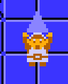

**CS101::Spring 2026**

Here you will find a listing of lesson materials for the course such as slides, assignments, and similar.

- **Project Downloads**: [Starter files, tutorials, and other downloadable project materials](1_project_files.html)

<!-- {width=10%} -->

## W1. Welcome Weeks

- **Getting to Know You**: [Welcome Week Survey](https://forms.gle/EobK4xncr4f63Z8WA)
- **Getting to know your neighbor** Pair-up with **two** people in the class to ask the following questions. Write down their answers -- you will be introducing them during next class! 
  -  What is your name?
  -  Where is home?
  -  What is your favorite part about life at Allegheny College so far?
  -  Do you have any Computer Science experience(s) already (jobs, academic, industrial, similar)?
  -  Have you done any projects with programming?
  -  What can you share about the projects?
  -  What is your favorite phone app?
  -  What is your favorite breakfast cereal?
- Be sure to join the class' GitHub Organization (check your email!)
- Also, be sure that you are in the Discord channel for the course. If you are not in the Discord channel, please let me know!

- **Activity 01**: Installing Essential Tools and Solving the Maze
  - [GitHub Classroom Link](https://classroom.github.com/a/WIB5VCnJ)
- Installing necessary software for the course (if anyone needs help!) 
  - [Python](https://www.python.org/)
  - [Visual Studio Code](https://code.visualstudio.com/download) 
  - [GitHub](https://github.com/git-guides/install-git)
  - [Pipx](https://pipx.pypa.io/stable/installation/)

## W2. Reviewing Python

- **Literals, Variables, Conditionals, Strings, etc. ** 
  - [HTML](2_i_introToPython_solutions.html) Slides
<!-- - **Loops, Dictionaries and Lists ** 
  - [HTML](3_ii_introToPython_solutions.html) Slides -->
- **Lab 01**: Mastering Python Loops
  - [GitHub Classroom Link](https://classroom.github.com/a/AnsmidnZ)

## W3. More on Python

- **Lists, Dictionaries and Sets (Oh My!)**
  - [HTML](4_data_structures_solutions.html) Slides
- **Activity 02**: Getting Started with UV Package Manager
  - [GitHub Classroom Link](https://classroom.github.com/a/8rO34Wu8)
- **Lab 02**: Mastering Python Data Structures
  - [GitHub Classroom Link](https://classroom.github.com/a/fheOnxRv)
- **Activity 03**: Data Cleaning and Advanced Plotting
  - [GitHub Classroom Link](https://classroom.github.com/a/Jg-nptBV)

## W4. Continuing on with Python

- **Lab 03**: Completing Smaller Programs in Python
  - [GitHub Classroom Link](https://classroom.github.com/a/XQgLsac3)

## W5. Numerical Programming

- **Numerical Programs**
  - [HTML](5_numerical_programs_solutions.html) Slides
- **Exhaustive and Approximate Solutions**
  - [HTML](5_exhaustive_approximation.html) Slides
- **Activity 04**: Numerical Programming and Exhaustive Search
  - [GitHub Classroom Link](https://classroom.github.com/a/PjByMoX6)
- **Lab 04**: Build Your Own Game of *Rock, Paper, Scissors*!
  - [GitHub Classroom Link](https://classroom.github.com/a/KqaKW0-E)

## W6. Functions and Functional *Things*

- **Functions and Lambda Functions**
  - [HTML](6_lambdaFunctions.html) Slides
- **Activity 05**: Introduction to Software Testing with pytest
  - [GitHub Classroom Link](https://classroom.github.com/a/m0CA2kF5)
- **Lab 05**: Taylor Series Programming For Approximation
  - [GitHub Classroom Link](https://classroom.github.com/a/d8u_yHUd)

## W7. Function-based Programming

- **Higher-Order Functions, Decorators & Simple Classes**
  - [HTML](7_higherOrderFunctions_decorators_classes.html) Slides
- **Activity 06**: Introduction to the Sphinx Documentation Library
  - [GitHub Classroom Link](https://classroom.github.com/a/iKhmrd4q)

## W8. Object-Oriented Programming and Exceptions
- **Object-Oriented Programming and Exceptions**
  - [HTML](8_objectOrientedProgramming_exceptions.html) Slides
- **Activity 07**: Introduction to Game Development with Pygame
  - [GitHub Classroom Link](https://classroom.github.com/a/AsoTYz15)
  - [Project files and tutorials](1_project_files.html#act-07)
- **Lab 06**: Midterm Exam Preparation
  - [GitHub Classroom Link](https://classroom.github.com/a/8t4e0Cbv)
- **Activity 08**: Socket Programming with Classes and Exceptions - Chat & Game App
  - [GitHub Classroom Link](https://classroom.github.com/a/4TPCQlJQ)

## W09. Spring Break 

## W10. Files, opening and closing files
- **Reading & Writing Files**
  - [HTML](10_file_operations_structured_data.html) Slides
- **Activity 09**:  Building Web-Based Data Applications
  - [GitHub Classroom Link](https://classroom.github.com/a/yeQ23kQn)
- **Lab 07**: Data Analysis and Visualization Programming 
  - [GitHub Classroom Link](https://classroom.github.com/a/kpGpHPW9)

## W11. Modules and Packages, and More on Python Libraries
- **Creating Your Own Python Modules**
  - [HTML](11_python_modules_and_libraries.html) Slides
- **Algorithm Complexity**
  - [HTML](11_complexity_intro_slides.html) Slides
- **Activity 10**:  Algorithm Performance Analysis: Doubling Experiments
  - [GitHub Classroom Link](https://classroom.github.com/a/4FxfSNEr)

## W12. More on Complexity and Algorithmic Problem Solving
- **Final Project-INDIVIDUAL**: Python Application Development_Individual Project
  - [GitHub Classroom Link](https://classroom.github.com/a/NQebGEOv)
- **Final Project-GROUPS**: Python Application Development_Group Project
  - [GitHub Classroom Link](https://classroom.github.com/a/tfN0mkSZ)
  - Note: If you are working in groups (as pairs), please click on the URL and first add your team name. Then have your partner click and select the team name. It is very hard to undo team paring setting and so please do not join the wrong group. If you have any questions about this, please let me know!
- **Algorithm Complexity Demonstrations**
  - [HTML](12_comprehensive_big_o_slides.html) Slides

## W13. Applications and Development
- **Algorithm Complexity Demonstrations**
  - [HTML](13_Applications_filesearch.html) Slides

---

## Special Notes
::: {.callout-note}
## Please plan accordingly for the following important deadlines:
- The final project will be due on April 30th, 2026 at 9:00am.
- Presentations will be held on Friday, 24th April 2026 during lab.
- These are hard deadlines and no late submissions can be accepted.
:::
