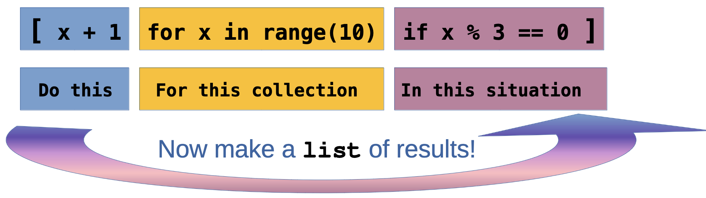

# On For Today

::: {.callout-tip icon="true"}
## Let's explore file operations in Python!
**Topics covered in today's discussion:**

* 📁 **Opening and Closing Files** — Managing file resources properly
* 📖 **Reading Text Files** — Getting data from `.txt` files
* ✍️ **Writing Text Files** — Saving data to `.txt` files
* 🔒 **Context Managers** — The `with` statement for safe file handling
* 📊 **CSV Files** — Working with structured data
* 🎯 **Practical Projects** — Joke Machine, Todo List, Grade Processor
* 💡 **Best Practices** — Error handling and file management
* 🏆 **Challenge Problems & Solutions** — Practice what you've learned!
:::

<center>
{width=40%}
</center>

---

## Why File Operations Matter

::: {.callout-important icon="false"}
**Real-World Applications**

Every useful program needs to work with data that persists beyond a single run:

* 📊 **Data Analysis** — Loading datasets from CSV files
* 💾 **Configuration** — Saving user preferences and settings
* 📝 **Logging** — Recording program activity and errors
* 🗄️ **Data Storage** — Persisting information between program runs
* 📈 **Reports** — Generating output files with results
:::

::: {.callout-note}
**The Big Idea:** Files are the bridge between your program's temporary memory and permanent storage. Understanding file operations is essential for building practical, useful software!
:::

---

# Part 1: File Basics

::: {.callout-note icon="false"}
## The Three Essential Steps
Working with files follows a simple pattern:

1. **Open** the file (get a file handle)
2. **Read or Write** data (do your work)
3. **Close** the file (release the resource)
:::

::: {style="color: #8E44AD;"}
**Key Insight:** Files are like books in a library 📚. You check them out (open), read or write in them, then return them (close) so others can use them. Forgetting to close a file is like keeping a library book forever!
:::

::: {.callout-warning icon="false"}

Note: Jupyter will not allow you to write files. To test the code in this section, copy it into a local Python file using an editor and then run it on your machine.
:::

---

## Opening a File — The Basics

::: {.callout-important icon="false"}
## The `open()` Function
```python
# Open a file for reading
file = open("data.txt", "r")

# Do something with the file...
content = file.read()

# ALWAYS close the file when done!
file.close()

print(content)
```
:::

::: {.callout-important icon="false"}
**File Modes:**

* `"r"` — Read mode (default). File must exist.
* `"w"` — Write mode. Creates new file or **overwrites** existing file.
* `"a"` — Append mode. Adds to the end of an existing file.
* `"r+"` — Read and write mode.
:::

---

## The Problem with Manual Closing

::: {.callout-warning icon="false"}
## What Could Go Wrong?
```python
file = open("data.txt", "r")

# If an error occurs here, the file never closes!
result = some_risky_operation(file)

file.close()  # This line might never execute!
```

**Issues with manual file closing:**

* If an error occurs, `close()` might not execute
* Easy to forget, especially in complex code
* Can lead to file locks and resource leaks
* Other programs might not be able to access the file
:::

::: {style="color: #E74C3C;"}
**Warning:** Forgetting to close files can corrupt data or prevent other programs from accessing them. There's a better way! 🔒
:::

---

## Context Managers — The Better Way

::: {.callout-important icon="false"}
## The `with` Statement
```python
# This is the Pythonic way!
with open("data.txt", "r") as file:
    content = file.read()
    print(content)
# File automatically closes here, even if an error occurs!

# The file is now closed — safe and clean!
```
:::

::: {.callout-note icon="false"}
**How it works:**

* The `with` statement creates a **context manager**
* The file automatically closes when the block ends
* Even if an error occurs, cleanup happens
* You never have to remember to call `close()`
:::

::: {style="color: #27AE60;"}
**Best Practice:** Always use `with` when working with files. It's safer, cleaner, and more Pythonic! ✨
:::

---

# Part 2: Reading Text Files

::: {.callout-note icon="false"}
## Different Ways to Read
Python gives you several methods for reading file content:

* `read()` — Read the entire file as a single string
* `readline()` — Read one line at a time
* `readlines()` — Read all lines into a list
* Iterating — Loop through lines directly
:::

---

## Reading the Entire File — `.read()`

::: {.callout-important icon="false"}
## Getting All Content at Once
```python
with open("story.txt", "r") as file:
    content = file.read()
    print(content)
    print(f"File has {len(content)} characters")
```

**When to use `.read()`:**

* ✅ Small files that fit comfortably in memory
* ✅ When you need the entire content as one string
* ❌ Large files (can consume too much memory)
:::

::: {.callout-tip icon="false"}
**Try it yourself:** Create a file called `story.txt` with a short story, then read it with this method!
:::

---

## Reading Line by Line — `.readline()`

::: {.callout-important icon="false"}
## Reading One Line at a Time
```python
with open("data.txt", "r") as file:
    line1 = file.readline()  # Read first line
    line2 = file.readline()  # Read second line
    line3 = file.readline()  # Read third line
    
    print("Line 1:", line1.strip())
    print("Line 2:", line2.strip())
    print("Line 3:", line3.strip())
```

**Notice:** `strip()` removes the newline character (`\n`) at the end of each line.

**When to use `.readline()`:**

* Processing the file sequentially
* When you need precise control over reading
* Reading headers separately from data
:::

---

## Reading All Lines — `.readlines()`

::: {.callout-important icon="false"}
## Get a List of All Lines
```python
with open("names.txt", "r") as file:
    lines = file.readlines()

print(f"Total lines: {len(lines)}")

for line in lines:
    print(line.strip())
```
:::

::: {.callout-important icon="false"}
**How it works:**

* `readlines()` returns a **list** where each element is one line
* Each line includes the newline character (`\n`)
* Use `strip()` to remove whitespace and newlines
* Great when you need to process lines multiple times
:::

---

## The Most Pythonic Way — Iteration

::: {.callout-important icon="false"}
## Loop Directly Through the File
```python
with open("log.txt", "r") as file:
    for line in file:
        line = line.strip()
        if "ERROR" in line:
            print(f"Found error: {line}")
```
:::

::: {.callout-note icon="false"}
**Why this is best:**

* ✅ Memory efficient — reads one line at a time
* ✅ Works with files of any size
* ✅ Clean, readable syntax
* ✅ The most Pythonic approach
:::

::: {style="color: #27AE60;"}
**Best Practice:** When processing a file line by line, iterate directly over the file object!
:::

---

## Light Challenge 1 — Count Words

::: {.callout-warning icon="false"}
## Quick Practice!
Given a file `words.txt` with text content, write code to count how many words it contains.

**Hint:** Use `.split()` to break text into words!

```python
# Your code here
with open("words.txt", "r") as file:
    # How would you count the words?
    pass
```
:::

---

## Light Challenge 1 — Solution

::: {.callout-tip icon="false"}
## Solution
```python
with open("words.txt", "r") as file:
    content = file.read()
    words = content.split()
    word_count = len(words)
    print(f"Total words: {word_count}")
```

**How it works:**

* `.read()` gets the entire file content as a string
* `.split()` breaks the string into a list of words (splits on whitespace)
* `len(words)` counts how many words are in the list

**Alternative one-liner:**
```python
with open("words.txt", "r") as file:
    print(f"Total words: {len(file.read().split())}")
```
:::

---

# Part 3: Writing Text Files

::: {.callout-note icon="false"}
## Three Writing Modes

* `"w"` — **Write mode**: Creates new file or **overwrites** existing file
* `"a"` — **Append mode**: Adds to the end of existing file
* `"x"` — **Exclusive creation**: Fails if file already exists
:::

::: {style="color: #E74C3C;"}
**Warning:** Write mode (`"w"`) will **delete** all existing content! Use append mode (`"a"`) if you want to keep existing data.
:::

---

## Writing to a File — `.write()`

::: {.callout-important icon="false"}
## Creating and Writing Content
```python
with open("output.txt", "w") as file:
    file.write("Hello, World!\n")
    file.write("This is line 2.\n")
    file.write("Goodbye!\n")

print("File created successfully!")
```

**Key points:**

* `.write()` doesn't add newlines automatically — you must include `\n`
* Returns the number of characters written
* Each `.write()` call appends to the file
:::

::: {.callout-tip icon="false"}
**Try it:** Run this code and open `output.txt` to see the result!
:::

---

## Writing Multiple Lines — `.writelines()`

::: {.callout-important icon="false"}
## Writing from a List
```python
lines = [
    "Apple\n",
    "Banana\n",
    "Cherry\n",
    "Date\n"
]

with open("fruits.txt", "w") as file:
    file.writelines(lines)

print("Fruits written to file!")
```
:::

::: {.callout-important icon="false"}
**How it works:**

* `writelines()` takes a **list** of strings
* Each string should include `\n` if you want line breaks
* More efficient than multiple `.write()` calls
* Great for writing formatted data
:::

---

## Append Mode — Adding Without Deleting

::: {.callout-important icon="false"}
## Preserving Existing Content
```python
# First, create a file
with open("log.txt", "w") as file:
    file.write("Log started.\n")

# Later, add more entries
with open("log.txt", "a") as file:
    file.write("User logged in.\n")
    file.write("User performed action.\n")

# Read the result
with open("log.txt", "r") as file:
    print(file.read())
```

**Output:**
```
Log started.
User logged in.
User performed action.
```
:::

::: {style="color: #27AE60;"}
**Use Case:** Append mode is perfect for logging, where you want to keep all previous entries!
:::

---

## Light Challenge 2 — Todo List Writer

::: {.callout-warning icon="false"}
## Quick Practice!
Create a program that takes a list of tasks and writes them to a file `todo.txt`, numbered like this:

```
1. Buy groceries
2. Finish homework
3. Call mom
4. Meet old friend for coffee
5. Go for a run
6. Read a book
7. Plan weekend trip
8. Catch the game with friends
```

```python
tasks = ["Buy groceries", "Finish homework",
"Call mom" ,"Meet old friend for coffee", 
"Go for a run", "Read a book", "Plan weekend trip", 
"Catch the game with friends"]

# Your code here
```
:::

---

## Light Challenge 2 — Solution 

::: {.callout-tip icon="false"}
## Solution
```python
tasks = ["Buy groceries", "Finish homework",
"Call mom" ,"Meet old friend for coffee", 
"Go for a run", "Read a book", "Plan weekend trip", 
"Catch the game with friends"]

with open("todo.txt", "w") as file:
    for i, task in enumerate(tasks, 1):
        file.write(f"{i}. {task}\n")

print("Todo list created!")
```

**How it works:**

* `enumerate(tasks, 1)` iterates through the list, providing both index and item
* The `1` starts numbering at 1 instead of 0
* `f"{i}. {task}\n"` formats each line with the number and task
* Don't forget the `\n` to create separate lines!

:::

## Light Challenge 2 — Solution (Part 2)

::: {.callout-tip icon="false"}

**Alternative using list comprehension:**
```python
tasks = ["Buy groceries", "Finish homework",
"Call mom" ,"Meet old friend for coffee", 
"Go for a run", "Read a book", "Plan weekend trip", 
"Catch the game with friends"]

with open("todo.txt", "w") as file:
    lines = [f"{i}. {task}\n" for i, task in enumerate(tasks, 1)]
    file.writelines(lines)
```
:::


::: {.callout-note icon="false"}
<center>

{width=70%}
</center>

<center>
(Cheat sheet for list comprehensions!)
</center>
:::

---

## Project 1 — The Joke Machine 🎭

::: {.callout-important icon="false"}
## A Fun Way to Learn File Operations
**Goal:** Load jokes from a file, pick a random one, and display it!

**First, create `jokes.txt`:**

```text
Why do programmers prefer dark mode? Because light attracts bugs! 🐛
Why do Java developers wear glasses? Because they don't C#! 👓
How many programmers does it take to change a light bulb? None, that's a hardware problem! 💡
Why did the programmer quit his job? Because he didn't get arrays! 📊
What's a programmer's favorite hangout place? Foo Bar! 🍺
```
:::

<center>
{width=50%}
</center>

---

## Project 1 — The Joke Machine (Code)

::: {.callout-important icon="false"}
## Implementation
```python
import random

def load_jokes(filename):
    """Load all jokes from a file into a list."""
    with open(filename, "r") as file:
        jokes = [line.strip() for line in file if line.strip()]
    return jokes

def tell_joke(jokes):
    """Pick and return a random joke."""
    return random.choice(jokes)

# Main program
def main():
    jokes = load_jokes("jokes.txt")
    print("🎭 JOKE MACHINE 🎭")
    print("─" * 50)
    print(tell_joke(jokes))
    print("─" * 50)

if __name__ == "__main__":
    main()
```
:::

---

## Project 1 — The Joke Machine (Enhancement)

::: {.callout-important icon="false"}
## Interactive Version
```python
import random

def load_jokes(filename):
    with open(filename, "r") as file:
        return [line.strip() for line in file if line.strip()]

def main():
    jokes = load_jokes("jokes.txt")
    print("🎭 JOKE MACHINE 🎭")
    
    while True:
        print("\nPress Enter for a joke (or 'q' to quit):")
        user_input = input("> ")
        
        if user_input.lower() == 'q':
            print("Thanks for laughing! 😄")
            break
        
        print(f"\n{random.choice(jokes)}\n")

if __name__ == "__main__":
    main()
```
:::

---

## Want **More** jokes??

::: {.callout-note icon="false" style="color: #27AE60;"}

<!-- ::: {style="color: #27AE60;" font-size="1.0em;"} -->
Add to `jokes.txt`! Here are some to get you started!

```text
What did 20 do when it was hungry? Twenty-eight.
Why is grass so dangerous? Because it's full of blades!
Why are mountains so funny? They’re hill areas.
Why wasn’t the cactus invited to hang out with the mushrooms? He wasn’t a fungi.
Why shouldn’t you fund raise for marathons? They just take the money and run.
Why did the crab cross the road? It didn’t—it used the sidewalk.
Why does it take pirates a long time to learn the alphabet? Because they can spend years at C!
Why can't a nose be 12 inches long? Because then it would be a foot.
Why can’t you put two half-dollars in your pocket? Because two halves make a hole, and your money will fall out!
Why does a moon rock taste better than an Earth rock? It’s a little meteor.
How much do rainbows weigh? Not much. They’re actually pretty light.
What is the most popular fish in the ocean? The starfish.
A slice of apple pie costs $2.50 in Jamaica, $3.75 in Bermuda, and $3 in the Bahamas. Those are the pie-rates of the Caribbean.
Why did the football coach yell at the vending machine? He wanted his quarter back!
I had a joke about paper today, but it was tearable.
What kind of job can you get at a bicycle factory? A spokesperson
What does a condiment wizard perform? Saucery
What's the difference in an alligator and a crocodile? You’ll see one later and one in a while.
What’s the difference between the bird flu and the swine flu? One requires tweetment and the other an oinkment.
What’s the difference between ducks and dine-and-dashers? Ducks take care of their bills.
What's the difference between spring rolls and summer rolls? Their seasoning.
What’s the difference between Iron Man and Aluminum Man? Iron Man stops the bad guy. Aluminum Man foils their plans.
What’s the difference between a poorly dressed man on a unicycle and a well-dressed man on a bicycle? Attire.
What’s the difference between a $20 steak and a $55 steak? February 14th.
What's the best thing about Switzerland? The flag is a big plus.
I went to the aquarium this weekend, but I didn’t stay long -- There’s something fishy about that place.
I found a lion in my closet the other day! When I asked what it was doing there, it said 'Narnia business.'
What's a cat's favorite instrument? Purrrr-cussion.
Why did the snail paint a giant S on his car? So when he drove by, people could say: 'Look at that S car go!'
What do you call a happy cowboy? A jolly rancher.
What subject do cats like best in school? Hiss-tory.
Humpty Dumpty had a great fall. He said his summer was pretty good too.
My boss told me to dress for the job I want, not for the one I have. So I went in as Batman.
How do you make holy water? You boil the hell out of it.
Justice is a dish best served cold. Otherwise, it's just water.
Why should you never throw grandpa's false teeth at a vehicle? You might denture car.
Why are Christmas trees bad at knitting? They always drop their needles.
What did the lunch box say to the refrigerator? Don't hate me because I'm a little cooler.
I can always tell when someone is lying. I can tell when they're standing too.
Some people pick their nose, but I was born with mine.
If your house is cold, just stand in the corner. It’s always 90 degrees there.
Why did the scarecrow win an award? Because he was outstanding in his field!
```
:::


---

# Part 4: Working with CSV Files

::: {.callout-note icon="false"}
## What Is a CSV File?
**CSV** stands for **Comma-Separated Values**. It's a simple format for structured data:

```csv
name,age,city
Alice,25,New York
Bob,30,Meadville
Charlie,35,Chicago
```

* First row usually contains **headers** (column names)
* Each subsequent row is a **record** (data entry)
* Fields are separated by commas
* Widely supported by Excel, Google Sheets, databases, etc.
:::

---

## Reading CSV Files — The `csv` Module

::: {.callout-important icon="false"}
## Using Python's Built-in CSV Module
```python
import csv

with open("students.csv", "r") as file:
    reader = csv.reader(file)
    
    # Skip the header row
    header = next(reader)
    print("Headers:", header)
    
    # Process each row
    for row in reader:
        name, age, grade = row
        print(f"{name} is {age} years old and got grade {grade}")
```

**Sample `students.csv`:**
```csv
name,age,grade
Alice,20,92
Bob,21,87
Charlie,19,95
```
:::

---

## CSV with Dictionaries — `DictReader`

::: {.callout-important icon="false"}
## More Convenient Access
```python
import csv

with open("students.csv", "r") as file:
    reader = csv.DictReader(file)
    
    for row in reader:
        # Access by column name!
        print(f"{row['name']} got a grade of {row['grade']}")
```

**Output:**
```
Alice got a grade of 92
Bob got a grade of 87
Charlie got a grade of 95
```
:::

::: {.callout-note icon="false"}
**Why `DictReader` is great:**

* Access fields by name, not position
* More readable and maintainable
* Less error-prone when CSV structure changes
* No need to manually parse the header
:::

---

## Writing CSV Files — `csv.writer`

::: {.callout-important icon="false"}
## Creating CSV Files
```python
import csv

students = [
    ["name", "age", "grade"],  # header
    ["Alice", 20, 92],
    ["Bob", 21, 87],
    ["Charlie", 19, 95]
]

with open("output.csv", "w", newline="") as file:
    writer = csv.writer(file)
    writer.writerows(students)

print("CSV file created!")
```

**Important:** Use `newline=""` when opening CSV files for writing to avoid extra blank lines on Windows!
:::

---

## Writing CSV Files — `DictWriter`

::: {.callout-important icon="false"}
## Writing with Dictionaries
```python
import csv

students = [
    {"name": "Alice", "age": 20, "grade": 92},
    {"name": "Bob", "age": 21, "grade": 87},
    {"name": "Charlie", "age": 19, "grade": 95}
]

my_filename = "students.csv" # name of the file to create
with open(my_filename, "w", newline="") as file:
    fieldnames = ["name", "age", "grade"] # The order of columns
    writer = csv.DictWriter(file, fieldnames=fieldnames)
    
    writer.writeheader()  # Write the header row
    writer.writerows(students) # Write the data rows

print(f"CSV file created with DictWriter : {my_filename}!")
```
:::

::: {style="color: #27AE60;"}
**Best Practice:** Use `DictWriter` when you have data in dictionary format — it's cleaner and more maintainable!
:::

---

## Light Challenge 3 — Average Grade Calculator

::: {.callout-warning icon="false"}
## Quick Practice!
Given a CSV file `grades.csv` with columns `name` and `grade`, calculate the average grade.

```csv
name,grade
Alice,92
Bob,87
Charlie,95
Diana,88
```

```python
import csv

# Your code here
# Calculate and print the average grade
```
:::

---

## Light Challenge 3 — Solution (Part 1)

::: {.callout-tip icon="false"}
## Solution
```python
import csv

total = 0
count = 0

with open("grades.csv", "r") as file:
    reader = csv.DictReader(file)
    
    for row in reader:
        total += int(row["grade"])
        count += 1

average = total / count
print(f"Average grade: {average:.1f}")
```

**How it works:**

* Use `DictReader` to access columns by name
* Convert `row["grade"]` to `int` (CSV data is always strings!)
* Accumulate `total` and `count` as we read each row
* Calculate average and use `:.1f` to format to 1 decimal place

:::

## Light Challenge 3 — Solution (Part 2)

::: {.callout-tip icon="false"}

**More Pythonic version:**
```python
import csv

with open("grades.csv", "r") as file:
    reader = csv.DictReader(file)
    grades = [int(row["grade"]) for row in reader]

average = sum(grades) / len(grades)
print(f"Average grade: {average:.1f}")
```
:::

::: {.callout-note icon="false"}
<center>

{width=70%}
</center>

<center>
(Cheat sheet for list comprehensions!)
</center>
:::

---

# Part 5: Practical Projects

<center>
{width=50%}
</center>

::: {.callout-note icon="false"}
## Let's Build Useful Programs!
These projects demonstrate real-world file operations with practical applications.
:::

---

## Project 2 — Todo List Manager 📝

::: {.callout-important icon="false"}
## Persistent Task Management
```python
def load_todos(filename):
    """Load todos from file, return empty list if file doesn't exist."""
    try:
        with open(filename, "r") as file:
            return [line.strip() for line in file]
    except FileNotFoundError:
        return []

def save_todos(filename, todos):
    """Save all todos to file."""
    with open(filename, "w") as file:
        for todo in todos:
            file.write(todo + "\n")

def add_todo(todos, task):
    """Add a new task."""
    todos.append(task)
    print(f"✅ Added: {task}")

def show_todos(todos):
    """Display all todos."""
    if not todos:
        print("No tasks yet! 🎉")
        return
    
    print("\n📝 Your Todos:")
    for i, todo in enumerate(todos, 1):
        print(f"  {i}. {todo}")
```
:::

---

## Project 2 — Todo List Manager (Main Program)

::: {.callout-important icon="false"}
## Full Interactive Program
```python
def main():
    filename = "todos.txt"
    todos = load_todos(filename)
    
    while True:
        print("\n" + "="*40)
        print("TODO LIST MANAGER")
        print("="*40)
        print("1. View todos")
        print("2. Add todo")
        print("3. Remove todo")
        print("4. Quit")
        
        choice = input("\nChoice: ").strip()
        
        if choice == "1":
            show_todos(todos)
        elif choice == "2":
            task = input("Enter task: ")
            add_todo(todos, task)
            save_todos(filename, todos)
        elif choice == "3":
            show_todos(todos)
            try:
                num = int(input("Remove which number? "))
                removed = todos.pop(num - 1)
                print(f"❌ Removed: {removed}")
                save_todos(filename, todos)
            except (ValueError, IndexError):
                print("Invalid number!")
        elif choice == "4":
            print("Goodbye! 👋")
            break

if __name__ == "__main__":
    main()
```
:::

---

## Project 3 — Grade Processor 📊

::: {.callout-important icon="false"}
## CSV Processing with Statistics
```python
import csv

def load_grades(filename):
    """Load student grades from CSV."""
    students = []
    with open(filename, "r") as file:
        reader = csv.DictReader(file)
        for row in reader:
            students.append({
                "name": row["name"],
                "grade": int(row["grade"])
            })
    return students

def calculate_statistics(students):
    """Calculate grade statistics."""
    grades = [s["grade"] for s in students]
    return {
        "average": sum(grades) / len(grades),
        "highest": max(grades),
        "lowest": min(grades),
        "passing": sum(1 for g in grades if g >= 60)
    }

def generate_report(students, stats, output_file):
    """Generate a formatted report."""
    with open(output_file, "w") as file:
        file.write("GRADE REPORT\n")
        file.write("=" * 50 + "\n\n")
        
        file.write("Student Grades:\n")
        for student in sorted(students, key=lambda s: s["grade"], reverse=True):
            status = "✓ PASS" if student["grade"] >= 60 else "✗ FAIL"
            file.write(f"  {student['name']:20} {student['grade']:3} {status}\n")
        
        file.write("\n" + "=" * 50 + "\n")
        file.write(f"Average: {stats['average']:.1f}\n")
        file.write(f"Highest: {stats['highest']}\n")
        file.write(f"Lowest: {stats['lowest']}\n")
        file.write(f"Passing Students: {stats['passing']}/{len(students)}\n")
```
:::

---

## Project 3 — Grade Processor (Usage)

::: {.callout-important icon="false"}
## Running the Grade Processor
```python
def main():
    # Load grades
    students = load_grades("grades.csv")
    
    # Calculate statistics
    stats = calculate_statistics(students)
    
    # Generate report
    generate_report(students, stats, "grade_report.txt")
    
    # Display summary
    print(f"Processed {len(students)} students")
    print(f"Average grade: {stats['average']:.1f}")
    print(f"Report saved to grade_report.txt")

if __name__ == "__main__":
    main()
```

**Sample `grades.csv`:**
```csv
name,grade
Alice,92
Bob,87
Charlie,95
Diana,88
Eve,76
Frank,54
```
:::

---

## Project 4 — Sample Log File Data 📄

<!-- ::: {.callout-tip icon="false"} -->

::: {.callout-important icon="false"}
## Copy and Paste This Into `server.log`
To test the Log File Analyzer, create a file called `server.log` with this content:

```text
2026-03-20 08:15:22 INFO Server started successfully
2026-03-20 08:15:23 INFO Loading configuration from config.json
2026-03-20 08:15:24 INFO Database connection established
2026-03-20 08:16:01 INFO User authentication service initialized
2026-03-20 08:17:45 WARNING High memory usage detected: 85%
2026-03-20 08:18:12 INFO Processing user request for /api/data
2026-03-20 08:18:15 ERROR Failed to connect to external API: Connection timeout
2026-03-20 08:18:16 INFO Retrying connection to external API
2026-03-20 08:18:20 INFO Connection successful on retry
2026-03-20 08:19:33 INFO User session created for user_id: 12345
2026-03-20 08:20:47 WARNING Slow query detected: 2.3 seconds
2026-03-20 08:21:05 INFO Cache hit for product catalog
2026-03-20 08:22:18 ERROR Database query failed: Table 'users' does not exist
2026-03-20 08:22:19 ERROR Rolling back transaction
2026-03-20 08:23:44 WARNING Disk space running low: 15% remaining
2026-03-20 08:24:52 INFO Backup process started
2026-03-20 08:25:01 INFO Processing batch job: 1000 records
2026-03-20 08:26:33 ERROR Failed to send email notification: SMTP server unreachable
2026-03-20 08:27:15 INFO User logged out: user_id: 12345
2026-03-20 08:28:40 WARNING Rate limit exceeded for IP: 192.168.1.100
2026-03-20 08:29:52 INFO Scheduled maintenance task completed
2026-03-20 08:30:11 INFO Request handled successfully
```

<!-- **This sample log contains:**

* 13 INFO messages
* 4 WARNING messages  
* 4 ERROR messages
* 21 total lines

Perfect for testing the analyzer! -->
:::

---

## Project 4 — Log File Analyzer 🔍

::: {.callout-important icon="false"}
## Processing Large Text Files
```python
def analyze_log(filename):
    """Analyze a log file for errors and warnings."""
    stats = {
        "total_lines": 0,
        "errors": 0,
        "warnings": 0,
        "info": 0
    }
    
    error_messages = []
    
    # We will read the file line by line to avoid memory issues with large logs
    # This way we can process logs of any size without loading everything into memory at once
    # Note: To find the errors, we will check if the line contains the word "ERROR" (case-insensitive)
    with open(filename, "r") as file:
        for line in file:
            stats["total_lines"] += 1
            line_lower = line.lower()
            
            if "error" in line_lower:
                stats["errors"] += 1
                error_messages.append(line.strip())
            elif "warning" in line_lower:
                stats["warnings"] += 1
            elif "info" in line_lower:
                stats["info"] += 1
    
    return stats, error_messages

def save_error_report(errors, output_file):
    """Save error messages to a separate file."""
    with open(output_file, "w") as file:
        file.write("ERROR REPORT\n")
        file.write("=" * 60 + "\n\n")
        for i, error in enumerate(errors, 1):
            file.write(f"{i}. {error}\n")

# Usage
stats, errors = analyze_log("server.log")
print(f"Found {stats['errors']} errors, {stats['warnings']} warnings")
save_error_report(errors, "errors_only.txt")
```
:::

## Project 4 — What to find? 🔍

::: {.callout-note icon="false"}

**This sample log contains:**

* 13 INFO messages
* 4 WARNING messages  
* 4 ERROR messages
* 21 total lines

Perfect for testing the analyzer!
:::

<center>
{width=50%}
</center>


---

# Part 6: Best Practices & Error Handling

::: {.callout-note icon="false"}
## Writing Robust File Operations

Good programs handle errors gracefully and don't crash when files are missing or corrupted.
:::

---

## Checking If a File Exists

::: {.callout-important icon="false"}
## Using `os.path` Module
```python
import os

filename = "data.txt"

if os.path.exists(filename):
    with open(filename, "r") as file:
        content = file.read()
        print(content)
else:
    print(f"File '{filename}' not found!")
```
:::

::: {.callout-important icon="false"}
## Modern Way: Using `pathlib`
```python
from pathlib import Path

filename = Path("data.txt")

if filename.exists():
    content = filename.read_text()
    print(content)
else:
    print(f"File '{filename}' not found!")
```
:::

---

## Handling File Errors with Try-Except

::: {.callout-important icon="false"}
## Graceful Error Handling
```python
def safe_read_file(filename):
    """Read a file with error handling."""
    try:
        with open(filename, "r") as file:
            return file.read()
    except FileNotFoundError:
        print(f"Error: '{filename}' does not exist.")
        return None
    except PermissionError:
        print(f"Error: No permission to read '{filename}'.")
        return None
    except Exception as e:
        print(f"Unexpected error: {e}")
        return None

# Usage
content = safe_read_file("data.txt")
if content:
    print(content)
```
:::

::: {style="color: #27AE60;"}
**Best Practice:** Always anticipate and handle potential file errors in production code!
:::

---

## Best Practices Summary

::: {.callout-tip icon="false"}
## File Operations Checklist

✅ **Always use `with` statements** — Automatic cleanup

✅ **Handle exceptions** — Don't let missing files crash your program

✅ **Use appropriate modes** — `"r"` vs `"w"` vs `"a"`

✅ **Close files properly** — Even in error cases (context managers help!)

✅ **Use `csv` module for CSV files** — Don't reinvent the wheel

✅ **Think about encoding** — Use `encoding="utf-8"` for non-ASCII text

✅ **Validate input** — Check file exists before reading

✅ **Use `pathlib` for modern code** — More intuitive than `os.path`

:::

---

# Challenge Problems

<center>
{width=60%}
</center>

::: {.callout-warning icon="false"}
## 🏁 Time to Practice!
Work through each challenge before looking at the solutions.
:::

---

## Challenge 1 — Word Frequency Counter

::: {.callout-warning icon="false"}
## Text Analysis Challenge
Write a program that reads a text file and creates a report showing how many times each word appears, sorted by frequency.

```python
# Your code here
# Read from 'text.txt'
# Count word frequency
# Save to 'word_frequency.txt'

# Example output format:
# Word Frequency Report
# =====================
# the: 45
# and: 32
# is: 28
# ...
```

**Hints:**
- Use `.lower()` to treat "The" and "the" as the same word
- Remove punctuation (you can use `string.punctuation`)
- Sort by frequency (highest first)
:::

---

## Challenge 2 — CSV Data Filter

::: {.callout-warning icon="false"}
## Data Processing Challenge
Given a CSV file `employees.csv`, create two new CSV files:
- `high_salary.csv` — employees earning over $75,000
- `department_summary.csv` — count of employees per department

**Sample `employees.csv`:**
```csv
name,department,salary
Alice,Engineering,85000
Bob,Sales,65000
Charlie,Engineering,92000
Diana,HR,58000
Eve,Sales,78000
```

```python
import csv

# Your code here
```
:::

---

## Challenge 3 — Log File Merger

::: {.callout-warning icon="false"}
## Multi-File Processing Challenge
You have multiple log files: `log1.txt`, `log2.txt`, `log3.txt`. Merge them into a single file `merged_log.txt` with timestamps preserved and sorted chronologically.

Each log line format: `2026-03-20 14:30:15 - Message here`

```python
# Your code here
# Read all log files
# Sort entries by timestamp
# Write to merged_log.txt
```

**Extra challenge:** Remove duplicate entries!
:::

---

## Challenge 4 — Contact Book Manager

::: {.callout-warning icon="false"}
## Full Application Challenge
Create a contact book application that stores contacts in a CSV file with these features:

- **Add contact** (name, phone, email)
- **Search** by name
- **Display all** contacts
- **Delete** contact
- **Export** to formatted text file

```python
import csv

# Your code here
# Implement ContactBook class with methods:
# - load_contacts(filename)
# - save_contacts(filename)
# - add_contact(name, phone, email)
# - search_contact(name)
# - delete_contact(name)
# - export_to_text(filename)
```
:::

---

## Challenge 5 — Data Cleaner and Reporter

::: {.callout-warning icon="false"}
## Advanced CSV Challenge
Write a program that reads a CSV file with messy data, cleans it, and generates a report.

**Given `sales_data.csv`:**
```csv
product,quantity,price
Apple,10,1.50
Banana,,2.00
Cherry,15,
Orange,20,3.50
,25,2.75
Grape,30,4.00
```

**Your program should:**
1. Remove rows with missing critical data
2. Calculate total revenue for each product
3. Save cleaned data to `sales_clean.csv`
4. Generate a report showing:
   - Total products
   - Total revenue
   - Best-selling product
   - Product sorted by revenue

```python
import csv

# Your code here
```
:::

---

# Challenge Solutions

---

## Solution 1 — Word Frequency Counter

```python
import string
from collections import Counter

def count_word_frequency(input_file, output_file):
    # Read and process text
    with open(input_file, "r") as file:
        text = file.read().lower()
    
    # Remove punctuation
    translator = str.maketrans("", "", string.punctuation)
    text = text.translate(translator)
    
    # Count words
    words = text.split() # make a list of words
    # count occurrences of each word returns a dictionary-like object
    word_counts = Counter(words) 
    
    # Write report
    with open(output_file, "w") as file:
        file.write("Word Frequency Report\n")
        file.write("=" * 50 + "\n\n")
        
        for word, count in word_counts.most_common(): # use python's built-in sorting by frequency
            file.write(f"{word}: {count}\n")
    
    print(f"Report saved to {output_file}")

# Usage
count_word_frequency("text.txt", "word_frequency.txt")
# Next steps: Open 'word_frequency.txt' to see the results, or prepare a plot of the top 10 words using matplotlib!
```

---

## Solution 1 — Word Frequency Counter (Explanation)

::: {.callout-note icon="false"}
**How it works:**

1. **Read the file** and convert to lowercase for case-insensitive counting
2. **Remove punctuation** using `str.translate()` — this ensures "hello," and "hello" are counted together
3. **Split into words** using `.split()`, which handles multiple spaces
4. **Use `Counter`** from `collections` — automatically counts occurrences
5. **Write results** sorted by frequency using `.most_common()`

**Key techniques:**
- `Counter` is perfect for counting hashable objects
- `str.maketrans()` + `translate()` efficiently removes punctuation
- `.most_common()` returns items sorted by count (descending)
:::

---

## Solution 2 — CSV Data Filter

```python
import csv

def filter_employees(input_file):
    # Read all employees
    employees = []
    with open(input_file, "r") as file:
        reader = csv.DictReader(file)
        for row in reader:
            row["salary"] = int(row["salary"])
            employees.append(row)
    
    # Filter high salary employees
    high_salary = [e for e in employees if e["salary"] > 75000]
    
    with open("high_salary.csv", "w", newline="") as file:
        fieldnames = ["name", "department", "salary"]
        writer = csv.DictWriter(file, fieldnames=fieldnames)
        writer.writeheader()
        writer.writerows(high_salary)
    
    # Count by department
    departments = {}
    for emp in employees:
        dept = emp["department"]
        departments[dept] = departments.get(dept, 0) + 1
    
    with open("department_summary.csv", "w", newline="") as file:
        writer = csv.writer(file)
        writer.writerow(["department", "employee_count"])
        for dept, count in sorted(departments.items()):
            writer.writerow([dept, count])
    
    print(f"Created high_salary.csv ({len(high_salary)} employees)")
    print(f"Created department_summary.csv ({len(departments)} departments)")

# Usage
filter_employees("employees.csv")
```

---

## Solution 2 — CSV Data Filter (Explanation)

::: {.callout-note icon="false"}
**How it works:**

1. **Load all employees** using `DictReader` for easy field access
2. **Convert salary to int** — CSV data is always read as strings
3. **Filter using list comprehension** — concise and Pythonic
4. **Use `DictWriter`** to write filtered results with headers
5. **Count departments** using a dictionary — `.get()` handles missing keys
6. **Write summary** with regular `csv.writer` since we're building rows manually

**Key techniques:**
- `DictReader`/`DictWriter` make CSV operations more readable
- List comprehensions for filtering are clean and efficient
- `.get(key, default)` safely accesses dictionary keys
:::

---

## Solution 3 — Log File Merger

```python
def merge_log_files(log_files, output_file):
    # Read all log entries
    all_entries = []
    
    for log_file in log_files:
        try:
            with open(log_file, "r") as file:
                for line in file:
                    line = line.strip()
                    if line:  # Skip empty lines
                        all_entries.append(line)
        except FileNotFoundError:
            print(f"Warning: {log_file} not found, skipping...")
    
    # Sort by timestamp (first 19 characters: YYYY-MM-DD HH:MM:SS)
    all_entries.sort(key=lambda entry: entry[:19])
    
    # Remove duplicates while preserving order
    unique_entries = []
    seen = set()
    for entry in all_entries:
        if entry not in seen:
            unique_entries.append(entry)
            seen.add(entry)
    
    # Write merged log
    with open(output_file, "w") as file:
        for entry in unique_entries:
            file.write(entry + "\n")
    
    print(f"Merged {len(log_files)} files into {output_file}")
    print(f"Total entries: {len(all_entries)}")
    print(f"Unique entries: {len(unique_entries)}")

# Usage
log_files = ["log1.txt", "log2.txt", "log3.txt"]
merge_log_files(log_files, "merged_log.txt")
```

---

## Solution 3 — Log File Merger (Explanation)

::: {.callout-note icon="false"}
**How it works:**

1. **Read all files** into a single list, handling missing files gracefully
2. **Sort by timestamp** — Python sorts strings chronologically when formatted as `YYYY-MM-DD HH:MM:SS`
3. **Remove duplicates** using a set to track what we've seen
4. **Preserve order** by using a list alongside the set
5. **Write results** to merged file

**Key techniques:**
- Try-except prevents one missing file from breaking everything
- Lambda functions for custom sorting (extract timestamp)
- Set for O(1) duplicate checking
- String slicing `[:19]` to extract just the timestamp portion

**Enhancement:** For huge log files, consider using a priority queue to merge without loading everything into memory!
:::

---

## Solution 4 — Contact Book Manager (Part 1)

```python
import csv

class ContactBook:
    def __init__(self, filename="contacts.csv"):
        self.filename = filename
        self.contacts = self.load_contacts()
    
    def load_contacts(self):
        """Load contacts from CSV file."""
        try:
            with open(self.filename, "r") as file:
                reader = csv.DictReader(file)
                return list(reader)
        except FileNotFoundError:
            return []
    
    def save_contacts(self):
        """Save contacts to CSV file."""
        with open(self.filename, "w", newline="") as file:
            if self.contacts:
                fieldnames = ["name", "phone", "email"]
                writer = csv.DictWriter(file, fieldnames=fieldnames)
                writer.writeheader()
                writer.writerows(self.contacts)
    
    def add_contact(self, name, phone, email):
        """Add a new contact."""
        contact = {"name": name, "phone": phone, "email": email}
        self.contacts.append(contact)
        self.save_contacts()
        print(f"✅ Added: {name}")
```

---

## Solution 4 — Contact Book Manager (Part 2)

```python
    def search_contact(self, name):
        """Search for contacts by name."""
        results = [c for c in self.contacts if name.lower() in c["name"].lower()]
        return results
    
    def delete_contact(self, name):
        """Delete a contact by exact name match."""
        original_count = len(self.contacts)
        self.contacts = [c for c in self.contacts if c["name"].lower() != name.lower()]
        
        if len(self.contacts) < original_count:
            self.save_contacts()
            print(f"❌ Deleted: {name}")
            return True
        else:
            print(f"Contact '{name}' not found.")
            return False
    
    def display_all(self):
        """Display all contacts."""
        if not self.contacts:
            print("No contacts yet!")
            return
        
        print("\n" + "=" * 60)
        print("CONTACT BOOK")
        print("=" * 60)
        for contact in sorted(self.contacts, key=lambda c: c["name"]):
            print(f"Name:  {contact['name']}")
            print(f"Phone: {contact['phone']}")
            print(f"Email: {contact['email']}")
            print("-" * 60)
```

---

## Solution 4 — Contact Book Manager (Part 3)

```python
    def export_to_text(self, output_file):
        """Export contacts to formatted text file."""
        with open(output_file, "w") as file:
            file.write("CONTACT BOOK\n")
            file.write("=" * 60 + "\n\n")
            
            for contact in sorted(self.contacts, key=lambda c: c["name"]):
                file.write(f"Name:  {contact['name']}\n")
                file.write(f"Phone: {contact['phone']}\n")
                file.write(f"Email: {contact['email']}\n")
                file.write("-" * 60 + "\n")
        
        print(f"📄 Exported to {output_file}")

# Usage example
def main():
    book = ContactBook()
    
    book.add_contact("Alice Smith", "555-1234", "alice@example.com")
    book.add_contact("Bob Johnson", "555-5678", "bob@example.com")
    
    print("\n--- Search for 'alice' ---")
    results = book.search_contact("alice")
    for contact in results:
        print(f"Found: {contact['name']} - {contact['phone']}")
    
    book.display_all()
    book.export_to_text("contacts_export.txt")

if __name__ == "__main__":
    main()
```

---

## Solution 4 — Contact Book Manager (Explanation)

::: {.callout-note icon="false"}
**How it works:**

1. **Class-based design** — encapsulates all contact operations
2. **Automatic persistence** — saves to CSV after each modification
3. **Case-insensitive search** — finds contacts regardless of capitalization
4. **Export functionality** — creates human-readable text format

**Key techniques:**
- Store contacts as list of dictionaries (in-memory representation)
- CSV for structured storage (persistent representation)
- List comprehensions for filtering and deleting
- The `sorted()` function with lambda for alphabetical display

**OOP benefits:**
- Data and methods bundled together
- Easy to extend with new features
- Maintains consistent state between memory and disk
:::

---

## Solution 5 — Data Cleaner and Reporter (Part 1)

```python
import csv

def clean_and_report(input_file):
    # Read and clean data
    clean_data = []
    
    with open(input_file, "r") as file:
        reader = csv.DictReader(file)
        
        for row in reader:
            # Skip rows with missing critical data
            if not row.get("product") or not row.get("quantity") or not row.get("price"):
                continue
            
            # Convert to proper types
            try:
                row["quantity"] = int(row["quantity"])
                row["price"] = float(row["price"])
                row["revenue"] = row["quantity"] * row["price"]
                clean_data.append(row)
            except ValueError:
                continue  # Skip rows with invalid numbers
    
    # Save cleaned data
    with open("sales_clean.csv", "w", newline="") as file:
        fieldnames = ["product", "quantity", "price", "revenue"]
        writer = csv.DictWriter(file, fieldnames=fieldnames)
        writer.writeheader()
        writer.writerows(clean_data)
    
    return clean_data
```

---

## Solution 5 — Data Cleaner and Reporter (Part 2)

```python
def generate_report(clean_data, report_file):
    if not clean_data:
        print("No valid data to report!")
        return
    
    # Calculate statistics
    total_products = len(clean_data)
    total_revenue = sum(row["revenue"] for row in clean_data)
    best_seller = max(clean_data, key=lambda row: row["revenue"])
    
    # Sort by revenue
    sorted_data = sorted(clean_data, key=lambda row: row["revenue"], reverse=True)
    
    # Write report
    with open(report_file, "w") as file:
        file.write("SALES REPORT\n")
        file.write("=" * 70 + "\n\n")
        
        file.write(f"Total Products: {total_products}\n")
        file.write(f"Total Revenue: ${total_revenue:.2f}\n")
        file.write(f"Best Seller: {best_seller['product']} (${best_seller['revenue']:.2f})\n")
        file.write("\n" + "=" * 70 + "\n")
        file.write("Products by Revenue:\n")
        file.write("-" * 70 + "\n")
        
        for row in sorted_data:
            file.write(f"{row['product']:15} Qty: {row['quantity']:3} "
                      f"Price: ${row['price']:6.2f} Revenue: ${row['revenue']:8.2f}\n")
    
    print(f"\n✅ Data cleaned and saved to sales_clean.csv")
    print(f"📊 Report saved to {report_file}")
    print(f"Total Revenue: ${total_revenue:.2f}")

# Usage
clean_data = clean_and_report("sales_data.csv")
generate_report(clean_data, "sales_report.txt")
```

---

## Solution 5 — Data Cleaner and Reporter (Explanation)

::: {.callout-note icon="false"}
**How it works:**

1. **Validate each row** — skip rows with missing product, quantity, or price
2. **Type conversion with error handling** — `try-except` catches invalid numbers
3. **Calculate derived data** — add revenue column (quantity × price)
4. **Save cleaned data** to new CSV file
5. **Generate comprehensive report** — statistics, rankings, formatted output

**Key techniques:**
- `.get()` method safely checks for missing fields
- Try-except for robust type conversion
- Generator expressions in `sum()` for efficiency
- `max()` with lambda function to find best seller
- F-strings with format specifiers (`:6.2f`) for aligned output

**Real-world value:**
- Handles messy, real-world data gracefully
- Separates raw data from cleaned data
- Provides actionable insights through reporting
:::

---

# Wrapping Up

## Key Takeaways

:::: {.columns}
::: {.column width="33%"}

**File Basics**

* Use `with` statements — always!
* Context managers handle cleanup automatically
* Choose the right mode: `"r"`, `"w"`, or `"a"`
* Close files properly (context managers do this)

:::
::: {.column width="33%"}

**Reading & Writing**

* `.read()` for entire file
* Iterate for line-by-line (most efficient)
* `.write()` doesn't add newlines — you do!
* Use `csv` module for structured data
* `DictReader`/`DictWriter` are convenient

:::
::: {.column width="34%"}

**Best Practices**

* Handle exceptions gracefully
* Check if files exist first
* Use appropriate encoding
* Validate input data
* Test with edge cases
* Think about memory for large files

:::
::::

---

## Resources for Further Learning

::: {.callout-tip icon="false"}
## Going Deeper

* **Python Documentation** — [docs.python.org/3/tutorial/inputoutput.html](https://docs.python.org/3/tutorial/inputoutput.html)
* **CSV Module** — [docs.python.org/3/library/csv.html](https://docs.python.org/3/library/csv.html)
* **Pathlib** — Modern path handling: [docs.python.org/3/library/pathlib.html](https://docs.python.org/3/library/pathlib.html)
* **JSON files** — Another structured format worth learning!
* **Pandas** — Powerful library for data analysis with CSV files

**Practice Projects:**
- Build a password manager (encrypted file storage)
- Create a budget tracker (CSV-based)
- Develop a markdown note-taking app
- Program a simple database (CSV tables)
:::

---

# Questions?

<center>
{width=50%}
</center>

::: {.callout-note icon="false"}
## You Now Know How To:

✅ Open, read, write, and close files safely
✅ Use context managers (`with` statements)
✅ Process text files line by line efficiently
✅ Work with CSV files using Python's `csv` module
✅ Handle file errors gracefully
✅ Build practical applications with file I/O
✅ Write clean, Pythonic file-handling code

**Keep practicing!** File operations are fundamental to real-world programming. 🚀
:::
