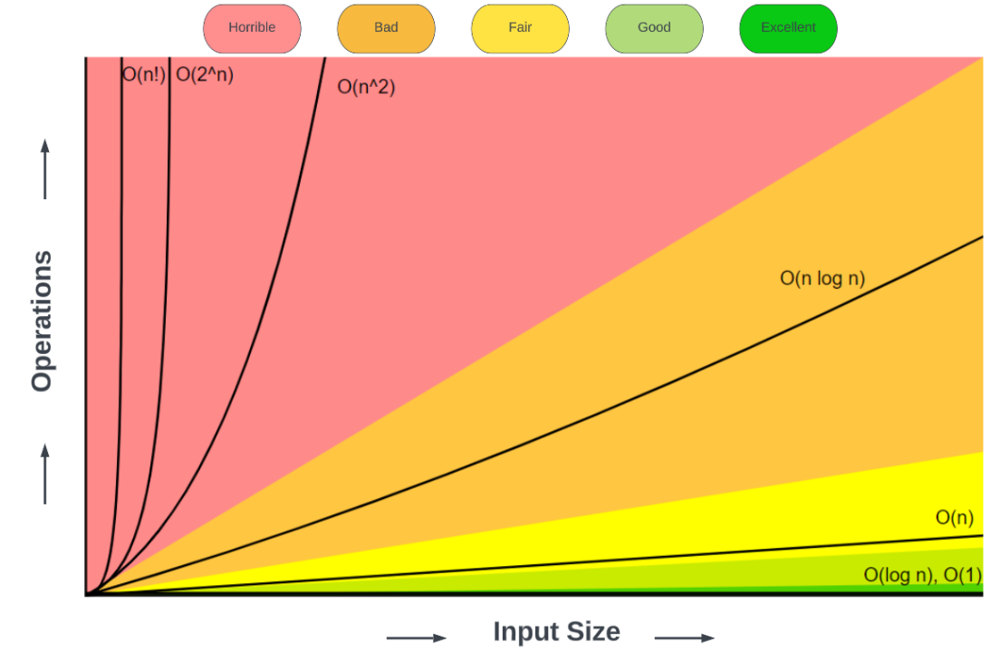
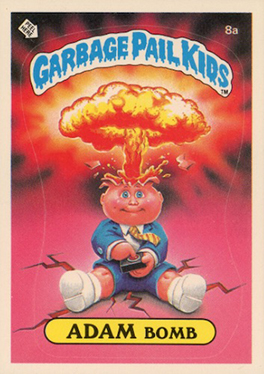

```{=html}
<script src="https://cdn.jsdelivr.net/npm/chart.js"></script>
<style>
  .plot-button {
    background-color: #2E86C1;
    color: white;
    padding: 10px 20px;
    border: none;
    border-radius: 5px;
    cursor: pointer;
    font-size: 16px;
    margin: 10px 5px;
    transition: background-color 0.3s;
  }
  .plot-button:hover {
    background-color: #1A5490;
  }
  .chart-container {
    position: relative;
    height: 400px;
    width: 80%;
    margin: 20px auto;
  }
  .comparison-container {
    position: relative;
    height: 500px;
    width: 90%;
    margin: 20px auto;
  }
</style>

<script>
function generateComplexityData(type, n, maxValue = null) {
  const data = [];
  for (let i = 1; i <= n; i++) {
    let value;
    switch(type) {
      case 'O(1)':
        value = 1;
        break;
      case 'O(log n)':
        value = Math.log2(i);
        break;
      case 'O(n)':
        value = i;
        break;
      case 'O(n²)':
        value = i * i;
        break;
      case 'O(2ⁿ)':
        // For exponential, calculate only if i is within safe range
        if (i <= 20) {
          value = Math.pow(2, i);
        } else {
          // Stop generating data after 20 for exponential to avoid overflow
          break;
        }
        break;
      default:
        value = i;
    }
    data.push({x: i, y: value});
  }
  return data;
}

function plotComplexity(canvasId, complexityType, color) {
  const ctx = document.getElementById(canvasId);
  if (!ctx) return;
  
  // Destroy existing chart if it exists
  if (window[canvasId + '_chart']) {
    window[canvasId + '_chart'].destroy();
  }
  
  const maxN = complexityType === 'O(2ⁿ)' ? 20 : 100;
  const data = generateComplexityData(complexityType, maxN);
  
  window[canvasId + '_chart'] = new Chart(ctx, {
    type: 'line',
    data: {
      datasets: [{
        label: complexityType,
        data: data,
        borderColor: color,
        backgroundColor: color + '33',
        borderWidth: 3,
        tension: 0.1,
        fill: true
      }]
    },
    options: {
      responsive: true,
      maintainAspectRatio: false,
      scales: {
        x: {
          type: 'linear',
          title: {
            display: true,
            text: 'Input Size (n)',
            font: { size: 16 }
          },
          ticks: { font: { size: 14 } }
        },
        y: {
          type: 'logarithmic',
          title: {
            display: true,
            text: 'Operations',
            font: { size: 16 }
          },
          ticks: { font: { size: 14 } }
        }
      },
      plugins: {
        legend: {
          display: true,
          labels: { font: { size: 16 } }
        },
        title: {
          display: true,
          text: complexityType + ' Complexity Growth',
          font: { size: 20 }
        }
      }
    }
  });
}

function plotAllComplexities(canvasId) {
  const ctx = document.getElementById(canvasId);
  if (!ctx) return;
  
  // Destroy existing chart if it exists
  if (window[canvasId + '_chart']) {
    window[canvasId + '_chart'].destroy();
  }
  
  const maxN = 50; // Common max for better comparison
  
  const complexities = [
    { type: 'O(1)', color: '#27AE60' },
    { type: 'O(log n)', color: '#2E86C1' },
    { type: 'O(n)', color: '#F39C12' },
    { type: 'O(n²)', color: '#E74C3C' },
    { type: 'O(2ⁿ)', color: '#8E44AD' }
  ];
  
  const datasets = complexities.map(comp => ({
    label: comp.type,
    data: generateComplexityData(comp.type, maxN),
    borderColor: comp.color,
    backgroundColor: comp.color + '33',
    borderWidth: 2,
    tension: 0.1,
    fill: false,
    spanGaps: true // Allow gaps in data for O(2ⁿ)
  }));
  
  window[canvasId + '_chart'] = new Chart(ctx, {
    type: 'line',
    data: { datasets: datasets },
    options: {
      responsive: true,
      maintainAspectRatio: false,
      scales: {
        x: {
          type: 'linear',
          title: {
            display: true,
            text: 'Input Size (n)',
            font: { size: 16 }
          },
          ticks: { font: { size: 14 } },
          min: 1,
          max: maxN
        },
        y: {
          type: 'logarithmic',
          title: {
            display: true,
            text: 'Operations (log scale)',
            font: { size: 16 }
          },
          ticks: { font: { size: 14 } }
        }
      },
      plugins: {
        legend: {
          display: true,
          labels: { font: { size: 16 } }
        },
        title: {
          display: true,
          text: 'All Complexity Types Compared',
          font: { size: 22 }
        }
      }
    }
  });
}
</script>
```

# Welcome to Algorithm Complexities! 🚀

<center>
{width=60%}
</center>

## On For Today 🎯

::: {.callout-tip icon="true"}

**Let’s explore Complexity Levels that describe how things scale in real life!!**


Topics covered in today’s discussion:

* 🎪 **O(1)** - The Magic Trick Level
* 🔍 **O(log n)** - The Smart Detective Level  
* 🚶 **O(n)** - The One-by-One Level
* 🐌 **O(n²)** - The Handshake Problem Level
* 💥 **O(2ⁿ)** - The Explosion Level
:::

<center>
{width=30%}
</center>

<!-- ::: {style="color: #2E86C1; font-size: 0.9em; text-align: center; margin-top: 0.5em;"}
🎉 Ready to become complexity detectives? Let's go! 🕵️‍♀️
::: -->


<!-- # What is "Complexity" Anyway? 🤔 -->

## Complexity is All About **How Things Scale** 📈

::: {.callout-note icon="true"}

**Complexity** = How much **more work** do you need when you have **more stuff** to deal with?

**Real-Life Examples:**

* 🍕 **Making dinner for friends:** 2 friends vs 20 friends - how much more work?
* 📚 **Finding a book:** In a small pile vs a huge library - how much longer?
* 🎁 **Gift wrapping:** 5 gifts vs 50 gifts - how much more time?
* 👋 **Meeting everyone at a party:** 10 people vs 100 people - how many more handshakes?
:::

# The Big Question 💭

(One that every programmer will wonder!)

::: {.callout-important icon="true"}
## **When you double the amount of "stuff," what happens to the amount of *work*?**

* Does it stay the same? 
* Double too? 
* Get **way** worse?
* Or explode completely?

**That's what complexity tells us!** 🎯
:::

::: {style="color: #8E44AD; font-size: 1.2em; text-align: center; margin-top: 1em;"}
Let's explore each complexity level! 🚀
:::

## O(1) - The Magic Trick Level ⚡

::: {.callout-tip icon="true"}
## **"No Matter How Much, It Takes the Same Time!"** 🎪

**O(1) means:** Whether you have 1 thing or 1 million things, the task takes exactly the same amount of time!
:::

::: {.callout icon="true"}
**Everyday O(1) Examples:**

🔑 **Using a key to open your door** - Same one turn always!

💡 **Turning on a light switch** - Same flip always!

📱 **Checking the time on your phone** - Always instant!

🏧 **Using your debit card** - Same swipe time always!

:::


## Why O(1) is Amazing ⚡

::: {.callout-tip icon="true"}
## **The Holy Grail of Algorithms!** 🏆

✨ **It's like magic** - the amount of work **never changes**

🎯 **Perfect performance** - always fast, always reliable

🚀 **Every programmer dreams of O(1) solutions!**
:::


::: {.callout icon="False"}
**Real-World O(1) Examples:**

* 🪑 Sitting down in a chair
* 📱 Looking up a contact by name  
* 💳 Checking account balance
* 🎵 Skipping to specific song
* 📦 Grabbing the top item from a stack
:::

---

## O(1) Complexity Visualization 📊

<center>
<button class="plot-button" onclick="plotComplexity('o1Chart', 'O(1)', '#27AE60')">
  Show O(1) Growth Chart 📈
</button>
</center>

<div class="chart-container">
  <canvas id="o1Chart"></canvas>
</div>

## O(log n) - The Smart Detective Level 🕵️

::: {.callout-tip icon="true"}
## **"Cut the Problem in Half, Over and Over!"** 🔍

**O(log n) means:** Each step eliminates half of what's left to search. Super efficient even with huge amounts!
:::

::: {.callout icon="true"}

**Everyday O(log n) Examples:**

🎯 **Guessing a number 1-1000** - Cut problem in half each time, found in ~10 questions max!

📖 **Finding word in dictionary** - Open to middle, go left or right, found in seconds!

🎪 **20 Questions game** - Each question eliminates half the possibilities

🔍 **Phone contact search** - Type "J" → cuts to J names, type "Jo" → even fewer options

🗂️ **Looking for a file in a sorted filing cabinet** - Open to middle, go left or right, found in seconds!
:::

## Why O(log n) is Amazing 🏆

::: {.callout-tip icon="true"}
## **Incredible Scaling Performance!** 📊

**Amazing scaling:**
* 1,000 items → ~10 steps
* 1,000,000 items → ~20 steps  
* 1,000,000,000 items → ~30 steps

🧠 **Smart strategy beats brute force**
:::


::: {.callout icon="true"}
**Used everywhere:**

* 🔍 Google searches
* 🗺️ GPS route finding
* 📱 Phone contact search
:::

## But What's the Catch?

<center>
{width=35%}
</center>

::: {.callout-warning icon="true"}
## **The catch:** You need things **organized first!** 📋
(This might take some time, but once it's done, searching is lightning fast!)
:::

---

## O(log n) Complexity Visualization 📊

<center>
<button class="plot-button" onclick="plotComplexity('ologChart', 'O(log n)', '#2E86C1')">
  Show O(log n) Growth Chart 📈
</button>
</center>

<div class="chart-container">
  <canvas id="ologChart"></canvas>
</div>

## O(n) - The One-by-One Level 🚶

::: {.callout-note icon="true"}
## **"Check Every Single Thing, One by One"** 👀

**O(n) means:** Double the stuff = Double the work. Fair and predictable!
:::

::: {.callout icon="False"}

**Everyday O(n) Examples:**

📚 **Reading every page in a book** - 100 pages = 100 page flips, 200 pages = 200 page flips

🛒 **Counting items in shopping cart** - Must touch each item once, 10 items = 10 counts

🎵 **Listening to playlist** - 50 songs = 50× the time

📝 **Grading test stack** - 30 tests = 30× the work
:::

::: {.callout-important icon="true"}
## **The good news:** O(n) is often the best you can do for many tasks
 - Easy to determine the time necessary for running `n` tasks. You can determine smallest run-time with accuracy!
:::

## Why O(n) is Pretty Good ✅

::: {.callout-note icon="true"}
## **Predictable and Fair!** 📈

✅ **Predictable and fair** - work scales linearly

🎯 **Working at scale** - Doubling the input only doubles the work, not more! 

📈 **Reasonable for most tasks:** O(n) is often the “best possible” complexity, not just a “good” one. Even though it’s not constant time, it’s: *Predictable*, *Scalable*, and *Optimal* for many real-world problems


* Finding highest grade
* Adding up expenses
* Reading all text messages
:::

::: {.callout-warning icon="true"}
## **When it gets slow:** 
Really large amounts of data - but still very manageable for normal use! 🎯
:::

---

## O(n) Complexity Visualization 📊

<center>
<button class="plot-button" onclick="plotComplexity('onChart', 'O(n)', '#F39C12')">
  Show O(n) Growth Chart 📈
</button>
</center>

<div class="chart-container">
  <canvas id="onChart"></canvas>
</div>

## O(n²) - The Handshake Problem Level 🤝

::: {.callout-warning icon="true"}
## **"Everyone Must Meet Everyone Else!"** 😰

**O(n²) means:** When you double the people, you get **four times** the work! This gets crazy fast.
:::

::: {.callout icon="False"}

**Everyday O(n²) Examples:**

🤝 **Party introductions** - 4 people = 6 handshakes, 8 people = 28 handshakes, 16 people = 120 handshakes!

🏆 **Sports tournament** - Everyone plays everyone, gets expensive fast!

👥 **Group photo arrangements** - Every person next to every other, gets overwhelming quickly!

📝 **Comparing all student tests** - Looking for identical answers, 30 students = 435 comparisons!

:::

## Why O(n²) Gets Scary 📈

::: {.callout-warning icon="true"}
## **Explosive Growth!** 💥

📈 **Explosive growth:**

* 10 things → 100 operations
* 100 things → 10,000 operations
* 1,000 things → 1,000,000 operations!

⚠️ **The danger zone** - where apps become unusably slow
:::


::: {.callout icon="False"}
🐌 **Common culprits:**
* Comparing every item to every other
* Nested loops in programming
* Poor algorithm choices
:::

::: {.callout-important icon="true"}
## **When to worry:** Anything over ~1,000 items gets really slow! 🚨
:::

---

## O(n²) Complexity Visualization 📊

<center>
<button class="plot-button" onclick="plotComplexity('on2Chart', 'O(n²)', '#E74C3C')">
  Show O(n²) Growth Chart 📈
</button>
</center>

<div class="chart-container">
  <canvas id="on2Chart"></canvas>
</div>

## O(2ⁿ) - The Explosion Level 💥

::: {.callout-important icon="true"}
## **"Every Choice Doubles Your Problems!"** 🤯

**O(2ⁿ) means:** Add just one more thing, and you **double** all the work! This explodes instantly.
:::

::: {.callout icon="False"}

**Everyday O(2ⁿ) Examples:**

🧬 **Family tree exploration** - 2 parents → 4 grandparents → 8 great-grandparents → 16 great-great-grandparents

<!-- 🍕 **Pizza topping combinations** - 1 topping = 2 choices, 10 toppings = 1,024 combinations! -->

🔐 **Password cracking** - Each digit doubles possibilities, 10-digit PIN = 1+ billion combos!

🎁 **Gift wrapping combinations** - Each gift: wrapped or not, 20 gifts = 1+ million combinations!

:::

## Why O(2ⁿ) is Terrifying 💀

::: {.callout-important icon="true"}
## **Grows Impossibly Fast!** 🚨

💀 **Grows impossibly fast:**

* 10 things → 1,024 operations
* 20 things → 1,048,576 operations  
* 30 things → 1,073,741,824 operations!

🚫 **Usually unusable** for anything but *tiny* problems
:::

::: {.callout icon="False"}

⏰ **Real-world impact:**

* Why cryptography works (good!)
* Why some problems are "impossible" (bad!)
:::


::: {.callout-warning icon="true"}
## **Bottom line:** Avoid at all costs unless you have < 20 items! ⚠️
:::

---

## O(2ⁿ) Complexity Visualization 📊

<center>
<button class="plot-button" onclick="plotComplexity('o2nChart', 'O(2ⁿ)', '#8E44AD')">
  Show O(2ⁿ) Growth Chart 📈
</button>
</center>

<div class="chart-container">
  <canvas id="o2nChart"></canvas>
</div>

## The Complexity Race Table 🏃‍♀️💨

::: {.callout icon="true"}

Let's see what happens when we have 1,000 things to process.
:::

<!-- ::: {.callout icon="false"} -->
| Complexity | Name | Steps Needed | Real-World Feeling |
|------------|------|--------------|-------------------|
| **O(1)** | Magic Trick | **1 step** | ⚡ Instant! |
| **O(log n)** | Smart Detective | **~10 steps** | 🏃 Super fast! |
| **O(n)** | One-by-One | **1,000 steps** | 🚶 Takes a moment |
| **O(n²)** | Handshake Problem | **1,000,000 steps** | 🐌 Ugh, so slow... |
| **O(2ⁿ)** | Explosion | **2¹⁰⁰⁰ steps** | 💀 Heat death of universe |
<!-- ::: -->

---

## Complexity Analysis can Blow Your Mind! 🤯
<center>
{width=40%}
</center>

# The Big Takeaway 🎯

::: {.callout-important icon="true"}
## **Small differences in complexity = HUGE differences in real-world performance!**

This is why choosing the right approach matters so much in programming! 🚀
:::

::: {style="color: #8E44AD; font-size: 1.2em; text-align: center; margin-top: 1em;"}
Ready for your challenge? Let's become complexity detectives! 🕵️‍♂️
:::

---

## 📊 Complete Complexity Comparison

<!-- ::: {.callout icon="true"} -->
<!-- **See All Complexities Side-by-Side!** 🏁 -->

<!-- Click the button below to visualize and compare types of complexity. -->
<!-- ::: -->

<center>
<button class="plot-button" onclick="plotAllComplexities('comparisonChart')">
  Show All Complexities Compared 🚀
</button>
</center>

<div class="comparison-container">
  <canvas id="comparisonChart"></canvas>
</div>

---

## Key Observations from the Complexity Comparison! 📈

<center>
{width=55%}
</center>

::: {.callout icon="true"}

* 🟢 **O(1)** stays perfectly flat
* 🔵 **O(log n)** grows very slowly  
* 🟠 **O(n)** grows steadily
* 🔴 **O(n²)** accelerates quickly
* 🟣 **O(2ⁿ)** explodes exponentially
:::

---

## Challenge: Guess the Complexity Level! 🏗 


| Task | Complexity | Justification|
|------------|------|---|
| 🧑‍🍳 Cooking a meal for 4 people| ? | ?|
| 📚 Finding a word in a dictionary| ? | ?|
| 🧬 Exploring family tree generations| ? |?|
| 🧑‍🤝‍🧑 Introducing everyone at a party| ? |?|
| 🔍 Searching for a name in your phone contacts| ? |?|
| 🎁 Figuring out gift wrapping combinations for 10 gifts| ? |?|
| 📖 Reading every page in a book| ? |?|

:::{.callout-important icon="true"}

<!-- 🧑‍🍳 Cooking a meal for 4 people → O(n)
n = number of people (or portions)
You typically scale ingredients and prep roughly linearly with servings.

📚 Finding a word in a dictionary → O(log n) (if using a sorted dictionary)
n = number of words
Like binary search: you repeatedly halve the search space.
If unsorted, it would degrade to O(n).

🧬 Exploring family tree generations → O(2ⁿ) (exponential)
n = number of generations
Each generation roughly doubles (2 parents, 4 grandparents, etc.).

🧑‍🤝‍🧑 Introducing everyone at a party → O(n²)
n = number of people
If everyone is introduced to everyone else, you get pairwise interactions.

🔍 Searching for a name in your phone contacts → O(n) (typical case)
n = number of contacts
Linear scan if unsorted.
Could be O(log n) if perfectly sorted and searched efficiently.

🎁 Figuring out gift wrapping combinations for 10 gifts → O(n!) (factorial)
n = number of gifts
If considering all possible orderings or combinations of wrapping, this grows extremely fast.

📖 Reading every page in a book → O(n)
n = number of pages
You process each page once. -->

The below tasks are all over the place! Define the tasks according to complexity: easiest (O(1)) to hardest (O(2ⁿ)). Work in groups to justify your choices! Be prepared to share with the class! 🚀
:::

<!-- # Questions for Detective Work! 🕵️

::: {.callout icon="True"}

**🤔 Questions to Ask Yourself:**

* What happens when I double the input?
* Do I compare everything to everything?
* Can I organize data for faster searching?
* Am I exploring all combinations?
:::

**🎯 Pro Tip:** 
Look for efficient patterns in your daily life!

::: {style="color: #2E86C1; font-size: 0.9em; text-align: center; margin-top: 0.5em;"}
🎉 Let's see what amazing complexity examples you can find! 🚀
::: -->

---

# Detection of the Daily Complexity 🕵️‍♂️

::: {.callout-note icon="true"}
## **Now You're Ready for the Challenges!** 🎯

You've learned the 5 complexity levels. Time to become **complexity detectives** and find examples from your own life! Work in groups to come up with a real world task (that you complete!) for each complexity level. Be prepared to share your findings with the class! 🚀

:::

**Remember the Levels!** 📋

::: {.callout icon="True"}

**The 5 Complexity Levels:**

* ⚡ **O(1)** - Magic Trick (always same time)
* 🔍 **O(log n)** - Smart Detective (cut in half) 
* 🚶 **O(n)** - One-by-One (check everything)
* 🤝 **O(n²)** - Handshake Problem (everyone meets)
* 💥 **O(2ⁿ)** - Explosion (choices double work)

:::

<!-- 
More ideas, maybe for later...

1. Washing dishes → O(n)
Why: You typically wash each dish once.
n = number of dishes
More dishes = proportionally more time.
1. Folding laundry → O(n)
Why: Each clothing item is handled individually.
n = number of clothes
Straight linear scaling.
1. Finding a matching sock → O(n²) (worst case)
Why: If socks are unpaired, you might compare each sock with every other sock.
n = number of socks
Especially bad if they’re all mixed up.
1. Looking for keys in a messy room → O(n)
Why: You may need to check each possible location once.
n = number of possible places
Could be faster if you’re lucky, but worst-case is linear.
1. Sorting a pile of mail → O(n log n) (if you organize it)
Why: If you sort mail (by date, priority, etc.), it resembles efficient sorting algorithms like merge sort.
n = number of letters
More efficient than comparing everything to everything. -->


## Solutions: Arrange Tasks by Complexity Level 🏗 

| Task | Complexity | Estimated Steps Needed |
|------------|------|--------------|
| 🧑‍🍳 Cooking a meal for 4 people| O(n) | n = number of people (or portions) |
| 📚 Finding a word in a dictionary| O(log n) | n = number of words |
| 🧬 Exploring family tree generations| O(2ⁿ) | n = number of generations |
| 🧑‍🤝‍🧑 Introducing everyone at a party| O(n²) | n = number of people |
| 🔍 Searching for a name in your phone contacts| O(n) | n = number of contacts |
| 🎁 Figuring out gift wrapping combinations for 10 gifts| O(n!) | n = number of gifts |
| 📖 Reading every page in a book| O(n)| n = number of pages |

:::{.callout-important icon="true"}

Listed according by easiest (O(1)) to hardest (O(2ⁿ))
:::

---

## Justifications of Complexity Levels 🕵️‍♂️


::: {.columns}
::: {.column}


🧑‍🍳 **Cooking a meal for 4 people → O(n)**

n = number of people (or portions)
You typically scale ingredients and prep roughly linearly with servings.

📚 **Finding a word in a dictionary → O(log n) (if using a sorted dictionary)**

n = number of words
Like binary search: you repeatedly halve the search space.
If unsorted, it would degrade to O(n).

🧬 **Exploring family tree generations → O(2ⁿ) (exponential)**

n = number of generations
Each generation roughly doubles (2 parents, 4 grandparents, etc.).


🧑‍🤝‍🧑 **Introducing everyone at a party → O(n²)**
n = number of people
If everyone is introduced to everyone else, you get pairwise interactions.

:::
::: {.column}
🔍 **Searching for a name in your phone contacts → O(n) (typical case)**

n = number of contacts
Linear scan if unsorted.
Could be O(log n) if perfectly sorted and searched efficiently.

🎁 **Figuring out gift wrapping combinations for 10 gifts → O(n!) (factorial)**

n = number of gifts
If considering all possible orderings or combinations of wrapping, this grows extremely fast.

📖 **Reading every page in a book → O(n)**

n = number of pages
You process each page once.


:::
:::

<!-- end columns -->

