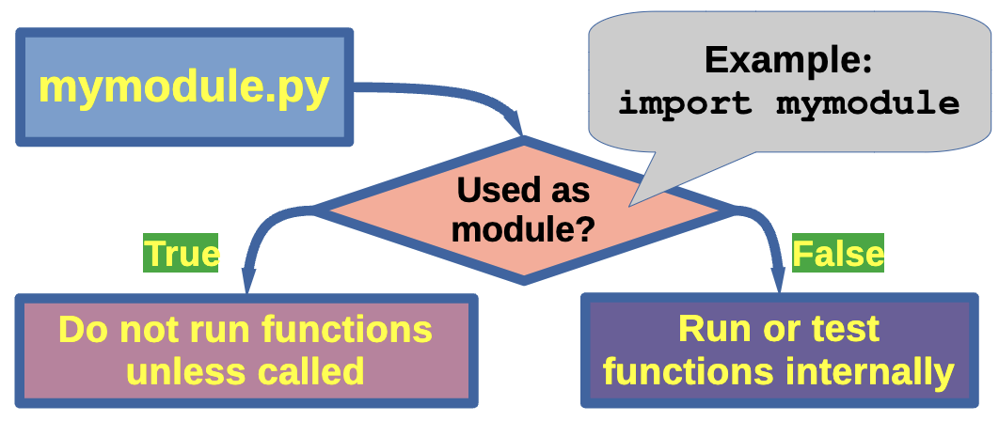

# On For Today

::: {.callout-tip icon="true"}
## Let's explore Python modules and libraries!
**Topics covered in today's discussion:**

* 📦 **What are Modules?** — Organizing code into reusable components
* 🔧 **Creating Your Own Modules** — Writing and structuring custom modules
* 📥 **Importing Modules** — Different ways to use modules in your code
<!-- * 🎯 **Module Best Practices** — Writing clean, maintainable modules -->
* 📚 **Python Libraries** — Exploring the ecosystem of useful libraries
* 🚀 **Practical Examples** — Building real modules from scratch
* 💡 **Project Ideas** — Math utilities, text processing, and more
* 🏆 **Challenge Problems & Solutions** — Practice what you've learned!
:::

<center>
{width=40%}
</center>

---

## Why Modules Matter

::: {.callout-important icon="false"}
**Real-World Applications**

Every significant program is built from modules:

* 🔄 **Code Reuse** — Write once, use everywhere
* 🗂️ **Organization** — Keep related functions together
* 🤝 **Collaboration** — Share code across projects and teams
* 🧪 **Testing** — Easier to test smaller, focused modules
* 📖 **Maintainability** — Simpler to update and debug
* 🌐 **Libraries** — Access thousands of pre-built solutions
:::

::: {.callout-note}
**The Big Idea:** Modules are the building blocks of professional Python code. They transform scattered functions into organized, shareable tools that power everything from data science to web development!
:::

---

# Part 1: Understanding Modules

::: {.callout-note icon="false"}
## What Is a Module?
A **module** is simply a Python file containing definitions and statements.

* One `.py` file = One module
* Contains functions, classes, and variables
* Can be imported and used by other programs
* Helps organize code logically
:::

::: {style="color: #8E44AD;"}
**Key Insight:** Think of modules like toolboxes 🧰. Each toolbox (module) contains related tools (functions) that you can grab whenever you need them, instead of carrying everything around all the time!
:::

---

## Built-in Modules vs. Your Own Modules

:::: {.columns}
::: {.column width="50%"}
**Built-in Modules**

Python comes with many ready-to-use modules:

```python
import math
import random
import datetime
import os
import sys
import matplotlib
import numpy
import pandas
import pandas as pd
import matplotlib.pyplot as plt
from wordcloud import WordCloud
from textblob import TextBlob
import nltk
from collections import Counter
```

* We have already worked with some of these!
* Already installed with Python
* Well-tested and documented
* Cover common tasks

:::

::: {.column width="50%"}
**Your Own Modules**

You can create custom modules:

```python
# my_utilities.py
def greet(name):
    return f"Hello, {name}!"

def calculate_tip(bill, percent):
    return bill * (percent / 100)

def is_prime(n):
    if n <= 1:
        return False
    for i in range(2, int(n**0.5) + 1):
        if n % i == 0:
            return False
    return True
```

* Tailored to your needs
* Reusable across projects
* Easy to share with others
:::
::::

---


## Build Your Own Modules!

<center>

{width=60%}

</center>

<!-- ::: {.callout-important icon="false"} -->

**But what if you need your own functionality?**

But what if you need **custom functionality** that is not already in the standard library? That is where creating your own modules comes in! You can write your own code, organize it into modules, and use it just like any built-in module. Share them with the world! 🌍

<!-- ::: -->
---

# Part 2: Creating Your First Module

<!-- ::: {.callout-important icon="false"} -->
## Step 1: Create a Python File
Create a file named `mathtools.py`:

```python
"""
mathtools.py - A module for useful math operations.

This module provides functions for common mathematical calculations.
"""

def square(x):
    """Return the square of x."""
    return x ** 2

def cube(x):
    """Return the cube of x."""
    return x ** 3

def is_even(n):
    """Check if a number is even."""
    return n % 2 == 0

def factorial(n):
    """Calculate the factorial of n."""
    if n <= 1:
        return 1
    return n * factorial(n - 1)
```
<!-- ::: -->

::: {style="color: #27AE60;"}
**Best Practice:** Always include a docstring at the top of your module and for each function! 📝
:::

---

## Step 2: Using Your Module

<!-- ::: {.callout-important icon="false"} -->

**Create a Program That Imports Your Module**

Create `test_mathtools.py` in the **same directory**:

```python
import mathtools

# Use the functions from your module
print(mathtools.square(5))        # Output: 25
print(mathtools.cube(3))          # Output: 27
print(mathtools.is_even(10))      # Output: True
print(mathtools.factorial(5))     # Output: 120
```
<!-- ::: -->

::: {style="color: #27AE60;"}
**How it works:**

* `import mathtools` loads your module
* Access functions using `modulename.functionname`
* The module file must be in the same directory (or on Python's path)

:::

---

## Different Ways to Import

*How to import depends on your programming needs!*

<!-- ::: {.callout-important icon="false"} -->
**Import Variations**

**1. Import the entire module:**
```python
import mathtools
result = mathtools.square(5)
```

**2. Import specific functions:**
```python
from mathtools import square, cube
result = square(5)  # No prefix needed!
```

**3. Import everything (use sparingly!):**
```python
from mathtools import *
result = is_even(10)  # All functions available directly
```

**4. Import with an alias:**
```python
import mathtools as mt
result = mt.square(5)
```
<!-- ::: -->

---

## Import Best Practices

::: {.callout-warning icon="false"}
## Choose the Right Import Style

**✅ Good:**

Bring in only what you need and be clear about where code comes from.

```python
import mathtools                    # This is the module where functions come from
from mathtools import square, cube  # Explicit about what functions you are using
import mathtools as mt              # Short alias (abbreviations) for long module names
```

**❌ Avoid:**

Maybe you do not need to bring in **everything** from a module...

```python
from mathtools import *  # Unclear what functions are available
                         # Can cause naming conflicts
```
:::

::: {.callout-tip icon="false"}
**Rule of Thumb:**

- Use `import module` when using many functions from that module
- Use `from module import function` when using only a few specific functions
- Avoid `import *` in production code (okay for quick experiments)
:::

---

# Part 3: Module Structure and Organization

<!-- ::: {.callout-note icon="false"} -->
## Anatomy of a Well-Structured Module

```python

"""
Module docstring: Brief description of what this module does.

More detailed information can go here, including:
- Main features
- Usage examples
- Author information
"""

# Imports (if your module needs other modules)
import math
import random

# Constants (uppercase by convention)
PI = 3.14159
MAX_VALUE = 100

# Functions
def function_one():
    """Docstring for function_one."""
    print("This is function_one.")
    

def function_two():
    """Docstring for function_two."""
    print("This is function_two.")


# Classes (if needed)
class MyClass:
    """Docstring for MyClass."""
    def __init__(self, value):
        self.value = value

    def method_one(self):
        """Docstring for method_one."""
        print(f"Value is: {self.value}")


# Testing code (only runs when module is executed directly (not imported))
# However, if you import this module, the code below will NOT run, which is great for testing your module!
if __name__ == "__main__":
    # Call your functions here
    print("Running module tests...")
    function_one()
    function_two()
    my_instance = MyClass(42)
    my_instance.method_one()    
```
<!-- ::: -->

::: {.callout-note style="color: rgb(93, 39, 174);"}
👍 Keep your code readable for everyone! 👍
:::

---

## The Magic `__name__` Variable (mymodule.py)

**Understanding** `if __name__ == "__main__":`

<!-- ::: {.callout-important icon="false"} -->

```python
# mymodule.py

def greet(name):
    return f"Hello, {name}!"

def farewell(name):
    return f"Goodbye, {name}!"

# This code only runs if the file is executed directly
if __name__ == "__main__":
    print("Testing the module...")
    print(greet("Alice"))
    print(farewell("Bob"))
```

<!-- ::: -->

::: {style="color: #27AE60;"}
**Best Practice:** Having an `if __name__ == "__main__":` block allows a single Python file to act as a reusable library and a standalone script at the same time. The block prevents top-level code from running unintentionally, ensuring only necessary functions are run when used as an imported module. ✨
:::


## The Magic `__name__` Variable (An import and a direct run)

::: {.callout-important icon="false"}

**When you run:** `python mymodule.py`

- `__name__` equals `"__main__"`
- The test code runs

**When you import:** `import mymodule`

- `__name__` equals `"mymodule"`
- The test code **doesn't** run
:::

::: {.callout-tip style="color: #033819;"} 
The `if __name__ == "__main__":` block allows a single Python file to act as a reusable library and a standalone script at the same time. You can include test code or example usage in this block, which will only run when the file is executed directly, not when it is imported as a module. ✨
::: 

---

## Module Structure Best Practices


<center>
{width=60%}

</center>

::: {style="color: #27AE60;"}
**Best Practice:** Having an `if __name__ == "__main__":` block allows a single Python file to act as a reusable library and a standalone script at the same time. The block prevents top-level code from running unintentionally, ensuring only necessary functions are run when used as an imported module. ✨
:::


## Light Challenge 1 — Temperature Converter Module

::: {.callout-warning icon="false"}
## Quick Practice!

Create a module called `temperature.py` with functions to convert between Celsius and Fahrenheit.

**Requirements:**

- Function `celsius_to_fahrenheit(c)` — converts Celsius to Fahrenheit
- Function `fahrenheit_to_celsius(f)` — converts Fahrenheit to Celsius
- Include docstrings
- Add test code in `if __name__ == "__main__":`

**Formulas:**

- F = (C × 9/5) + 32
- C = (F - 32) × 5/9

```python
# Your code here
```
:::

---

## Light Challenge 1 — Solution

<!-- ::: {.callout-important icon="false"} -->
**Solution**

Create a program `temperature.py` as the module.

```python
"""
temperature.py - Temperature conversion utilities.

Provides functions to convert between Celsius and Fahrenheit.
"""

def celsius_to_fahrenheit(celsius):
    """Convert Celsius to Fahrenheit.
    
    Args:
        celsius: Temperature in Celsius
        
    Returns:
        Temperature in Fahrenheit
    """
    return (celsius * 9/5) + 32

def fahrenheit_to_celsius(fahrenheit):
    """Convert Fahrenheit to Celsius.
    
    Args:
        fahrenheit: Temperature in Fahrenheit
        
    Returns:
        Temperature in Celsius
    """
    return (fahrenheit - 32) * 5/9

if __name__ == "__main__":
    # Test the functions
    print("Testing temperature conversions...")
    print(f"0°C = {celsius_to_fahrenheit(0)}°F")
    print(f"32°F = {fahrenheit_to_celsius(32)}°C")
    print(f"100°C = {celsius_to_fahrenheit(100)}°F")
    print(f"212°F = {fahrenheit_to_celsius(212)}°C")
```
<!-- ::: -->

---

## Light Challenge 1 — Solution (Part 2)

<!-- ::: {.callout-important icon="false"} -->

**Using Your Temperature Module**

Now create a program `weather.py` to call your module.

```python
import temperature

# Convert various temperatures
temps_c = [0, 20, 37, 100]
temps_f = [32, 68, 98.6, 212]

print("Celsius to Fahrenheit:")
for temp in temps_c:
    f_temp = temperature.celsius_to_fahrenheit(temp)
    print(f"{temp}°C = {f_temp:.1f}°F")


print("\nFahrenheit to Celsius:")
for temp in temps_f:
    c_temp = temperature.fahrenheit_to_celsius(temp)
    print(f"{temp}°F = {c_temp:.1f}°C")

```

<!-- ::: -->

## Light Challenge 1 — Solution (Part 3)
**Output:**

```text
Celsius to Fahrenheit:
0°C = 32.0°F
20°C = 68.0°F
37°C = 98.6°F
100°C = 212.0°F

Fahrenheit to Celsius:
32°F = 0.0°C
68°F = 20.0°C
98.6°F = 37.0°C
212°F = 100.0°C
```

## Your Turn -- Your Own Module


<center>

{width=40%}

</center>

::: {.callout-info icon="false"}

Your turn to invent a simple module and use it in a program! Use the code on the next page to get started, or create your own from scratch. Be creative! You can make a module for anything you like — math, text processing, games, utilities, etc. The possibilities are endless! 🚀

:::

---

## Your Turn -- Your Own Module (Some starter code!)

::: {.callout-important}
Below is some starter code for a Fibonacci numbers module. You can use this as a base to create your own module, or write something completely different! Your mission is to use this code to create a module called `fibonacci.py` and then import it into a separate program to test it out.
:::

```python 
# Two functions to handle Fibonacci numbers

def fib(n):
    """Write Fibonacci series up to n."""
    a, b = 0, 1
    while a < n:
        print(a, end=' ')
        a, b = b, a+b
    print()

def fib2(n):
    """Return Fibonacci series up to n."""
    result = []
    a, b = 0, 1
    while a < n:
        result.append(a)
        a, b = b, a+b
    return result

if __name__ == "__main__":
    # Test the functions
    print("Testing Fibonacci functions...")

```

<!-- ```python
    fib(100)  # Print Fibonacci numbers less than 100
    print(fib2(100))  # Get Fibonacci numbers less than 100 as a list
``` -->

::: {style="color: #27AE60;"}

Use this code or write your own!! Experiment and create something fun! Remember to include docstrings for *future you*. Use the `if __name__ == "__main__":` block to test your module as stand alone and direct run.  🎉

:::

---

# Part 4: Exploring Python Libraries

::: {.callout-note icon="false"}
## What's the Difference?

**Module:** A single Python file with code you can import

**Package:** A directory containing multiple modules (plus an `__init__.py` file)

**Library:** A collection of packages and modules (broader term)

**In practice:** These terms are often used interchangeably!
:::

---

## The Python Standard Library 1

<!-- ::: {.callout-important icon="false"} -->

**Batteries Included!** 🔋

Python comes with a rich **standard library** — no installation needed:

:::: {.columns}

::: {.column width="50%"}
**Math and Numbers:**

- `math` — Mathematical functions
- `random` — Random number generation
- `statistics` — Statistical functions
- `decimal` — Precise decimal arithmetic

**Text Processing:**

- `re` — Regular expressions
- `string` — String operations
- `textwrap` — Text formatting


:::

::: {.column width="50%"}
**Date and Time:**

- `datetime` — Dates and times
- `time` — Time functions
- `calendar` — Calendar operations

**File and Data:**

- `os` — Operating system interface
- `pathlib` — Object-oriented paths
- `json` — JSON encoding/decoding
- `csv` — CSV file reading/writing

:::

::::

<!-- ::: -->


## Using Standard Library Modules


We have seen some of these modules before, but let's explore a few more!

::: {.callout-important icon="false"}
## Example 1: Random Module

```python
import random

# Generate random numbers
print(random.randint(1, 10))        # Random integer from 1 to 10
print(random.random())              # Random float from 0.0 to 1.0
print(random.uniform(1.5, 10.5))    # Random float from 1.5 to 10.5

# Choose from a list
colors = ["red", "blue", "green", "yellow"]
print(random.choice(colors))        # Pick one random color

# Shuffle a list
numbers = [1, 2, 3, 4, 5]
random.shuffle(numbers)
print(numbers)                      # List is shuffled in-place

# Sample without replacement
print(random.sample(colors, 2))     # Pick 2 different colors
```

**Use cases:**
- Games (dice rolls, card shuffling)
- Simulations
- Random sampling
- Password generation
:::

---

## Using Standard Library Modules

<!-- ::: {.callout-important icon="false"} -->
**Example 2: Datetime Module**

```python
from datetime import datetime, timedelta

# Current date and time
now = datetime.now()
print(f"Current time: {now}")
print(f"Year: {now.year}, Month: {now.month}, Day: {now.day}")

# Format dates nicely
print(now.strftime("%B %d, %Y"))           # March 28, 2026
print(now.strftime("%m/%d/%Y %I:%M %p"))   # 03/28/2026 02:30 PM

# Date arithmetic
tomorrow = now + timedelta(days=1)
next_week = now + timedelta(weeks=1)
print(f"Tomorrow: {tomorrow.strftime('%A, %B %d')}")
print(f"Next week: {next_week.strftime('%A, %B %d')}")

# Calculate differences
birthday = datetime(2026, 10, 31)
days_until = (birthday - now).days
print(f"Days until Halloween: {days_until}")
```

<!-- ::: -->

::: {.callout-tip icon="false" style="color: #8E44AD;"}
**Use cases:**

- Timestamps for logs
- Time tracking
:::

---

## Using Standard Library Modules

<!-- ::: {.callout-important icon="false"} -->
**Example 3: OS Module**

```python
import os

# Get current working directory
print(f"Current directory: {os.getcwd()}")

# List files in a directory
print("Files in current directory:")
for file in os.listdir('.'):
    print(f"  - {file}")

# Check if file/directory exists
if os.path.exists("data.txt"):
    print("data.txt exists!")
else:
    print("data.txt not found")

# Get file information
if os.path.exists("myfile.txt"):
    size = os.path.getsize("myfile.txt")
    print(f"File size: {size} bytes")

# Create a directory
if not os.path.exists("new_folder"):
    os.mkdir("new_folder")
    print("Created new_folder")

# Get environment variables
user = os.getenv("USER") or os.getenv("USERNAME")
print(f"Current user: {user}")
```
<!-- ::: -->

---

# Project 1 — String Utilities Module

<!-- ::: {.callout-important icon="false"} -->
## Building Text Processing Tools

**Create `stringtools.py`:**
```python
"""
stringtools.py - Useful string manipulation functions.

A collection of functions for common text processing tasks.
"""

def count_vowels(text):
    """Count the number of vowels in a string."""
    vowels = "aeiouAEIOU"
    return sum(1 for char in text if char in vowels)

def reverse_words(text):
    """Reverse the order of words in a string."""
    words = text.split()
    return " ".join(reversed(words))

def is_palindrome(text):
    """Check if a string is a palindrome (ignoring spaces and case)."""
    cleaned = "".join(text.lower().split())
    return cleaned == cleaned[::-1]

def title_case_smart(text):
    """Convert to title case, but keep small words lowercase."""
    small_words = {"a", "an", "the", "and", "but", "or", "for", "nor", "on", "at", "to", "by"}
    words = text.lower().split()
    result = []
    
    for i, word in enumerate(words):
        if i == 0 or word not in small_words:
            result.append(word.capitalize())
        else:
            result.append(word)
    
    return " ".join(result)
```
<!-- ::: -->

---

## Project 1 — String Utilities Module (Part 2)

<!-- ::: {.callout-important icon="false"} -->
**More String Functions to Add to `stringtools.py`, as necessary**

::: {.callout-important icon="false"}
Some of these functions include removing duplicate words, censoring bad words, and creating acronyms. Feel free to add your own functions as well!
:::

```python
def remove_duplicates(text):
    """Remove duplicate words while preserving order."""
    words = text.split()
    seen = set()
    result = []
    
    for word in words:
        if word.lower() not in seen:
            result.append(word)
            seen.add(word.lower())
    
    return " ".join(result)

def censor_words(text, bad_words):
    """Replace bad words with asterisks. Bring in the bad_words list from an external file or define it in your module."""
    words = text.split()
    censored = []
    
    for word in words:
        if word.lower() in [bw.lower() for bw in bad_words]:
            censored.append("*" * len(word))
        else:
            censored.append(word)
    
    return " ".join(censored)

def acronym(text):
    """Create an acronym from a phrase."""
    words = text.split()
    return "".join(word[0].upper() for word in words if word)

if __name__ == "__main__":
    print("Testing stringtools module...")
    print(f"Vowels in 'Hello World': {count_vowels('Hello World')}")
    print(f"Reverse: {reverse_words('Hello World')}")
    print(f"Is 'racecar' a palindrome? {is_palindrome('racecar')}")
    print(f"Title case: {title_case_smart('the lord of the rings')}")
    print(f"Acronym 'Portable Network Graphics': {acronym('Portable Network Graphics')}")
```
<!-- ::: -->

---

## Project 1 — Using String Utilities

<!-- ::: {.callout-important icon="false"} -->
**Practical Application: `stringtools_app.py`**

```python
import stringtools # bring in your stringtools module

# Analyze text
text = "The quick brown fox jumps over the lazy dog"

print("Text Analysis")
print("=" * 50)
print(f"Original: {text}")
print(f"Vowel count: {stringtools.count_vowels(text)}")
print(f"Reversed words: {stringtools.reverse_words(text)}")
print(f"Is palindrome: {stringtools.is_palindrome(text)}")
print(f"Smart title: {stringtools.title_case_smart(text.lower())}")

# Test palindromes
palindromes = ["racecar", "A man a plan a canal Panama", "hello"]
print("\nPalindrome Testing:")
for p in palindromes:
    result = "✓" if stringtools.is_palindrome(p) else "✗"
    print(f"{result} '{p}'")

# Create acronyms
phrases = [
    "Portable Network Graphics",
    "HyperText Markup Language",
    "Light Amplification by Stimulated Emission of Radiation"
]
print("\nAcronyms:")
for phrase in phrases:
    print(f"{phrase} → {stringtools.acronym(phrase)}")
```
<!-- ::: -->


---
## You Now Know How To ...

::: {.callout-note icon="false"}

✅ Create your own Python modules

✅ Import and use modules in different ways

✅ Structure modules with docstrings and best practices

✅ Use the `if __name__ == "__main__":` pattern

✅ Explore and use Python's standard library

✅ Build reusable code libraries

✅ Validate and sanitize user input

✅ Organize code for maintainability and reuse

:::

::: {.callout-important icon="true"}
**Keep building!** Modules are the foundation of professional Python development. 🚀
:::
