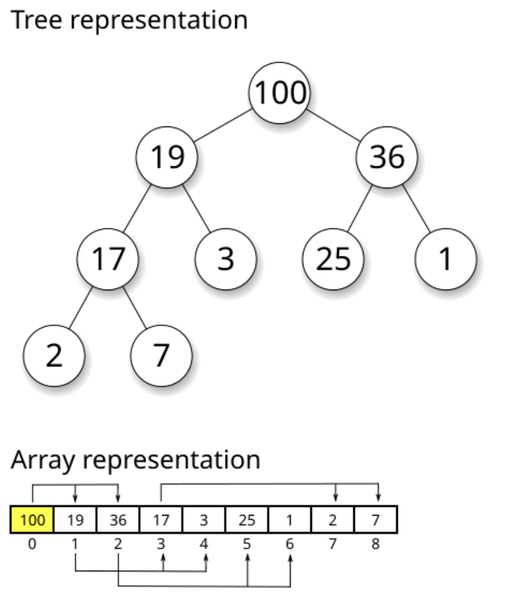

# On For Today

::: {.callout-tip icon="true"}
## Let's explore algorithm complexity!
**Topics covered in today's discussion:**

* ⚡ **O(1) - Constant Time** — Lightning-fast operations that never slow down
* 🔍 **O(log n) - Logarithmic Time** — Divide and conquer excellence
* 🏥 **Heap-Based Structures** — Smart priority management
* 💥 **O(2^n) - Exponential Time** — The recursive explosion
* 🗺️ **Travelling Salesman Problem** — Real-world optimization challenges
* 📊 **Performance Comparison** — Understanding when to use each approach
:::

<center>
{width=40%}
</center>

---

## Why Algorithm Complexity Matters

::: {.callout-important icon="false"}
**Real-World Impact**

Understanding algorithm complexity helps you:

* ⚡ **Build Faster Software** — Choose the right algorithm for the job
* 💰 **Save Money** — Efficient code means lower server costs
* 🌍 **Scale Applications** — Handle millions of users smoothly
* 🔋 **Reduce Energy Usage** — Green computing through efficiency
* 🎯 **Make Smart Trade-offs** — Balance speed, memory, and complexity
:::

::: {.callout-note}
**The Big Idea:** Small algorithmic choices can mean the difference between a program that runs in seconds versus one that takes years. Let's explore how different complexity classes affect real-world performance!
:::

---

# Part 1: O(1) - Constant Time

::: {.callout-note icon="false"}
## The Speed Champion ⚡
**O(1)** means the algorithm takes the **same amount of time** regardless of input size!
:::

::: {style="color: #8E44AD;"}
**Key Insight:** Think of O(1) operations like light switches 💡. Whether you have 1 light or 1000 lights in your house, each switch always takes the same time to flip!
:::

---

## What is O(1) - Constant Time?

::: {.callout-tip icon="true"}
## The Superpower of Algorithms ⚡

**O(1)** means the algorithm takes the **same amount of time** no matter how much data you give it!

**Real-World Analogy**: 
* Like a **valet parking service** - you hand over your ticket and get your car back instantly
* Whether there are 10 cars or 10,000 cars in the lot, it takes the same time!
* The valet has a **direct system** to find your exact car

:::

::: {.columns}
::: {.column}
**Performance Guarantee** 📊

* 10 items → 1 step
* 100 items → 1 step  
* 1,000,000 items → 1 step
* Same speed **forever**!

:::

::: {.column}
**Key Insight** 🔑

The algorithm has a **"shortcut"** that goes directly to the answer without checking other data!

**Magic Question**:

*"Can I get the answer without looking at most of the data?"*
:::
:::

---

## What Makes O(1) So Fast?

::: {.callout-blue icon="false"}
The Secret Ingredients 🎯

O(1) algorithms use **smart data organization** and **direct access patterns**

:::

::: {.columns}
::: {.column}
**Hash Tables (Dictionaries/Sets)**

```python
# Python dictionary (hash table) uses a hash function
# to map keys to memory locations for O(1) access
student_grades = {
    "Alice": 95,
    "Bob": 87,
    "Charlie": 92
}

# Hash function calculates EXACTLY where 
# "Alice" is stored in memory
# No searching required - direct jump to the value!
grade = student_grades["Alice"]  # O(1)!
```

**How it works:**

1. Hash function: `"Alice"` → memory location 147
2. Go directly to location 147
3. Get the value (95)
4. Done! No searching needed!
:::

::: {.column}
**Array Indexing**

```python
# Arrays store data in consecutive memory locations
# This allows direct access via index calculation
scores = [95, 87, 92, 78, 85]
#         0   1   2   3   4  (indices)

# Computer calculates memory address using formula:
# Address = base_address + (index × element_size)
# This mathematical calculation is O(1)!
first_score = scores[0]    # O(1) - instant access
third_score = scores[2]    # O(1) - instant access
```

**Mathematical Magic:**

* Memory address = Base + (2 × 4 bytes)
* Jump straight to the answer!
* No need to check other elements
:::
:::

---

## Interactive O(1) Dictionary Demo

::: {.callout-note icon="true"}
## See O(1) in Action! 🎮

Try looking up different students' grades. Notice how it's always instant!

:::

```{=html}
<div id="o1-demo" style="text-align: center; margin: 20px 0;">
    <h3>Student Grade Lookup - O(1) Dictionary Access</h3>
    <div style="margin: 15px 0;">
        <select id="student-select" style="padding: 8px; margin: 5px; border: 1px solid #ccc; border-radius: 4px; min-width: 180px;">
            <option value="">Choose a student...</option>
            <option value="Alice">Alice</option>
            <option value="Bob">Bob</option>
            <option value="Charlie">Charlie</option>
            <option value="Diana">Diana</option>
            <option value="Eve">Eve</option>
            <option value="Frank">Frank</option>
            <option value="Grace">Grace</option>
            <option value="Henry">Henry</option>
        </select>
        <button id="lookup-btn" style="padding: 8px 20px; margin: 5px; background: #27AE60; color: white; border: none; border-radius: 4px;">Look Up Grade</button>
        <button id="add-student-btn" style="padding: 8px 20px; margin: 5px; background: #3498DB; color: white; border: none; border-radius: 4px;">Add New Student</button>
        <button id="reset-demo-btn" style="padding: 8px 20px; margin: 5px; background: #95A5A6; color: white; border: none; border-radius: 4px;">Reset</button>
    </div>
    <div id="hash-visualization" style="height: 200px; border: 2px solid #eee; border-radius: 8px; position: relative; overflow: hidden;">
        <canvas id="hash-canvas" width="800" height="180" style="border: none;"></canvas>
    </div>
    <div id="lookup-info" style="margin: 10px 0; font-family: monospace; font-size: 14px;">
        <div>Hash Table Size: <span id="table-size">8</span> slots</div>
        <div>Operations: <span id="operation-count">0</span></div>
        <div>Result: <span id="lookup-result">Ready to lookup grades!</span></div>
    </div>
    <div style="margin: 10px 0;">
        <input type="text" id="new-student-name" placeholder="Student name" style="padding: 8px; margin: 5px; border: 1px solid #ccc; border-radius: 4px;">
        <input type="number" id="new-student-grade" placeholder="Grade (0-100)" min="0" max="100" style="padding: 8px; margin: 5px; border: 1px solid #ccc; border-radius: 4px;">
    </div>
</div>
```

---

## Mini Challenge: O(1) Operations

::: {.callout-tip icon="true"}
## Practice O(1) Thinking! 🧑‍💻

Try these exercises to understand constant time operations:

:::

::: {.columns}
::: {.column}
**Challenge 1: Phone Book**
```python
# Create your own phone book using a dictionary
# Dictionaries provide O(1) lookup time
phone_book = {}

# Add contacts - each insertion is O(1)
phone_book["Mom"] = "555-0123"
phone_book["Pizza"] = "555-PIZZA"
phone_book["Friend"] = "555-9999"

# Look up numbers instantly - O(1) access
print(phone_book["Mom"])

# YOUR TASK: Add 5 contacts 
# and time the lookups!
import time  # Import time module for benchmarking
start = time.time()  # Record start time
# Add your lookups here
result = phone_book["Mom"]  # O(1) lookup
end = time.time()  # Record end time
print(f"Time: {end-start}s")  # Display elapsed time
```
:::

::: {.column}
**Challenge 2: Class Enrollment**
```python
# Check which classes a student is in using sets
# Sets provide O(1) membership testing ("in" operator)
math_class = {"Alice", "Bob"}
science_class = {"Bob", "Diana"}
history_class = {"Alice", "Eve"}

student = "Alice"  # Student to check
enrolled = []  # List to store enrolled classes

# O(1) membership checking with sets!
# Each "in" check is constant time
if student in math_class:
    enrolled.append("Math")
if student in science_class:
    enrolled.append("Science")  
if student in history_class:
    enrolled.append("History")

print(f"{student}: {enrolled}")

# YOUR TASK: Check all students
# Notice how fast it is even with many classes!
```
:::
:::

---

## Bonus: O(1) Fibonacci with Binet's Formula! 

::: {.callout-tip icon="true"}
## The Mathematical Shortcut ✨

Believe it or not, you can calculate **any** Fibonacci number in **O(1)** time using pure mathematics!

:::

::: {.columns}
::: {.column}
**Binet's Formula**

Instead of recursion or iteration, use this closed-form mathematical formula:

$$F(n) = \frac{\varphi^n - \psi^n}{\sqrt{5}}$$

Where:

* $\varphi = \frac{1 + \sqrt{5}}{2} \approx 1.618$ (golden ratio)
* $\psi = \frac{1 - \sqrt{5}}{2} \approx -0.618$

**Complexity:** O(1) - constant time! 🚀

* Just pure math calculation: No loops, No recursion
* Later, we will see that there are other ways to calculate sequences which take *much* more time with complexity O(2^n), so this is a huge improvement!

:::

::: {.column}
**Python Implementation**

```python
import math  # Need sqrt and pow functions

def fibonacci_binet(n):
    """
    Calculate nth Fibonacci number using Binet's formula - O(1)!
    
    This is a closed-form mathematical solution that computes
    the result directly without any loops or recursion.
    Time Complexity: O(1) - constant time
    """
    # Calculate the golden ratio (phi)
    sqrt_5 = math.sqrt(5)
    phi = (1 + sqrt_5) / 2  # ≈ 1.618 (golden ratio)
    psi = (1 - sqrt_5) / 2  # ≈ -0.618
    
    # Apply Binet's formula
    # F(n) = (φ^n - ψ^n) / √5
    fib_n = (phi**n - psi**n) / sqrt_5
    
    # Round to nearest integer (handles floating-point precision)
    return round(fib_n)

# Test it out!
print("First 15 Fibonacci numbers using O(1) formula:")
for i in range(15):
    print(f"F({i}) = {fibonacci_binet(i)}")

# Direct calculation - instant even for large n!
print(f"\nF(50) = {fibonacci_binet(50):,}")
print(f"F(100) = {fibonacci_binet(100):,}")

# Compare speeds
import time
start = time.perf_counter()
result = fibonacci_binet(1000)
elapsed = time.perf_counter() - start
print(f"\nF(1000) calculated in {elapsed*1000000:.2f} microseconds!")
```

**Trade-off:** Works great for most values, but floating-point precision limits accuracy for very large n (typically n > 70).
:::
:::

---

# Part 2: O(log n) - Logarithmic Time

::: {.callout-note icon="false"}
## The Smart Divider 🧠
**O(log n)** means the algorithm **halves the problem** with each step!
:::

::: {style="color: #8E44AD;"}
**Key Insight:** Like playing "20 Questions" - each question eliminates half the possibilities. Guess a number from 1-1000? Only takes ~10 guesses!
:::

---

## What is O(log n) - Logarithmic Time?

::: {.callout-tip icon="true"}
## The Smart Problem Solver 🧠

**O(log n)** means the algorithm **halves the problem** with each step!

**Real-World Analogy**: 

* Like playing **"20 Questions"** - each answer eliminates half
* Guessing a number from 1-1000? "Is it > 500?" cuts it in half!
* **32 billion items** → Only **32 steps** maximum!

:::

::: {.columns}
::: {.column}
**Incredible Scaling** 📊

* 1,000 items → ~10 steps
* 1,000,000 items → ~20 steps  
* 1,000,000,000 items → ~30 steps
* **Mind-blowing efficiency!**

:::

::: {.column}
**Key Insight** 🔑

Algorithm **eliminates half** the possibilities each step.

**Magic Question**: 

*"Can I eliminate half the data without checking it?"*

If yes → Achieve O(log n)!
:::
:::

---

## Binary Search - The Classic O(log n)

::: {.columns}
::: {.column}
**How Binary Search Works**

```python
def binary_search(arr, target):
    """Search for target in sorted array using binary search - O(log n)"""
    left = 0  # Start of search range
    right = len(arr) - 1  # End of search range
    
    # Continue searching while range is valid
    while left <= right:
        # Find middle index (integer division)
        mid = (left + right) // 2
        
        # Check if we found the target
        if arr[mid] == target:
            return mid  # Found! Return the index
        # Target is in the right half
        elif arr[mid] < target:
            left = mid + 1  # Eliminate left half
        # Target is in the left half
        else:
            right = mid - 1  # Eliminate right half
    
    return -1  # Not found in array

# Find 7 in sorted list
numbers = [1,3,5,7,9,11,13,15]
position = binary_search(numbers, 7)
print(f"Found at index {position}")
```

**Why O(log n)?**

Each step cuts the search space in half!
:::

::: {.column}
**Step-by-Step Example**

Search for 7 in `[1,3,5,7,9,11,13,15]`:

1. Check middle (index 3): 7 == 7 ✓
2. **Found in 1 step!**

Search for 13:

1. Check mid (7): 13 > 7, go right
2. Check mid (11): 13 > 11, go right  
3. Check mid (13): 13 == 13 ✓
4. **Found in 3 steps!**

With 8 items, max 3 steps (log₂ 8 = 3)
With 1000 items, max 10 steps!
:::
:::

---

## Interactive Binary Search Demo

::: {.callout-note icon="true"}
## Watch O(log n) in Action! 🎮

See how binary search eliminates half the data with each step!

:::

```{=html}
<div id="binary-search-demo" style="text-align: center; margin: 20px 0;">
    <h3>Binary Search Visualizer - O(log n) Divide and Conquer</h3>
    <div style="margin: 15px 0;">
        <select id="target-number" style="padding: 8px; margin: 5px; border: 1px solid #ccc; border-radius: 4px;">
            <option value="">Choose number to find...</option>
            <option value="2">Search for 2</option>
            <option value="12">Search for 12</option>
            <option value="25">Search for 25</option>
            <option value="47">Search for 47</option>
            <option value="63">Search for 63</option>
            <option value="78">Search for 78</option>
            <option value="89">Search for 89</option>
        </select>
        <button id="start-binary-search" style="padding: 8px 20px; margin: 5px; background: #27AE60; color: white; border: none; border-radius: 4px;">Start Search</button>
        <button id="binary-speed-btn" style="padding: 8px 20px; margin: 5px; background: #F39C12; color: white; border: none; border-radius: 4px;">Speed: Normal</button>
        <button id="reset-binary-btn" style="padding: 8px 20px; margin: 5px; background: #95A5A6; color: white; border: none; border-radius: 4px;">Reset</button>
    </div>
    <div style="border: 2px solid #eee; border-radius: 8px; margin: 10px 0;">
        <canvas id="binary-canvas" width="800" height="200" style="border: none;"></canvas>
    </div>
    <div id="binary-info" style="margin: 10px 0; font-family: monospace; font-size: 14px;">
        <div>Steps Taken: <span id="binary-steps">0</span></div>
        <div>Comparisons: <span id="binary-comparisons">0</span></div>
        <div>Remaining Items: <span id="remaining-items">14</span></div>
        <div>Status: <span id="binary-status">Ready to search!</span></div>
    </div>
</div>
```

---

## Mini Challenge: Binary Search Practice

::: {.callout-tip icon="true"}
## Experience O(log n) Power! 🧑‍💻

:::

::: {.columns}
::: {.column}
**Challenge 1: Search Race**

<!-- first try. this code is not great since it can crash if the target is not found, but it gets the point across. 
```python
import time
import random

# Create test data
size = 100000
data = sorted([random.randint(1, 1000000) 
               for _ in range(size)])
target = data[size // 2]

# Linear search O(n)
start = time.time()
for i, val in enumerate(data):
    if val == target:
        linear_pos = i
        break
linear_time = time.time() - start

# Binary search O(log n)
def binary_search(arr, t):
    left, right = 0, len(arr)-1
    while left <= right:
        mid = (left + right) // 2
        if arr[mid] == t:
            return mid
        elif arr[mid] < t:
            left = mid + 1
        else:
            right = mid - 1
    return -1

start = time.time()
binary_pos = binary_search(data, target)
binary_time = time.time() - start

print(f"Linear: {linear_time:.6f}s")
print(f"Binary: {binary_time:.6f}s")
print(f"Binary is {linear_time/binary_time:.0f}x faster!")
``` -->

```python
import time      # Used to measure how long code takes to run
import random    # Used to generate random numbers and pick random targets

# Create a large sorted dataset
size = 100000
# Generate random numbers, then sort them (required for binary search)
data = sorted(random.randint(1, 1000000) for _ in range(size))

# ---------------------------
# Linear Search (O(n))
# ---------------------------
def linear_search(arr, t):
    # Go through each element one by one
    for i, val in enumerate(arr):
        # If we find the target, return its index
        if val == t:
            return i
    # If not found, return -1
    return -1

# ---------------------------
# Binary Search (O(log n))
# ---------------------------
def binary_search(arr, t):
    # Start with the full range of the list
    left, right = 0, len(arr)-1
    
    # Keep searching while the range is valid
    while left <= right:
        # Find the middle index
        mid = (left + right) // 2
        
        # If middle element is the target, return it
        if arr[mid] == t:
            return mid
        
        # If target is larger, ignore the left half
        elif arr[mid] < t:
            left = mid + 1
        
        # If target is smaller, ignore the right half
        else:
            right = mid - 1
    
    # If not found, return -1
    return -1

# ---------------------------
# Benchmarking section
# ---------------------------

# Number of times we repeat the test (for more accurate results)
trials = 100

# Variables to store total time for each algorithm
linear_total = 0
binary_total = 0

# Run the experiment multiple times
for _ in range(trials):
    
    # Pick a random value from the list to search for
    target = random.choice(data)

    # ---- Time linear search ----
    start = time.perf_counter()        # Start timer
    linear_search(data, target)        # Run search
    linear_total += time.perf_counter() - start  # Add elapsed time

    # ---- Time binary search ----
    start = time.perf_counter()        # Start timer
    binary_search(data, target)        # Run search
    binary_total += time.perf_counter() - start  # Add elapsed time

# ---------------------------
# Results
# ---------------------------

# Compute and print average time per search
print(f"Linear avg: {linear_total/trials:.8f}s")
print(f"Binary avg: {binary_total/trials:.8f}s")

# Show how many times faster binary search is
print(f"Binary is {linear_total/binary_total:.1f}x faster")
```

:::

::: {.column}
**Challenge 2: Heap Priority Queue**

<!-- no comments. while this takes up less space, no comments makes the code confusing
```python
import heapq

# Emergency room triage
emergency_room = []

# Add patients (priority, name)
# Lower number = higher priority
patients = [
    (1, "Heart Attack"),
    (5, "Broken Arm"),
    (2, "Severe Bleeding"),
    (8, "Checkup"),
    (3, "Chest Pain"),
]

for priority, condition in patients:
    heapq.heappush(emergency_room, 
                   (priority, condition))
    print(f"Added: {condition}")

print("\nTreating by priority:")
while emergency_room:
    priority, condition = heapq.heappop(
        emergency_room)
    print(f"{condition} (P{priority})")

# Each operation: O(log n)!
``` -->

```python
import heapq  # Provides heap (priority queue) functions

# This list will store our heap (priority queue)
# Python uses a min-heap by default
emergency_room = []

# Add patients as (priority, name)
# Lower number = higher priority (1 is most urgent)
patients = [
    (1, "Heart Attack"),
    (5, "Broken Arm"),
    (2, "Severe Bleeding"),
    (8, "Checkup"),
    (3, "Chest Pain"),
]

# ---------------------------
# Adding patients to the heap
# ---------------------------
for priority, condition in patients:
    # Push each patient into the heap
    # heapq automatically keeps the smallest priority at the front
    heapq.heappush(emergency_room, (priority, condition))
    
    # Print confirmation of addition
    print(f"Added: {condition}")

# ---------------------------
# Treating patients by priority
# ---------------------------
print("\nTreating by priority:")

# Continue until no patients remain
while emergency_room:
    # Remove and return the patient with the highest priority
    # (i.e., the smallest number)
    priority, condition = heapq.heappop(emergency_room)
    
    # Print which patient is being treated
    print(f"{condition} (P{priority})")

# Each push/pop operation takes O(log n) time
# because the heap reorganizes itself after each change
```
:::
:::

---

# Part 3: Heap-Based Priority Queues

::: {.callout-note icon="false"}
## Smart Organization for Fast Access 🏥
Heaps maintain **partial ordering** for **O(log n)** operations!
:::

---

## What Are Heaps?

:::: {.columns}

::: {.column}
  ## The Smart Organizer 🏥

  **Heaps** maintain priority order with **O(log n)** efficiency!

  **Real-World Analogy**:

  * Like **hospital triage** - critical patients first
  * Don't need perfect sorting, just quick access to highest priority
  * Add/remove patients in log(n) time!

:::

::: {.column}
  
  {width=90%}

Wikipedia: [https://en.wikipedia.org/wiki/Heap_%28data_structure%29](https://en.wikipedia.org/wiki/Heap_%28data_structure%29)
:::
::::
<!-- end columns -->

---

## Interactive Heap Operations Demo

::: {.callout-note icon="true"}
## Watch Heap Operations in Action! 🎮

See how heaps maintain order with O(log n) insertion and removal!

:::

```{=html}
<div id="heap-demo" style="text-align: center; margin: 20px 0;">
    <h3>Min-Heap Visualizer - O(log n) Operations</h3>
    <div style="margin: 15px 0;">
        <input type="number" id="heap-value-input" placeholder="Enter value" min="1" max="99" style="padding: 8px; margin: 5px; border: 1px solid #ccc; border-radius: 4px; width: 120px;">
        <button id="heap-push-btn" style="padding: 8px 20px; margin: 5px; background: #27AE60; color: white; border: none; border-radius: 4px;">Push (Insert)</button>
        <button id="heap-pop-btn" style="padding: 8px 20px; margin: 5px; background: #E74C3C; color: white; border: none; border-radius: 4px;">Pop (Remove Min)</button>
        <button id="heap-random-btn" style="padding: 8px 20px; margin: 5px; background: #3498DB; color: white; border: none; border-radius: 4px;">Add Random</button>
        <button id="heap-reset-btn" style="padding: 8px 20px; margin: 5px; background: #95A5A6; color: white; border: none; border-radius: 4px;">Reset</button>
    </div>
    
    <div style="border: 2px solid #eee; border-radius: 8px; margin: 10px 0; background: linear-gradient(135deg, #f5f7fa 0%, #c3cfe2 100%);">
        <canvas id="heap-canvas" width="800" height="750" style="border: none;"></canvas>
    </div>
    <div id="heap-info" style="margin: 10px 0; font-family: monospace; font-size: 14px; background: #f8f9fa; padding: 15px; border-radius: 8px;">
        <div><strong>Heap Size:</strong> <span id="heap-size">0</span> elements</div>
        <div><strong>Tree Height:</strong> <span id="heap-height">0</span> (log₂ of size)</div>
        <div><strong>Operations Count:</strong> <span id="heap-operations">0</span> steps in last operation</div>
        <div><strong>Status:</strong> <span id="heap-status">Ready to build a heap!</span></div>
        <div style="margin-top: 8px; color: #666;"><strong>Array Representation:</strong> <span id="heap-array">[]</span></div>
    </div>
</div>

<script>
/**
 * Interactive Min-Heap Visualizer
 * Demonstrates O(log n) insertion and removal operations
 */
class HeapVisualizer {
    constructor(canvasId) {
        this.canvas = document.getElementById(canvasId);
        if (!this.canvas) return;
        
        this.ctx = this.canvas.getContext('2d');
        this.heap = [];
        this.operationSteps = 0;
        this.animating = false;
        this.highlightedNodes = new Set();
        this.swapAnimation = null;
        
        // Visual settings
        this.nodeRadius = 22;
        this.levelHeight = 70;
        this.nodeColor = '#E3F2FD';
        this.highlightColor = '#FFA726';
        this.minColor = '#4CAF50';
        
        this.setupEventListeners();
        this.draw();
    }
    
    setupEventListeners() {
        const pushBtn = document.getElementById('heap-push-btn');
        const popBtn = document.getElementById('heap-pop-btn');
        const randomBtn = document.getElementById('heap-random-btn');
        const resetBtn = document.getElementById('heap-reset-btn');
        const input = document.getElementById('heap-value-input');
        
        if (pushBtn) pushBtn.addEventListener('click', () => this.pushValue());
        if (popBtn) popBtn.addEventListener('click', () => this.popValue());
        if (randomBtn) randomBtn.addEventListener('click', () => this.addRandom());
        if (resetBtn) resetBtn.addEventListener('click', () => this.reset());
        if (input) input.addEventListener('keypress', (e) => {
            if (e.key === 'Enter') this.pushValue();
        });
    }
    
    // Heap operations
    pushValue() {
        const input = document.getElementById('heap-value-input');
        if (!input || !input.value) {
            this.updateStatus('Please enter a value!');
            return;
        }
        
        const value = parseInt(input.value);
        if (isNaN(value) || value < 1 || value > 99) {
            this.updateStatus('Please enter a number between 1 and 99');
            return;
        }
        
        if (this.heap.length >= 15) {
            this.updateStatus('Heap is full! (max 15 elements for visualization)');
            return;
        }
        
        this.heap.push(value);
        this.operationSteps = this.bubbleUp(this.heap.length - 1);
        this.updateStatus(`Inserted ${value} with ${this.operationSteps} steps (O(log n))`);
        this.updateInfo();
        this.draw();
        
        input.value = '';
    }
    
    popValue() {
        if (this.heap.length === 0) {
            this.updateStatus('Heap is empty!');
            return;
        }
        
        const minValue = this.heap[0];
        
        // Move last element to root
        this.heap[0] = this.heap[this.heap.length - 1];
        this.heap.pop();
        
        // Bubble down from root
        if (this.heap.length > 0) {
            this.operationSteps = this.bubbleDown(0);
        } else {
            this.operationSteps = 1;
        }
        
        this.updateStatus(`Removed ${minValue} (minimum) with ${this.operationSteps} steps (O(log n))`);
        this.updateInfo();
        this.draw();
    }
    
    addRandom() {
        const value = Math.floor(Math.random() * 99) + 1;
        const input = document.getElementById('heap-value-input');
        if (input) {
            input.value = value;
            this.pushValue();
        }
    }
    
    reset() {
        this.heap = [];
        this.operationSteps = 0;
        this.highlightedNodes.clear();
        this.updateStatus('Heap reset! Add values to build a new heap.');
        this.updateInfo();
        this.draw();
    }
    
    // Heap algorithms
    bubbleUp(index) {
        let steps = 0;
        let current = index;
        
        while (current > 0) {
            const parentIndex = Math.floor((current - 1) / 2);
            steps++;
            
            if (this.heap[current] < this.heap[parentIndex]) {
                // Swap with parent
                [this.heap[current], this.heap[parentIndex]] = 
                [this.heap[parentIndex], this.heap[current]];
                current = parentIndex;
            } else {
                break;
            }
        }
        
        return steps;
    }
    
    bubbleDown(index) {
        let steps = 0;
        let current = index;
        const length = this.heap.length;
        
        while (true) {
            const leftChild = 2 * current + 1;
            const rightChild = 2 * current + 2;
            let smallest = current;
            steps++;
            
            if (leftChild < length && this.heap[leftChild] < this.heap[smallest]) {
                smallest = leftChild;
            }
            
            if (rightChild < length && this.heap[rightChild] < this.heap[smallest]) {
                smallest = rightChild;
            }
            
            if (smallest !== current) {
                [this.heap[current], this.heap[smallest]] = 
                [this.heap[smallest], this.heap[current]];
                current = smallest;
            } else {
                break;
            }
        }
        
        return steps;
    }
    
    // Drawing functions
    draw() {
        this.ctx.clearRect(0, 0, this.canvas.width, this.canvas.height);
        
        if (this.heap.length === 0) {
            this.drawEmptyState();
            return;
        }
        
        this.drawTitle();
        this.drawTree();
        this.drawLegend();
    }
    
    drawTitle() {
        this.ctx.fillStyle = '#333';
        this.ctx.font = 'bold 14px Arial';
        this.ctx.textAlign = 'center';
        this.ctx.fillText('MIN-HEAP TREE STRUCTURE', this.canvas.width / 2, 20);
    }
    
    drawEmptyState() {
        this.ctx.fillStyle = '#666';
        this.ctx.font = '14px Arial';
        this.ctx.textAlign = 'center';
        this.ctx.fillText('Add values to see the heap structure!', this.canvas.width / 2, this.canvas.height / 2);
        this.ctx.fillText('Minimum element always at the root (top)', this.canvas.width / 2, this.canvas.height / 2 + 25);
    }
    
    drawTree() {
        const startY = 50;
        const startX = this.canvas.width / 2;
        
        // Draw connections first
        for (let i = 0; i < this.heap.length; i++) {
            const leftChild = 2 * i + 1;
            const rightChild = 2 * i + 2;
            
            if (leftChild < this.heap.length) {
                this.drawConnection(i, leftChild, startX, startY);
            }
            if (rightChild < this.heap.length) {
                this.drawConnection(i, rightChild, startX, startY);
            }
        }
        
        // Draw nodes
        for (let i = 0; i < this.heap.length; i++) {
            const pos = this.getNodePosition(i, startX, startY);
            this.drawNode(pos.x, pos.y, this.heap[i], i);
        }
    }
    
    getNodePosition(index, startX, startY) {
        const level = Math.floor(Math.log2(index + 1));
        const levelStart = Math.pow(2, level) - 1;
        const positionInLevel = index - levelStart;
        const nodesInLevel = Math.pow(2, level);
        
        const levelWidth = Math.min(700, this.canvas.width - 100);
        const spacing = levelWidth / (nodesInLevel + 1);
        
        const x = startX - levelWidth / 2 + spacing * (positionInLevel + 1);
        const y = startY + level * this.levelHeight;
        
        return { x, y };
    }
    
    drawConnection(parentIndex, childIndex, startX, startY) {
        const parentPos = this.getNodePosition(parentIndex, startX, startY);
        const childPos = this.getNodePosition(childIndex, startX, startY);
        
        this.ctx.strokeStyle = '#666';
        this.ctx.lineWidth = 2;
        this.ctx.beginPath();
        this.ctx.moveTo(parentPos.x, parentPos.y + this.nodeRadius);
        this.ctx.lineTo(childPos.x, childPos.y - this.nodeRadius);
        this.ctx.stroke();
    }
    
    drawNode(x, y, value, index) {
        // Determine node color
        let fillColor = this.nodeColor;
        if (index === 0) {
            fillColor = this.minColor; // Root is always minimum
        }
        
        // Draw circle
        this.ctx.fillStyle = fillColor;
        this.ctx.beginPath();
        this.ctx.arc(x, y, this.nodeRadius, 0, 2 * Math.PI);
        this.ctx.fill();
        
        // Draw border
        this.ctx.strokeStyle = '#333';
        this.ctx.lineWidth = 2;
        this.ctx.stroke();
        
        // Draw value
        this.ctx.fillStyle = index === 0 ? 'white' : '#333';
        this.ctx.font = 'bold 16px Arial';
        this.ctx.textAlign = 'center';
        this.ctx.textBaseline = 'middle';
        this.ctx.fillText(value.toString(), x, y);
        
        // Draw index below node
        this.ctx.fillStyle = '#666';
        this.ctx.font = '10px Arial';
        this.ctx.fillText(`[${index}]`, x, y + this.nodeRadius + 12);
    }
    
    drawLegend() {
        const legendY = this.canvas.height - 15;
        this.ctx.font = '11px Arial';
        this.ctx.textAlign = 'left';
        
        // Min element (root)
        this.ctx.fillStyle = this.minColor;
        this.ctx.fillRect(20, legendY - 10, 15, 15);
        this.ctx.fillStyle = '#333';
        this.ctx.fillText('Minimum (root)', 40, legendY);
        
        // Regular node
        this.ctx.fillStyle = this.nodeColor;
        this.ctx.fillRect(160, legendY - 10, 15, 15);
        this.ctx.strokeStyle = '#333';
        this.ctx.strokeRect(160, legendY - 10, 15, 15);
        this.ctx.fillStyle = '#333';
        this.ctx.fillText('Other nodes', 180, legendY);
        
        // Heap property explanation
        this.ctx.fillStyle = '#666';
        this.ctx.font = 'italic 11px Arial';
        this.ctx.textAlign = 'right';
        this.ctx.fillText('Min-Heap Property: Parent ≤ Children', this.canvas.width - 20, legendY);
    }
    
    updateInfo() {
        const sizeEl = document.getElementById('heap-size');
        const heightEl = document.getElementById('heap-height');
        const opsEl = document.getElementById('heap-operations');
        const arrayEl = document.getElementById('heap-array');
        
        if (sizeEl) sizeEl.textContent = this.heap.length;
        if (heightEl) {
            const height = this.heap.length > 0 ? Math.floor(Math.log2(this.heap.length)) + 1 : 0;
            heightEl.textContent = height;
        }
        if (opsEl) opsEl.textContent = this.operationSteps;
        if (arrayEl) arrayEl.textContent = '[' + this.heap.join(', ') + ']';
    }
    
    updateStatus(message) {
        const statusEl = document.getElementById('heap-status');
        if (statusEl) statusEl.textContent = message;
    }
}

// Initialize heap visualizer when DOM is ready
if (document.readyState === 'loading') {
    document.addEventListener('DOMContentLoaded', function() {
        setTimeout(() => {
            if (document.getElementById('heap-canvas')) {
                window.heapViz = new HeapVisualizer('heap-canvas');
            }
        }, 500);
    });
} else {
    setTimeout(() => {
        if (document.getElementById('heap-canvas')) {
            window.heapViz = new HeapVisualizer('heap-canvas');
        }
    }, 500);
}
</script>
```

---

## Code to Demonstrate Heaps?


::: {.columns}
::: {.column}
**Heap Property**

```python
# Min-heap: Parent ≤ Children
#       1
#      / \
#     3   2
#    / \ / \
#   8  5 7  9

# Root always has minimum value
# Height = log₂(n)
```

**Key Benefits:**
* Fast access to min/max: O(1)
* Fast insertion: O(log n)
* Fast removal: O(log n)
:::

::: {.column}
**Python Heap Example**

```python
import heapq  # Python's built-in heap implementation

# Create an empty min-heap
# Min-heap property: parent <= children
heap = []

# Add items - each push is O(log n)
# Heap automatically reorganizes to maintain property
heapq.heappush(heap, 5)
heapq.heappush(heap, 2)
heapq.heappush(heap, 8)
heapq.heappush(heap, 1)

print(heap)  # [1, 2, 8, 5] - partially ordered

# Get and remove minimum - O(log n)
# Heap reorganizes after removal
min_val = heapq.heappop(heap)
print(min_val)  # 1 (smallest element always at top)

# Heap automatically maintains order after each operation!
```
:::
:::

---

## When to Use Heaps

::: {.callout-important icon="false"}
**Perfect Use Cases:**

* 🏥 **Priority Queues** - Process items by importance
* 📊 **Finding Top-K Elements** - Get k largest/smallest efficiently
* 🎮 **Event Scheduling** - Handle events in time order
* 🚗 **Route Planning** - Dijkstra's shortest path algorithm
* 📈 **Streaming Data** - Maintain running median/statistics

**Trade-off:** Not fully sorted, just maintains priority relationship
:::

---

# Part 4: O(2^n) - Exponential Time

::: {.callout-note icon="false"}
## The Recursive Monster 💥
**O(2^n)** means time **doubles** with each additional element!
:::

::: {style="color: #E74C3C;"}
**Warning:** Exponential algorithms become impossible very quickly. Even 50 items can take longer than the age of the universe!
:::

---

## What is O(2^n) - Exponential Time?

::: {.callout-warning icon="true"}
## The Recursive Explosion 💥

**O(2^n)** means the algorithm's time **doubles** with each additional input!

**Real-World Analogy**: 
* Like a **chain letter** - each person sends to 2 more
* Day 1: 1 person, Day 2: 2, Day 3: 4...
* **Day 30: Over 1 billion people!**

:::

::: {.columns}
::: {.column}
**Explosive Growth** 🚀

* 10 items → 1,024 operations
* 20 items → 1,048,576 operations  
* 30 items → 1,073,741,824 operations
* **Each +1 item doubles the work!**

:::

::: {.column}
**Key Insight** 🔑

Typically uses **branching recursion** - each call creates multiple recursive calls.

**Danger Signal**: 

*"Does my function call itself multiple times?"*

If yes → Might be O(2^n)!
:::
:::

---

## Naive Fibonacci - Classic O(2^n)

::: {.columns}
::: {.column}
**The Exponential Fibonacci**

```python
def fibonacci(n):
    """Naive recursive Fibonacci - O(2^n) exponential time!"""
    # Base case: fib(0) = 0, fib(1) = 1
    if n <= 1:
        return n
    
    # TWO recursive calls - this creates exponential growth!
    # Each call branches into two more calls
    return fibonacci(n-1) + fibonacci(n-2)

# The explosion:
# fib(5) calls fib(4) and fib(3)
# fib(4) calls fib(3) and fib(2)
# fib(3) is calculated MULTIPLE times! (wasteful redundancy)

print(fibonacci(10))  # Result: 55
# But took ~177 function calls to compute!
# Time complexity: O(2^n) - doubles with each n
```

**Why O(2^n)?**
* Each call creates 2 more calls
* Massive redundant computation
* Binary tree of recursion
:::

::: {.column}
**The O(n) Solution**

```python
def fibonacci_fast(n):
    """Iterative Fibonacci - O(n) linear time!"""
    # Base case
    if n <= 1:
        return n
    
    # Iterative approach: O(n)
    # Only stores two previous values
    prev, curr = 0, 1
    # Build up from fib(2) to fib(n)
    for _ in range(2, n + 1):
        prev, curr = curr, prev + curr  # Simultaneous assignment
    return curr

# OR use memoization (caching)
from functools import lru_cache

@lru_cache(maxsize=None)  # Cache all results
def fib_memo(n):
    """Memoized Fibonacci - O(n) with caching"""
    if n <= 1:
        return n
    # Same recursive structure, but results are cached
    return fib_memo(n-1) + fib_memo(n-2)

# Now each fib(k) computed only once!
print(fibonacci_fast(50))  # Instant! No exponential explosion
```
:::
:::

---

## Interactive Fibonacci Demo

::: {.callout-note icon="true"}
## Watch the Exponential Explosion! 🎮

See how naive Fibonacci creates massive redundant calculations!

:::

```{=html}
<div id="exponential-demo" style="text-align: center; margin: 20px 0;">
    <h3>Naive Fibonacci - O(2^n) Recursive Explosion</h3>
    <div style="margin: 30px 0;">
        <select id="fib-number" style="padding: 8px; margin: 5px; border: 1px solid #ccc; border-radius: 4px; font-size: 14px;">
            <option value="3">Fibonacci(3)</option>
            <option value="5">Fibonacci(5)</option>
            <option value="7" selected>Fibonacci(7)</option>
            <option value="9">Fibonacci(9)</option>
            <option value="10">Fibonacci(10) - Slow!</option>
        </select>
        <button id="start-fibonacci" style="padding: 8px 20px; margin: 5px; background: #E74C3C; color: white; border: none; border-radius: 4px;">Calculate Fibonacci</button>
        <button id="show-optimized" style="padding: 8px 20px; margin: 5px; background: #27AE60; color: white; border: none; border-radius: 4px;">Show O(n) Solution</button>
        <button id="reset-fibonacci" style="padding: 8px 20px; margin: 5px; background: #95A5A6; color: white; border: none; border-radius: 4px;">Reset</button>
    </div>
    <div style="border: 2px solid #eee; border-radius: 8px; margin: 10px 0;">
        <canvas id="fib-canvas" width="800" height="300" style="border: none;"></canvas>
    </div>
    <div id="fib-info" style="margin: 10px 0; font-family: monospace; font-size: 14px;">
        <div>Calculating: <span id="current-calculation">Ready to calculate!</span></div>
        <div>Function Calls: <span id="function-calls">0</span> | Depth: <span id="max-depth">0</span> | Result: <span id="fib-result">-</span></div>
        <div>Status: <span id="fibonacci-status">Choose a Fibonacci number to calculate</span></div>
    </div>
</div>
```

---

## Mini Challenge: Optimization Challenge

::: {.callout-tip icon="true"}
## Compare O(2^n) vs O(n)! 🧑‍💻

:::

**Challenge: Fibonacci Performance**

```python
import time  # For timing execution
from functools import lru_cache  # For memoization decorator

# Naive O(2^n) - exponential time complexity
def fib_slow(n):
    """Naive recursive Fibonacci without caching"""
    if n <= 1:
        return n
    # Each call creates 2 more calls - exponential growth!
    return fib_slow(n-1) + fib_slow(n-2)

# Optimized O(n) with memoization (caching)
@lru_cache(maxsize=None)  # Decorator caches all results
def fib_fast(n):
    """Optimized Fibonacci with memoization"""
    if n <= 1:
        return n
    # Same structure, but cached results prevent recalculation
    return fib_fast(n-1) + fib_fast(n-2)

# Test both approaches with different input sizes
test_values = [10, 15, 20, 25, 30]

print("n\tSlow Time\tFast Time\tSpeedup")
for n in test_values:
    # Time slow version (O(2^n))
    start = time.time()
    result_slow = fib_slow(n)
    slow_time = time.time() - start
    
    # Time fast version (O(n))
    fib_fast.cache_clear()  # Clear cache for fair comparison
    start = time.time()
    result_fast = fib_fast(n)
    fast_time = time.time() - start
    
    # Calculate speedup factor
    speedup = slow_time / max(fast_time, 0.000001)  # Avoid division by zero
    print(f"{n}\t{slow_time:.4f}s\t\t{fast_time:.6f}s\t{speedup:.0f}x")
    
    # Stop if slow version takes too long
    if slow_time > 5:
        print("Stopping - exponential version too slow!")
        break

# YOUR TASK: What patterns do you notice?
# How does the speedup change as n increases?
# Notice: speedup grows exponentially!
```

---

# Part 5: Travelling Salesman Problem

::: {.callout-note icon="false"}
## The Ultimate Optimization Challenge 🗺️
Finding the shortest route through all cities!
:::

---

## What is the Travelling Salesman Problem?

::: {.callout-tip icon="true"}
## The Ultimate Route Challenge 🗺️

**The Problem**: Visit every city exactly once and return home using the **shortest possible route**.

**Real-World Applications**: 

* 🚚 **Delivery Services** - UPS saves millions optimizing routes
* 🏭 **Circuit Board Manufacturing** - Drilling holes efficiently
* 🧬 **DNA Sequencing** - Optimal gene arrangements
* 🚌 **School Bus Routes** - Getting kids to school faster

:::

::: {.columns}
::: {.column}
**Why It Matters** 🚚

* Amazon saves fuel and time
* Manufacturing saves money
* Everyone gets faster service
* Reduces carbon emissions

:::

::: {.column}
**The Challenge** ⚡

* 3-4 cities: Easy
* 10 cities: 3,628,800 routes!
* 20 cities: More routes than atoms in universe!
* Optimal solution: O(n!) factorial time

**Key Question**: *How do we find good routes without checking every possibility?*
:::
:::

---

## TSP Complexity: The Factorial Explosion

::: {.callout-important icon="false"}
**For n cities, there are (n-1)!/2 unique routes**

Why? Fix starting city, divide by 2 (clockwise/counterclockwise are same).
:::

::: {.columns}
::: {.column}
**The Numbers**

```python
import math  # For factorial calculation

def tsp_routes(n):
    """Calculate number of unique TSP routes for n cities"""
    if n <= 1:
        return 0
    # Formula: (n-1)! / 2
    # Fix start city, divide by 2 (clockwise = counterclockwise)
    return math.factorial(n-1) // 2

# Watch the factorial explosion!
for n in range(3, 11):
    routes = tsp_routes(n)
    print(f"{n} cities: {routes:,} routes")
    # Notice: each additional city multiplies routes dramatically!
```

Results:

* 3 *cities* → 1 route,  5 *cities* → 12 routes
* 10 *cities* → 181,440 routes,  15 *cities* → 43,589,145,600 routes!
:::

::: {.column}
**Time to Check All Routes**

Assuming 1 microsecond per route:

* 10 cities: 0.18 seconds ✓
* 15 cities: 12 hours ⚠️
* 20 cities: 77 years 🛑
* 25 cities: 490 billion years! 💀

**Reality:** Need smart approximations, not exhaustive search!
:::
:::

---

## Interactive TSP Demo

::: {.callout-note icon="true"}
## Plan Your Route! 🎮

Click on the map to add cities, then find the best route!

:::

```{=html}
<div id="tsp-demo" style="text-align: center; margin: 20px 0;">
    <h3>🗺️ Interactive Travelling Salesman Demo</h3>
    <div style="margin: 15px 0;">
        <button id="add-city-btn" style="padding: 10px 20px; margin: 5px; background: #27AE60; color: white; border: none; border-radius: 4px;">Add Random City</button>
        <button id="solve-tsp-btn" style="padding: 10px 20px; margin: 5px; background: #E74C3C; color: white; border: none; border-radius: 4px;">Find Best Route!</button>
        <button id="reset-tsp-btn" style="padding: 10px 20px; margin: 5px; background: #95A5A6; color: white; border: none; border-radius: 4px;">Reset</button>
        <button id="demo-preset-btn" style="padding: 10px 20px; margin: 5px; background: #3498DB; color: white; border: none; border-radius: 4px;">Load Demo Cities</button>
    </div>
    <div style="border: 2px solid #3498DB; border-radius: 10px; margin: 10px auto; background: linear-gradient(135deg, #f5f7fa 0%, #c3cfe2 100%);">
        <canvas id="tsp-canvas" width="800" height="400" style="border: none; cursor: crosshair;"></canvas>
    </div>
    <div id="tsp-info" style="margin: 15px 0; font-family: monospace; font-size: 14px; background: #f8f9fa; padding: 15px; border-radius: 8px;">
        <div><strong>Cities:</strong> <span id="city-count">0</span></div>
        <div><strong>Possible Routes:</strong> <span id="route-count">0</span></div>
        <div><strong>Best Distance:</strong> <span id="best-distance">-</span></div>
        <div><strong>Computation Time:</strong> <span id="computation-time">-</span></div>
        <div style="color: #E74C3C;"><strong>⚠️ Complexity:</strong> <span id="complexity-warning">Add cities!</span></div>
    </div>
</div>
```

---

## Mini Challenge: TSP Approximations

::: {.callout-tip icon="true"}
## Smart Route Planning! 🧑‍💻

:::

**Challenge: Nearest Neighbor Heuristic**

```python
import random  # For generating random city positions
import math    # For distance calculations

# Generate random cities in a 100x100 grid
def generate_cities(n):
    """Create n cities with random (x, y) coordinates"""
    return [(random.randint(0, 100), 
             random.randint(0, 100)) 
            for _ in range(n)]

# Calculate Euclidean distance between two cities
def distance(city1, city2):
    """Calculate straight-line distance between cities"""
    x1, y1 = city1
    x2, y2 = city2
    # Pythagorean theorem: sqrt((x2-x1)^2 + (y2-y1)^2)
    return math.sqrt((x2-x1)**2 + (y2-y1)**2)

# Nearest neighbor heuristic - O(n²) approximation algorithm
def nearest_neighbor(cities):
    """Greedy TSP approximation: always visit nearest unvisited city"""
    unvisited = cities.copy()  # Copy to avoid modifying original
    route = [unvisited.pop(0)]  # Start at first city
    
    # Continue until all cities visited
    while unvisited:
        current = route[-1]  # Current city is last in route
        # Find nearest unvisited city using min() with key function
        nearest = min(unvisited, 
                      key=lambda c: distance(current, c))
        route.append(nearest)  # Add to route
        unvisited.remove(nearest)  # Mark as visited
    
    # Return to start city to complete the tour
    route.append(route[0])
    return route

# Calculate total distance of a route
def route_distance(route):
    """Sum distances between consecutive cities in route"""
    total = 0
    # Add distance between each pair of consecutive cities
    for i in range(len(route) - 1):
        total += distance(route[i], route[i+1])
    return total

# Test it!
cities = generate_cities(10)  # Create 10 random cities
route = nearest_neighbor(cities)  # Find approximate route
dist = route_distance(route)  # Calculate total distance

print(f"Route distance: {dist:.2f}")
print("Route:", route)

# Not optimal, but fast O(n²) and reasonably good!
# Avoids O(n!) brute force - practical for real-world use
```

---

# Complexity Comparison Summary

::: {.callout-note icon="false"}
## Choosing the Right Algorithm
:::

| Complexity | Name | Example | 10 items | 1000 items | When to Use |
|------------|------|---------|----------|------------|-------------|
| **O(1)** | Constant | Dict lookup | 1 step | 1 step | Direct access possible |
| **O(log n)** | Logarithmic | Binary search | 3 steps | 10 steps | Data is sorted |
| **O(n)** | Linear | Simple search | 10 steps | 1000 steps | Must check each item |
| **O(n log n)** | Log-linear | Merge sort | 33 steps | 10,000 steps | Good general sorting |
| **O(n²)** | Quadratic | Bubble sort | 100 steps | 1,000,000 steps | Small datasets only |
| **O(2^n)** | Exponential | Naive Fibonacci | 1024 steps | Impossible | Avoid if possible! |
| **O(n!)** | Factorial | TSP (brute force) | 3.6M steps | Impossible | Need approximations |

---

## Key Takeaways

::: {.callout-important icon="false"}
**What We Learned Today:**

1. ⚡ **O(1)** - Hash tables give instant access regardless of data size
2. 🔍 **O(log n)** - Binary search and heaps scale beautifully through divide-and-conquer
3. 🏥 **Heaps** - Maintain priority order with O(log n) operations
4. 💥 **O(2^n)** - Exponential algorithms become impossible quickly - use memoization!
5. 🗺️ **TSP** - Real-world problems often require smart approximations, not perfect solutions
6. 📊 **Trade-offs** - Choose algorithms based on data size, structure, and requirements
:::

::: {.callout-tip}
**The Big Picture:** Understanding complexity helps you write efficient code that scales. Small algorithmic choices make huge differences in real-world performance!
:::

---

## Next Steps & Practice

::: {.callout-note icon="false"}
**To Continue Learning About Complexity 🤔:**

* 📚 Study more sorting algorithms (merge sort, quick sort, heap sort)
* 🔬 Analyze algorithms in your own code
* 💻 Practice on coding platforms (LeetCode, HackerRank)
* 🎯 Learn about dynamic programming (turns O(2^n) → O(n))
* 🚀 Explore graph algorithms (Dijkstra, A*, etc.)

**Remember:** The best algorithm depends on your specific problem, data size, and constraints. There's no one-size-fits-all solution!
:::


```{=html}
<script>
// ============================================================================
// COMPREHENSIVE BIG O VISUALIZERS - JavaScript Code
// ============================================================================

/**
 * O(1) Hash Table Visualizer
 * Demonstrates constant-time hash table operations
 */
class HashTableVisualizer {
    constructor(canvasId) {
        this.canvas = document.getElementById(canvasId);
        if (!this.canvas) return;
        
        this.ctx = this.canvas.getContext('2d');
        this.hashTable = new Map();
        this.tableSize = 8;
        this.operationCount = 0;
        this.lastOperation = '';
        
        this.hashTable.set("Alice", 95);
        this.hashTable.set("Bob", 87);
        this.hashTable.set("Charlie", 92);
        this.hashTable.set("Diana", 88);
        
        this.setupEventListeners();
        this.draw();
    }
    
    setupEventListeners() {
        const lookupBtn = document.getElementById('lookup-btn');
        const addBtn = document.getElementById('add-student-btn');
        const resetBtn = document.getElementById('reset-demo-btn');
        const studentSelect = document.getElementById('student-select');
        
        if (lookupBtn) lookupBtn.addEventListener('click', () => this.lookupStudent());
        if (addBtn) addBtn.addEventListener('click', () => this.addStudent());
        if (resetBtn) resetBtn.addEventListener('click', () => this.resetDemo());
        if (studentSelect) studentSelect.addEventListener('change', () => {
            if (studentSelect.value) this.lookupStudent();
        });
    }
    
    simpleHash(str) {
        let hash = 0;
        for (let i = 0; i < str.length; i++) {
            hash = (hash + str.charCodeAt(i)) % this.tableSize;
        }
        return hash;
    }
    
    lookupStudent() {
        const select = document.getElementById('student-select');
        if (!select || !select.value) return;
        
        const studentName = select.value;
        this.operationCount++;
        
        const startTime = performance.now();
        const grade = this.hashTable.get(studentName);
        const endTime = performance.now();
        
        this.lastOperation = `lookup-${studentName}`;
        
        if (grade !== undefined) {
            this.updateResult(`${studentName}: ${grade}% (${(endTime - startTime).toFixed(4)}ms)`);
        } else {
            this.updateResult(`${studentName}: Not found`);
        }
        
        this.updateOperationCount();
        this.draw();
    }
    
    addStudent() {
        const nameInput = document.getElementById('new-student-name');
        const gradeInput = document.getElementById('new-student-grade');
        
        if (!nameInput || !gradeInput) return;
        
        const name = nameInput.value.trim();
        const grade = parseInt(gradeInput.value);
        
        if (!name || isNaN(grade) || grade < 0 || grade > 100) {
            this.updateResult('Please enter valid name and grade (0-100)');
            return;
        }
        
        this.operationCount++;
        const startTime = performance.now();
        this.hashTable.set(name, grade);
        const endTime = performance.now();
        
        this.lastOperation = `add-${name}`;
        this.updateResult(`Added ${name}: ${grade}% (${(endTime - startTime).toFixed(4)}ms)`);
        
        const select = document.getElementById('student-select');
        if (select && !Array.from(select.options).some(option => option.value === name)) {
            const option = document.createElement('option');
            option.value = name;
            option.textContent = name;
            select.appendChild(option);
        }
        
        nameInput.value = '';
        gradeInput.value = '';
        
        this.updateOperationCount();
        this.draw();
    }
    
    resetDemo() {
        this.hashTable.clear();
        this.hashTable.set("Alice", 95);
        this.hashTable.set("Bob", 87);
        this.hashTable.set("Charlie", 92);
        this.hashTable.set("Diana", 88);
        
        this.operationCount = 0;
        this.lastOperation = '';
        
        const select = document.getElementById('student-select');
        if (select) {
            select.innerHTML = `
                <option value="">Choose a student...</option>
                <option value="Alice">Alice</option>
                <option value="Bob">Bob</option>
                <option value="Charlie">Charlie</option>
                <option value="Diana">Diana</option>
                <option value="Eve">Eve</option>
                <option value="Frank">Frank</option>
                <option value="Grace">Grace</option>
                <option value="Henry">Henry</option>
            `;
        }
        
        this.updateResult('Reset complete! Ready to lookup grades.');
        this.updateOperationCount();
        this.draw();
    }
    
    updateOperationCount() {
        const countDisplay = document.getElementById('operation-count');
        if (countDisplay) countDisplay.textContent = this.operationCount;
    }
    
    updateResult(message) {
        const resultDisplay = document.getElementById('lookup-result');
        if (resultDisplay) resultDisplay.textContent = message;
    }
    
    draw() {
        this.ctx.clearRect(0, 0, this.canvas.width, this.canvas.height);
        
        this.ctx.fillStyle = '#333';
        this.ctx.font = 'bold 14px Arial';
        this.ctx.textAlign = 'center';
        this.ctx.fillText('HASH TABLE - O(1) DIRECT ACCESS', this.canvas.width / 2, 15);
        
        const slotWidth = 90;
        const slotHeight = 35;
        const startX = 50;
        const startY = 35;
        
        for (let i = 0; i < this.tableSize; i++) {
            const x = startX + i * (slotWidth + 5);
            const y = startY;
            
            let studentInSlot = null;
            let gradeInSlot = null;
            
            for (let [name, grade] of this.hashTable) {
                if (this.simpleHash(name) === i) {
                    studentInSlot = name;
                    gradeInSlot = grade;
                    break;
                }
            }
            
            let fillColor = '#f8f9fa';
            if (studentInSlot && this.lastOperation.includes(studentInSlot)) {
                fillColor = '#27AE60';
            } else if (studentInSlot) {
                fillColor = '#E3F2FD';
            }
            
            this.ctx.fillStyle = fillColor;
            this.ctx.fillRect(x, y, slotWidth, slotHeight);
            
            this.ctx.strokeStyle = '#333';
            this.ctx.lineWidth = 1;
            this.ctx.strokeRect(x, y, slotWidth, slotHeight);
            
            this.ctx.fillStyle = '#666';
            this.ctx.font = '10px Arial';
            this.ctx.textAlign = 'center';
            this.ctx.fillText(`Slot ${i}`, x + slotWidth/2, y - 3);
            
            if (studentInSlot) {
                this.ctx.fillStyle = '#333';
                this.ctx.font = 'bold 11px Arial';
                this.ctx.fillText(studentInSlot, x + slotWidth/2, y + 17);
                this.ctx.font = '10px Arial';
                this.ctx.fillText(`${gradeInSlot}%`, x + slotWidth/2, y + 30);
            } else {
                this.ctx.fillStyle = '#999';
                this.ctx.font = '10px Arial';
                this.ctx.fillText('empty', x + slotWidth/2, y + 22);
            }
        }
        
        this.ctx.fillStyle = '#333';
        this.ctx.font = '11px Arial';
        this.ctx.textAlign = 'left';
        this.ctx.fillText('Hash Function: name → slot number (direct access!)', startX, startY + slotHeight + 15);
        
        if (this.lastOperation) {
            const [operation, name] = this.lastOperation.split('-');
            const hash = this.simpleHash(name);
            
            this.ctx.fillStyle = '#E74C3C';
            this.ctx.font = 'bold 11px Arial';
            this.ctx.fillText(`"${name}" → hash = ${hash} → Direct to Slot ${hash}!`, startX, startY + slotHeight + 32);
        }
    }
}

/**
 * Binary Search Visualizer - O(log n)
 */
class BinarySearchVisualizer {
    constructor(canvasId) {
        this.canvas = document.getElementById(canvasId);
        if (!this.canvas) return;
        
        this.ctx = this.canvas.getContext('2d');
        this.array = [2, 5, 12, 18, 25, 34, 47, 56, 63, 71, 78, 85, 89, 94];
        this.target = -1;
        this.left = -1;
        this.right = -1;
        this.mid = -1;
        this.steps = 0;
        this.comparisons = 0;
        this.isSearching = false;
        this.isComplete = false;
        this.found = false;
        this.searchSpeed = 1200;
        this.eliminatedLeft = [];
        this.eliminatedRight = [];
        
        this.setupEventListeners();
        this.draw();
    }
    
    setupEventListeners() {
        const startBtn = document.getElementById('start-binary-search');
        const speedBtn = document.getElementById('binary-speed-btn');
        const resetBtn = document.getElementById('reset-binary-btn');
        
        if (startBtn) startBtn.addEventListener('click', () => this.startSearch());
        if (speedBtn) speedBtn.addEventListener('click', () => this.toggleSpeed());
        if (resetBtn) resetBtn.addEventListener('click', () => this.resetSearch());
    }
    
    startSearch() {
        const select = document.getElementById('target-number');
        if (!select || !select.value) {
            this.updateStatus('Please select a number!');
            return;
        }
        
        if (this.isSearching) return;
        
        this.target = parseInt(select.value);
        this.resetSearch();
        this.left = 0;
        this.right = this.array.length - 1;
        this.isSearching = true;
        this.updateStatus(`Searching for ${this.target}...`);
        
        this.performBinarySearch();
    }
    
    performBinarySearch() {
        if (!this.isSearching || this.left > this.right) {
            if (!this.found) {
                this.updateStatus(`${this.target} not found after ${this.steps} steps.`);
            }
            this.isSearching = false;
            this.isComplete = true;
            return;
        }
        
        this.mid = Math.floor((this.left + this.right) / 2);
        this.steps++;
        this.comparisons++;
        this.updateCounters();
        this.draw();
        
        if (this.array[this.mid] === this.target) {
            this.found = true;
            this.updateStatus(`Found ${this.target} at index ${this.mid} in ${this.steps} steps!`);
            this.isSearching = false;
            this.isComplete = true;
            this.draw();
            return;
        }
        
        setTimeout(() => {
            if (this.array[this.mid] < this.target) {
                for (let i = this.left; i <= this.mid; i++) {
                    if (!this.eliminatedLeft.includes(i)) {
                        this.eliminatedLeft.push(i);
                    }
                }
                this.left = this.mid + 1;
            } else {
                for (let i = this.mid; i <= this.right; i++) {
                    if (!this.eliminatedRight.includes(i)) {
                        this.eliminatedRight.push(i);
                    }
                }
                this.right = this.mid - 1;
            }
            
            this.performBinarySearch();
        }, this.searchSpeed);
    }
    
    toggleSpeed() {
        const speedBtn = document.getElementById('binary-speed-btn');
        if (!speedBtn) return;
        
        if (this.searchSpeed === 1200) {
            this.searchSpeed = 600;
            speedBtn.textContent = 'Speed: Fast';
            speedBtn.style.background = '#E67E22';
        } else if (this.searchSpeed === 600) {
            this.searchSpeed = 200;
            speedBtn.textContent = 'Speed: Very Fast';
            speedBtn.style.background = '#E74C3C';
        } else {
            this.searchSpeed = 1200;
            speedBtn.textContent = 'Speed: Normal';
            speedBtn.style.background = '#F39C12';
        }
    }
    
    resetSearch() {
        this.left = -1;
        this.right = -1;
        this.mid = -1;
        this.steps = 0;
        this.comparisons = 0;
        this.isSearching = false;
        this.isComplete = false;
        this.found = false;
        this.eliminatedLeft = [];
        this.eliminatedRight = [];
        this.updateCounters();
        this.updateStatus('Ready to search!');
        this.draw();
    }
    
    updateCounters() {
        const stepsDisplay = document.getElementById('binary-steps');
        const comparisonsDisplay = document.getElementById('binary-comparisons');
        const remainingDisplay = document.getElementById('remaining-items');
        
        if (stepsDisplay) stepsDisplay.textContent = this.steps;
        if (comparisonsDisplay) comparisonsDisplay.textContent = this.comparisons;
        
        if (remainingDisplay) {
            if (this.left >= 0 && this.right >= 0) {
                const remaining = Math.max(0, this.right - this.left + 1);
                remainingDisplay.textContent = remaining;
            } else {
                remainingDisplay.textContent = this.array.length;
            }
        }
    }
    
    updateStatus(message) {
        const statusDisplay = document.getElementById('binary-status');
        if (statusDisplay) statusDisplay.textContent = message;
    }
    
    draw() {
        this.ctx.clearRect(0, 0, this.canvas.width, this.canvas.height);
        
        this.ctx.fillStyle = '#333';
        this.ctx.font = 'bold 14px Arial';
        this.ctx.textAlign = 'center';
        this.ctx.fillText('BINARY SEARCH - O(log n) DIVIDE AND CONQUER', this.canvas.width / 2, 15);
        
        const elementWidth = 50;
        const elementHeight = 35;
        const startX = 25;
        const startY = 70;
        const spacing = 3;
        
        for (let i = 0; i < this.array.length; i++) {
            const x = startX + i * (elementWidth + spacing);
            const y = startY;
            
            let fillColor = '#E3F2FD';
            let textColor = '#333';
            let borderColor = '#333';
            let borderWidth = 1;
            
            if (this.found && i === this.mid) {
                fillColor = '#27AE60';
                textColor = 'white';
                borderWidth = 3;
            } else if (this.isSearching && i === this.mid) {
                fillColor = '#2E86C1';
                textColor = 'white';
                borderWidth = 3;
            } else if (this.eliminatedLeft.includes(i) || this.eliminatedRight.includes(i)) {
                fillColor = '#BDC3C7';
                textColor = '#555';
            } else if (this.left >= 0 && this.right >= 0 && i >= this.left && i <= this.right) {
                fillColor = '#F8F9FA';
                borderColor = '#2E86C1';
                borderWidth = 2;
            }
            
            this.ctx.fillStyle = fillColor;
            this.ctx.fillRect(x, y, elementWidth, elementHeight);
            
            this.ctx.strokeStyle = borderColor;
            this.ctx.lineWidth = borderWidth;
            this.ctx.strokeRect(x, y, elementWidth, elementHeight);
            
            this.ctx.fillStyle = textColor;
            this.ctx.font = 'bold 12px Arial';
            this.ctx.textAlign = 'center';
            this.ctx.fillText(this.array[i].toString(), x + elementWidth/2, y + elementHeight/2 + 4);
            
            this.ctx.fillStyle = '#666';
            this.ctx.font = '9px Arial';
            this.ctx.fillText(i.toString(), x + elementWidth/2, y + elementHeight + 12);
        }
        
        if (this.isSearching && this.left >= 0 && this.right >= 0) {
            const leftX = startX + this.left * (elementWidth + spacing);
            const rightX = startX + this.right * (elementWidth + spacing) + elementWidth;
            const y = startY - 12;
            
            this.ctx.strokeStyle = '#2E86C1';
            this.ctx.lineWidth = 2;
            this.ctx.beginPath();
            this.ctx.moveTo(leftX, y);
            this.ctx.lineTo(leftX, y - 5);
            this.ctx.lineTo(rightX, y - 5);
            this.ctx.lineTo(rightX, y);
            this.ctx.stroke();
            
            this.ctx.fillStyle = '#2E86C1';
            this.ctx.font = 'bold 10px Arial';
            this.ctx.textAlign = 'center';
            this.ctx.fillText(`Search Range [${this.left}...${this.right}]`, (leftX + rightX) / 2, y - 8);
        }
        
        if (this.isSearching && this.mid >= 0) {
            const midX = startX + this.mid * (elementWidth + spacing) + elementWidth/2;
            const y = startY + elementHeight + 28;
            
            this.ctx.fillStyle = '#E74C3C';
            this.ctx.font = 'bold 12px Arial';
            this.ctx.textAlign = 'center';
            
            if (this.array[this.mid] === this.target) {
                this.ctx.fillText(`${this.array[this.mid]} == ${this.target} ✓ FOUND!`, midX, y);
            } else if (this.array[this.mid] < this.target) {
                this.ctx.fillText(`${this.array[this.mid]} < ${this.target} → RIGHT`, midX, y);
            } else {
                this.ctx.fillText(`${this.array[this.mid]} > ${this.target} → LEFT`, midX, y);
            }
        }
    }
}

/**
 * Fibonacci Recursion Tree Visualizer - O(2^n) Performance Demonstration
 * Interactive animation showing how naive Fibonacci recursion creates exponential function calls
 * Demonstrates O(2^n) time complexity - each level doubles the number of recursive calls
 */
class FibonacciVisualizer {
    constructor(canvasId) {
        this.canvas = document.getElementById(canvasId);
        if (!this.canvas) return;
        
        this.ctx = this.canvas.getContext('2d');
        
        // Initialize Fibonacci calculation and visualization state
        this.fibNumber = 7;
        this.callStack = [];
        this.totalCalls = 0;
        this.maxDepth = 0;
        this.currentDepth = 0;
        this.isCalculating = false;
        this.showOptimized = false;
        this.result = -1;
        this.nodeRadius = 15;
        this.levelHeight = 35;
        this.nodes = [];
        
        this.setupEventListeners();
        this.draw();
    }
    
    setupEventListeners() {
        const startBtn = document.getElementById('start-fibonacci');
        const optimizedBtn = document.getElementById('show-optimized');
        const resetBtn = document.getElementById('reset-fibonacci');
        const numberSelect = document.getElementById('fib-number');
        
        if (startBtn) startBtn.addEventListener('click', () => this.startCalculation());
        if (optimizedBtn) optimizedBtn.addEventListener('click', () => this.showOptimizedSolution());
        if (resetBtn) resetBtn.addEventListener('click', () => this.resetVisualization());
        if (numberSelect) numberSelect.addEventListener('change', () => this.changeNumber());
    }
    
    changeNumber() {
        const select = document.getElementById('fib-number');
        if (!select) return;
        
        this.fibNumber = parseInt(select.value);
        this.resetVisualization();
    }
    
    startCalculation() {
        if (this.isCalculating) {
            this.updateStatus('Calculation already in progress...');
            return;
        }
        
        this.resetVisualization();
        this.isCalculating = true;
        this.showOptimized = false;
        this.updateStatus(`Calculating Fibonacci(${this.fibNumber}) with naive recursion...`);
        
        // Start the recursive calculation
        this.fibonacciNaive(this.fibNumber, 0, this.canvas.width / 2, 40);
        this.isCalculating = false;
        this.updateStatus(`Completed! Result: ${this.result}, Total calls: ${this.totalCalls}`);
        this.updateCounters();
        this.draw();
    }
    
    fibonacciNaive(n, depth, x, y) {
        this.totalCalls++;
        this.currentDepth = depth;
        if (depth > this.maxDepth) {
            this.maxDepth = depth;
        }
        
        // Add node to visualization
        const node = {
            n: n,
            x: x,
            y: y,
            depth: depth,
            result: -1,
            calculated: false
        };
        this.nodes.push(node);
        
        // Base case
        if (n <= 1) {
            node.result = n;
            node.calculated = true;
            return n;
        }
        
        // Recursive calls
        const leftX = x - Math.max(40, 300 / Math.pow(2, depth));
        const rightX = x + Math.max(40, 300 / Math.pow(2, depth));
        const childY = y + this.levelHeight;
        
        const left = this.fibonacciNaive(n - 1, depth + 1, leftX, childY);
        const right = this.fibonacciNaive(n - 2, depth + 1, rightX, childY);
        
        const result = left + right;
        node.result = result;
        node.calculated = true;
        
        if (depth === 0) {
            this.result = result;
        }
        
        return result;
    }
    
    showOptimizedSolution() {
        this.showOptimized = true;
        
        // Calculate optimized version
        const start = performance.now();
        const optimizedResult = this.fibonacciOptimized(this.fibNumber);
        const end = performance.now();
        
        this.updateStatus(`Optimized O(n) solution: Result ${optimizedResult} in ${(end - start).toFixed(4)}ms vs ${this.totalCalls} function calls for naive approach`);
        this.draw();
    }
    
    fibonacciOptimized(n) {
        if (n <= 1) return n;
        let a = 0, b = 1;
        for (let i = 2; i <= n; i++) {
            [a, b] = [b, a + b];
        }
        return b;
    }
    
    resetVisualization() {
        this.totalCalls = 0;
        this.maxDepth = 0;
        this.currentDepth = 0;
        this.result = -1;
        this.nodes = [];
        this.callStack = [];
        this.isCalculating = false;
        this.showOptimized = false;
        this.updateCounters();
        this.updateStatus('Choose a Fibonacci number to calculate');
        this.draw();
    }
    
    updateCounters() {
        const callsDisplay = document.getElementById('function-calls');
        const depthDisplay = document.getElementById('max-depth');
        const resultDisplay = document.getElementById('fib-result');
        const calculationDisplay = document.getElementById('current-calculation');
        
        if (callsDisplay) callsDisplay.textContent = this.totalCalls;
        if (depthDisplay) depthDisplay.textContent = this.maxDepth;
        if (resultDisplay) resultDisplay.textContent = this.result >= 0 ? this.result : '-';
        if (calculationDisplay) calculationDisplay.textContent = `Fibonacci(${this.fibNumber})`;
    }
    
    updateStatus(message) {
        const statusDisplay = document.getElementById('fibonacci-status');
        if (statusDisplay) statusDisplay.textContent = message;
    }
    
    draw() {
        this.ctx.clearRect(0, 0, this.canvas.width, this.canvas.height);
        
        // Draw title
        this.ctx.fillStyle = '#333';
        this.ctx.font = 'bold 14px Arial';
        this.ctx.textAlign = 'center';
        
        if (this.showOptimized) {
            this.ctx.fillText('FIBONACCI - O(n) OPTIMIZED vs O(2^n) NAIVE COMPARISON', this.canvas.width / 2, 15);
        } else {
            this.ctx.fillText('FIBONACCI - O(2^n) RECURSIVE EXPLOSION', this.canvas.width / 2, 15);
        }
        
        if (this.nodes.length === 0) {
            // Draw explanation
            this.ctx.fillStyle = '#666';
            this.ctx.font = '12px Arial';
            this.ctx.fillText('Click "Calculate Fibonacci" to see the recursive tree explosion!', this.canvas.width / 2, this.canvas.height / 2);
            return;
        }
        
        // Draw connections first
        this.drawConnections();
        
        // Draw nodes
        for (const node of this.nodes) {
            this.drawNode(node);
        }
        
        // Draw optimization comparison if shown
        if (this.showOptimized) {
            this.drawOptimizationComparison();
        }
        
        // Draw legend
        this.drawLegend();
    }
    
    drawConnections() {
        this.ctx.strokeStyle = '#666';
        this.ctx.lineWidth = 1;
        
        // Group nodes by depth and position
        const nodesByDepth = {};
        for (const node of this.nodes) {
            if (!nodesByDepth[node.depth]) {
                nodesByDepth[node.depth] = [];
            }
            nodesByDepth[node.depth].push(node);
        }
        
        // Draw connections from parent to children
        for (let depth = 0; depth < this.maxDepth; depth++) {
            const parents = nodesByDepth[depth] || [];
            const children = nodesByDepth[depth + 1] || [];
            
            for (const parent of parents) {
                if (parent.n > 1) {
                    // Find children (should be n-1 and n-2)
                    const leftChild = children.find(child => 
                        Math.abs(child.x - (parent.x - Math.max(40, 300 / Math.pow(2, depth)))) < 20 &&
                        child.n === parent.n - 1
                    );
                    const rightChild = children.find(child => 
                        Math.abs(child.x - (parent.x + Math.max(40, 300 / Math.pow(2, depth)))) < 20 &&
                        child.n === parent.n - 2
                    );
                    
                    if (leftChild) {
                        this.ctx.beginPath();
                        this.ctx.moveTo(parent.x, parent.y + this.nodeRadius);
                        this.ctx.lineTo(leftChild.x, leftChild.y - this.nodeRadius);
                        this.ctx.stroke();
                    }
                    
                    if (rightChild) {
                        this.ctx.beginPath();
                        this.ctx.moveTo(parent.x, parent.y + this.nodeRadius);
                        this.ctx.lineTo(rightChild.x, rightChild.y - this.nodeRadius);
                        this.ctx.stroke();
                    }
                }
            }
        }
    }
    
    drawNode(node) {
        // Choose color based on value
        let fillColor = '#E3F2FD';
        if (node.n <= 1) {
            fillColor = '#C8E6C9';  // Base cases - green
        } else if (node.calculated) {
            fillColor = '#FFECB3';  // Calculated - yellow
        }
        
        // Draw circle
        this.ctx.fillStyle = fillColor;
        this.ctx.beginPath();
        this.ctx.arc(node.x, node.y, this.nodeRadius, 0, 2 * Math.PI);
        this.ctx.fill();
        
        // Draw border
        this.ctx.strokeStyle = '#333';
        this.ctx.lineWidth = 1;
        this.ctx.stroke();
        
        // Draw text
        this.ctx.fillStyle = '#333';
        this.ctx.font = 'bold 10px Arial';
        this.ctx.textAlign = 'center';
        this.ctx.fillText(`f(${node.n})`, node.x, node.y - 1);
        if (node.calculated && node.result >= 0) {
            this.ctx.font = '9px Arial';
            this.ctx.fillText(`=${node.result}`, node.x, node.y + 8);
        }
    }
    
    drawOptimizationComparison() {
        const y = this.canvas.height - 30;
        
        this.ctx.fillStyle = '#27AE60';
        this.ctx.font = 'bold 11px Arial';
        this.ctx.textAlign = 'left';
        this.ctx.fillText(`O(n) Optimized: ${this.fibNumber} steps`, 20, y);
        
        this.ctx.fillStyle = '#E74C3C';
        this.ctx.fillText(`O(2^n) Naive: ${this.totalCalls} calls`, 250, y);
        
        this.ctx.fillStyle = '#333';
        this.ctx.fillText(`Speedup: ${Math.round(this.totalCalls / this.fibNumber)}x faster!`, 450, y);
    }
    
    drawLegend() {
        const legendY = this.canvas.height - 10;
        this.ctx.font = '9px Arial';
        this.ctx.textAlign = 'left';
        
        // Base case
        this.ctx.fillStyle = '#C8E6C9';
        this.ctx.fillRect(20, legendY - 8, 12, 12);
        this.ctx.fillStyle = '#333';
        this.ctx.fillText('Base case', 35, legendY);
        
        // Calculated
        this.ctx.fillStyle = '#FFECB3';
        this.ctx.fillRect(120, legendY - 8, 12, 12);
        this.ctx.fillStyle = '#333';
        this.ctx.fillText('Calculated', 135, legendY);
        
        // Pending
        this.ctx.fillStyle = '#E3F2FD';
        this.ctx.fillRect(220, legendY - 8, 12, 12);
        this.ctx.strokeStyle = '#333';
        this.ctx.strokeRect(220, legendY - 8, 12, 12);
        this.ctx.fillStyle = '#333';
        this.ctx.fillText('Recursive call', 235, legendY);
    }
}

/**
 * TSP Visualizer - Factorial Complexity
 * Simplified version for demonstration
 */
class TSPVisualizer {
    constructor(canvasId) {
        this.canvas = document.getElementById(canvasId);
        if (!this.canvas) return;
        
        this.ctx = this.canvas.getContext('2d');
        this.cities = [];
        this.bestRoute = [];
        this.bestDistance = Infinity;
        
        this.setupEventListeners();
        this.loadDemoData();
        this.draw();
    }
    
    setupEventListeners() {
        const addBtn = document.getElementById('add-city-btn');
        const solveBtn = document.getElementById('solve-tsp-btn');
        const resetBtn = document.getElementById('reset-tsp-btn');
        const demoBtn = document.getElementById('demo-preset-btn');
        
        if (addBtn) addBtn.addEventListener('click', () => this.addRandomCity());
        if (solveBtn) solveBtn.addEventListener('click', () => this.solve());
        if (resetBtn) resetBtn.addEventListener('click', () => this.reset());
        if (demoBtn) demoBtn.addEventListener('click', () => this.loadDemoData());
        
        if (this.canvas) {
            this.canvas.addEventListener('click', (e) => this.handleClick(e));
        }
    }
    
    handleClick(e) {
        const rect = this.canvas.getBoundingClientRect();
        const x = e.clientX - rect.left;
        const y = e.clientY - rect.top;
        this.addCity(x, y);
    }
    
    addCity(x, y) {
        this.cities.push({x, y, id: this.cities.length});
        this.updateInfo();
        this.draw();
    }
    
    addRandomCity() {
        const x = 20 + Math.random() * (this.canvas.width - 40);
        const y = 20 + Math.random() * (this.canvas.height - 40);
        this.addCity(x, y);
    }
    
    loadDemoData() {
        this.cities = [
            {x: 100, y: 150, id: 0},
            {x: 300, y: 100, id: 1},
            {x: 500, y: 200, id: 2},
            {x: 400, y: 300, id: 3},
            {x: 200, y: 250, id: 4},
            {x: 600, y: 150, id: 5}
        ];
        this.bestRoute = [];
        this.bestDistance = Infinity;
        this.updateInfo();
        this.draw();
    }
    
    reset() {
        this.cities = [];
        this.bestRoute = [];
        this.bestDistance = Infinity;
        this.updateInfo();
        this.draw();
    }
    
    distance(c1, c2) {
        return Math.sqrt((c1.x - c2.x)**2 + (c1.y - c2.y)**2);
    }
    
    factorial(n) {
        if (n <= 1) return 1;
        let result = 1;
        for (let i = 2; i <= n; i++) result *= i;
        return result;
    }
    
    async solve() {
        if (this.cities.length < 3) {
            this.updateResult('Need at least 3 cities!', '-');
            return;
        }
        
        if (this.cities.length > 9) {
            alert('Too many cities for demo! Use 9 or fewer.');
            return;
        }
        
        const start = performance.now();
        await this.nearestNeighbor();
        const end = performance.now();
        
        this.updateResult(
            this.bestDistance.toFixed(1) + ' px',
            (end - start).toFixed(1) + 'ms'
        );
        this.draw();
    }
    
    async nearestNeighbor() {
        const visited = new Set([0]);
        const route = [0];
        let current = 0;
        let total = 0;
        
        while (route.length < this.cities.length) {
            let nearest = -1;
            let nearestDist = Infinity;
            
            for (let i = 0; i < this.cities.length; i++) {
                if (!visited.has(i)) {
                    const d = this.distance(this.cities[current], this.cities[i]);
                    if (d < nearestDist) {
                        nearestDist = d;
                        nearest = i;
                    }
                }
            }
            
            route.push(nearest);
            visited.add(nearest);
            total += nearestDist;
            current = nearest;
        }
        
        total += this.distance(this.cities[current], this.cities[0]);
        
        this.bestRoute = route;
        this.bestDistance = total;
    }
    
    updateInfo() {
        const countEl = document.getElementById('city-count');
        const routesEl = document.getElementById('route-count');
        const warningEl = document.getElementById('complexity-warning');
        
        const n = this.cities.length;
        const routes = n > 1 ? Math.floor(this.factorial(n-1) / 2) : 0;
        
        if (countEl) countEl.textContent = n;
        if (routesEl) {
            if (routes > 1000000) {
                routesEl.textContent = `${(routes/1000000).toFixed(1)}M`;
            } else {
                routesEl.textContent = routes.toLocaleString();
            }
        }
        
        if (warningEl) {
            if (n <= 4) {
                warningEl.textContent = 'Perfect for learning!';
            } else if (n <= 8) {
                warningEl.textContent = 'Getting complex - notice computation time!';
            } else {
                warningEl.textContent = '⚠️ High complexity - may take seconds!';
            }
        }
    }
    
    updateResult(dist, time) {
        const distEl = document.getElementById('best-distance');
        const timeEl = document.getElementById('computation-time');
        
        if (distEl) distEl.textContent = dist;
        if (timeEl) timeEl.textContent = time;
    }
    
    draw() {
        this.ctx.clearRect(0, 0, this.canvas.width, this.canvas.height);
        
        // Draw grid
        this.ctx.strokeStyle = '#ECF0F1';
        this.ctx.lineWidth = 1;
        for (let x = 0; x <= this.canvas.width; x += 50) {
            this.ctx.beginPath();
            this.ctx.moveTo(x, 0);
            this.ctx.lineTo(x, this.canvas.height);
            this.ctx.stroke();
        }
        for (let y = 0; y <= this.canvas.height; y += 50) {
            this.ctx.beginPath();
            this.ctx.moveTo(0, y);
            this.ctx.lineTo(this.canvas.width, y);
            this.ctx.stroke();
        }
        
        // Draw route
        if (this.bestRoute.length > 0) {
            this.ctx.strokeStyle = '#E74C3C';
            this.ctx.lineWidth = 2;
            this.ctx.beginPath();
            
            const start = this.cities[this.bestRoute[0]];
            this.ctx.moveTo(start.x, start.y);
            
            for (let i = 1; i < this.bestRoute.length; i++) {
                const city = this.cities[this.bestRoute[i]];
                this.ctx.lineTo(city.x, city.y);
            }
            this.ctx.lineTo(start.x, start.y);
            this.ctx.stroke();
        }
        
        // Draw cities
        this.cities.forEach((city, i) => {
            this.ctx.fillStyle = i === 0 ? '#E74C3C' : '#3498DB';
            this.ctx.beginPath();
            this.ctx.arc(city.x, city.y, 8, 0, 2 * Math.PI);
            this.ctx.fill();
            
            this.ctx.strokeStyle = 'white';
            this.ctx.lineWidth = 2;
            this.ctx.stroke();
            
            this.ctx.fillStyle = 'white';
            this.ctx.font = 'bold 11px Arial';
            this.ctx.textAlign = 'center';
            this.ctx.textBaseline = 'middle';
            this.ctx.fillText(i.toString(), city.x, city.y);
        });
    }
}

// Initialize all visualizers
document.addEventListener('DOMContentLoaded', function() {
    setTimeout(() => {
        if (document.getElementById('hash-canvas')) {
            window.hashViz = new HashTableVisualizer('hash-canvas');
        }
        if (document.getElementById('binary-canvas')) {
            window.binaryViz = new BinarySearchVisualizer('binary-canvas');
        }
        if (document.getElementById('fib-canvas')) {
            window.fibViz = new FibonacciVisualizer('fib-canvas');
        }
        if (document.getElementById('tsp-canvas')) {
            window.tspViz = new TSPVisualizer('tsp-canvas');
        }
    }, 500);
});
</script>
```
