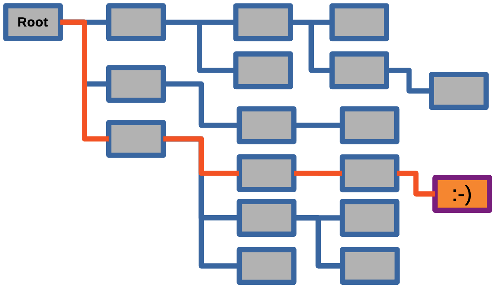
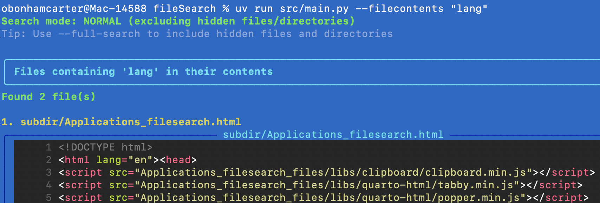

# What Makes a Project Successful?! 🎉

<center>

</center>


::: {style="color: #8E44AD;"}
**Know the Steps:** When you are developing a programming project to be shared online, there are steps to follow that will help the community understand, adopt and use your project effectively. 📝
:::


---

# On For Today 🚀

::: {.callout-tip icon="true"}
## Building Real-World Python Applications
**In this series, we'll build complete, practical projects!**

* 📦 **Project Setup** — Using modern Python tools (uv)
* 🎨 **Beautiful Output** — Rich library for colorization
* 🔍 **File Operations** — Working with files and directories
* 🎯 **Command-Line Tools** — argparse for user interaction
* 🧪 **Testing** — Validating your code works correctly
* 🔒 **Hidden File Filtering** — Smart directory traversal
:::

<center>
{width=30%}
</center>

::: {style="color: #27AE60;"}
**Today's Goal:** Build a file search tool to locate information across files! 🔍
:::


---

## Traversing File Systems!

<center>
{width=60%}
</center>

::: {.callout-note icon="false"}
## Why File Searching?

**Common Use Cases:**

- Finding specific files in large projects
- Searching for code snippets or configuration settings
- Auditing codebases for security issues or TODO comments
:::

---

## And Find Files and Content They Contain!

<center>
{width=60%}
</center>

::: {.callout-important icon="false"}
## With This Solution?

**Our FileSearch Tool:**

- Search by filename, type or file contents
- Colorized, readable output
- Filters hidden files by default
:::

---

## This Band Is The Only Thing Cooler Than This Project!

<center>
{width=95%}
</center>


# 📋 Anyways. Back to What We're Building...

::: {.callout-note icon="false"}
## FileSearch — A Powerful File Search Utility

A command-line tool that helps you:

* 🔍 **Search by filename** — Find files matching a pattern
* 📄 **Search by content** — Find files containing specific text
* 🎨 **Colorized output** — Beautiful, readable results
* 🔒 **Smart filtering** — Exclude hidden directories by default
* 🌈 **Syntax highlighting** — View code files with colors
* ⚡ **Fast & flexible** — Search anywhere, customize everything
:::

::: {.callout-important icon="false"}
**Real-World Use Cases:**

- Find all Python files that import a specific module
- Locate configuration files across multiple projects
- Search for TODO comments in your codebase
- Find files by extension or naming patterns
:::

---

# 🛠️ Part 1: Project Setup with UV
(You already know the drill, but I'll do it again for practice!)
¯\\_(ツ)_/¯

::: {.callout-note icon="false"}
## What is UV?

**UV** is a modern, fast Python package manager created by Astral.

**Why use UV instead of pip?**

* ⚡ **10-100x faster** than pip
* 🔒 **Automatic lock files** for reproducible installs
* 📦 **Built-in virtual environment** management
* 🎯 **Simple commands** — one tool for everything
:::

::: {style="color: #8E44AD;"}
**Why Cover These Steps?** You want to test each of these steps on your own machine to help you remember what commands to include in your `README.md` file when you share your project! 📝
:::

---

## Installing UV

Keep these commands handy for setting up UV on your system! It's a game-changer for Python development. 🚀

::: {.callout-important icon="false"}
## Installation Commands by Operating System

**macOS / Linux:**
```bash
# Using the official installer (recommended)
curl -LsSf https://astral.sh/uv/install.sh | sh

# Or using Homebrew (macOS only)
brew install uv

# Or using pip
pip install uv
```

**Windows:**
```powershell
# Using PowerShell
powershell -c "irm https://astral.sh/uv/install.ps1 | iex"

# Or using pip
pip install uv

# Or using winget
winget install --id=astral-sh.uv -e
```
:::

---


## Verify UV Installation

<center>

{width=40%}

</center>

::: {.callout-tip}
**After installation**, verify the installation was successful and that the software is available in your terminal:

```bash
uv --version # Should print the installed version of UV
uv sync # This will test the project setup and create a new uv.lock file when pyproject.toml is present
```
:::

---

## Creating Your Project

::: {.callout-important icon="false"}
## Step 1: Create the Project Structure

**Commands (all operating systems):**
```bash
# Create and navigate to your project directory
mkdir fileSearch
cd fileSearch

# Initialize a new UV project
uv init

# This creates:
# - pyproject.toml (project configuration)
# - README.md (documentation)
# - .python-version (Python version pin)
# - main.py (example file - we'll replace this)
```
:::

::: {.callout-note}
**What just happened?**

- UV created a new Python project with all necessary configuration
- A virtual environment is managed automatically
- You're ready to start coding! 🎉
:::

---

## Project Structure Overview

::: {.callout-important icon="false"}
## Step 2: Organize Your Code

**Create the proper directory structure:**
```bash
# Remove the example file
rm main.py

# Create source directory
mkdir src

# Your project structure should look like:
# fileSearch/
# ├── src/
# │   └── main.py (we will create this file here!)
# ├── pyproject.toml
# ├── README.md
# └── .python-version
```
:::

::: {style="color: #27AE60;"}
**Best Practice:**

- Keep your source code in a `src/` directory to separate it from configuration files and documentation! 📁
- Mention the files of the project in the `README.md` to provide clear instructions for users and collaborators! 📝
:::

---

## Adding Dependencies

::: {.callout-important icon="false"}
## Step 3: Install the Rich Library

Different projects require different libraries. For this project, we'll use **Rich** to provide beautiful terminal formatting and colors.

**Install it:**
```bash
# Add Rich as a dependency
uv add rich

# This automatically:
# - Installs Rich and its dependencies
# - Updates pyproject.toml
# - Creates/updates uv.lock
# - Activates the virtual environment
```
:::

::: {.callout-note}
**Verify installation:**
```bash
uv pip list

# You should see:
# Package         Version
# --------------- -------
# rich           13.x.x
# markdown-it-py  x.x.x
# pygments       x.x.x
# ...
```
:::

---

# 🎯 Part 2: Understanding the Problem

::: {.callout-note icon="false"}
## What Problems Are We Solving?

**Common Developer Needs:**

1. **Find files by name** — "Where did I put that config file?"
2. **Search file contents** — "Which files use this function?"
3. **Readable output** — "I can't read this plain text mess!"
4. **Filter noise** — "Too many .git and node_modules results!"
5. **View code nicely** — "I need syntax highlighting!"
:::

::: {style="color: #8E44AD;"}
**Our Solution:** A Python tool that addresses all these problems with a clean, user-friendly interface! 🎨
:::

---

## Program Features Overview

::: {.callout-important icon="false"}
## Core Functionality

**Input (Command-line arguments):**

- `--filename` : Search term for filenames
- `--filecontents` : Search term for file contents
- `--path` : Directory to search in
- `--full-search` : Include hidden files/directories

**Processing:**

- Recursively traverse directories
- Filter hidden files by default
- Search filenames and/or contents
- Detect file types for syntax highlighting

**Output:**

- Colorized tables for file lists
- Syntax-highlighted code display
- Panels and borders for organization
- Status messages and count summaries
:::

---

# 🔄 Part 3: Program Flow

::: {.callout-note icon="false"}
## High-Level Algorithm

**The program follows these steps:**

1. **Parse command-line arguments** → Get user's search criteria
2. **Determine search mode** → Full search or skip hidden files
3. **Execute searches** → Find matching files
4. **Format results** → Create beautiful output
5. **Display content** → Show file contents if requested
6. **Report completion** → Summary of findings
:::

---

## Flowchart — Program Logic

```{mermaid}
%%| fig-width: 11
%%| fig-height: 5
flowchart LR
    Start([Start]) --> Parse[Parse Args]
    Parse --> CheckMode{Full<br/>Mode?}
    
    CheckMode -->|Yes| FullMode[Include<br/>Hidden Files/Directories]
    CheckMode -->|No| NormalMode[Exclude<br/>Hidden Files/Directories]
    
    FullMode --> CheckArgs{Args?}
    NormalMode --> CheckArgs
    
    CheckArgs -->|None| ListAll[List All Files]
    CheckArgs -->|--filename| SearchName[Search<br/>Names]
    CheckArgs -->|--filecontents| SearchContent[Search<br/>Content]
    CheckArgs -->|Both| SearchBoth[Search<br/>Both]
    
    ListAll --> Display[Table<br/>Display]
    SearchName --> Display
    SearchContent --> ShowContent{Show<br/>Contents?}
    SearchBoth --> ShowContent
    
    ShowContent -->|Yes| Syntax[Syntax<br/>Highlight]
    ShowContent -->|No| Display
    Syntax --> DisplayPanel[Colored<br/>Panel]
    
    DisplayPanel --> Done([Done ✓])
    Display --> Done
    
    classDef startEnd fill:#27AE60,stroke:#229954,stroke-width:4px,color:#fff
    classDef decision fill:#3498DB,stroke:#2874A6,stroke-width:4px,color:#fff
    classDef process fill:#9B59B6,stroke:#7D3C98,stroke-width:4px,color:#fff
    classDef search fill:#E67E22,stroke:#CA6F1E,stroke-width:4px,color:#fff
    classDef output fill:#E74C3C,stroke:#C0392B,stroke-width:4px,color:#fff
    
    class Start,Done startEnd
    class CheckMode,CheckArgs,ShowContent decision
    class Parse,FullMode,NormalMode,Syntax process
    class ListAll,SearchName,SearchContent,SearchBoth search
    class Display,DisplayPanel output
```


::: {style="color: #8E44AD;"}
**Too Complicated?** Typical flowcarts look  very complicated however, these "flows" represent the program logic in a visual way, making code inputs and outputs easier to understand. The edge cases and limitations of the code are also easier to spot. 🎨
:::

---

## Flowchart Explanation

::: {.callout-note icon="false"}
## Understanding the Program Flow

**Decision Points:**

1. **Search Mode** — User can enable full search to include hidden files/directories
2. **Argument Selection** — Program behavior changes based on which flags are provided
3. **Content Display** — File contents are shown with syntax highlighting when searching by content

**Key Processes:**

- **File Discovery** — Recursive directory traversal with optional filtering
- **Pattern Matching** — Check filenames or file contents for search terms
- **Output Formatting** — Rich library creates tables, panels, and syntax highlighting
:::

---

# 💻 Part 4: Building the Code

::: {.callout-important icon="false"}
## Code Structure Overview

We'll build the program in these sections:

1. **Imports and Setup** — Load required libraries
2. **Helper Functions** — Utility functions for filtering
3. **Search Functions** — Core search logic
4. **Display Functions** — Output formatting
5. **Main Function** — Command-line interface and orchestration
:::

<center>
{width=40%}
</center>

---

## Step 1: Imports and Setup

::: {.callout-important icon="false"}
## Copy this code into `src/main.py`:

```python
from pathlib import Path
import argparse
from rich.console import Console
from rich.panel import Panel
from rich.table import Table
from rich.syntax import Syntax
from rich.text import Text

# Create a global console object for colorized output
console = Console()
```
:::

::: {style="color: #27AE60;"}
**What's happening:**

- `pathlib.Path` — Modern, object-oriented file path handling
- `argparse` — Parse command-line arguments
- `rich.*` — Various Rich components for beautiful output
- `console` — Single console instance used throughout the program
:::

---

## Step 2: Helper Function — Hidden File Detection

::: {.callout-important icon="false"}
## Add this helper function:

```python
def is_hidden(path):
    """Check if any part of the path is hidden (starts with .)
    
    Args:
        path: A Path object representing a file or directory
        
    Returns:
        bool: True if any part of the path starts with a dot
    """
    return any(part.startswith('.') and part not in ['.', '..'] 
               for part in path.parts)
# End of is_hidden()
```
:::

::: {.callout-note}
**Function Purpose:**

- Checks if a file or directory is "hidden" (starts with `.`)
- Excludes `.` and `..` (current and parent directory markers)
- Returns `True` if ANY part of the path is hidden
- Example: `.git/config` returns `True` because of `.git`
:::

---

## Step 3: Get Path Function

::: {.callout-important icon="false"}
## Add the first search function:

```python
def getPath(myFileType="*", full_search=False):
    """Get all files in the current directory and subdirectories.
    
    Args:
        myFileType: File pattern to match (default: all files)
        full_search: If True, include hidden files/directories
        
    Returns:
        list: List of Path objects for matching files
    """
    # Create a Path object for the directory
    base_path = Path('./')
    
    if full_search:
        myFiles = [p for p in base_path.rglob(myFileType) 
                   if p.is_file()]
    else:
        myFiles = [p for p in base_path.rglob(myFileType) 
                   if p.is_file() and not is_hidden(p)]
    
    return myFiles
# End of getPath()
```
:::

---

## Understanding getPath()

::: {.callout-note icon="false"}
## Code Breakdown

**Key Concepts:**

- `.rglob("*")` — Recursively search for all files and directories
- `p.is_file()` — Filter to only include files (not directories)
- Conditional filtering based on `full_search` parameter
- List comprehension for efficient filtering

**Example Usage:**
```python
# Get all non-hidden files
files = getPath()

# Get all files including hidden ones
all_files = getPath(full_search=True)

# Get only Python files (non-hidden)
py_files = getPath(myFileType="*.py")
```
:::

---

## Step 4: Search Filenames Function

::: {.callout-important icon="false"}
## Add filename search capability:

```python
def searchFilenames(myPath, searchTerm, full_search=False):
    """Search for files with searchTerm in their filename.
    
    Args:
        myPath: Directory path to search in
        searchTerm: String to search for in filenames
        full_search: If True, include hidden files/directories
        
    Returns:
        list: List of Path objects for matching files
    """
    # Create a Path object for the directory
    base_path = Path(myPath)
    
    if full_search:
        myFiles = [p for p in base_path.rglob("*") 
                   if p.is_file() and searchTerm in p.name]
    else:
        myFiles = [p for p in base_path.rglob("*") 
                   if p.is_file() 
                   and searchTerm in p.name 
                   and not is_hidden(p)]
    
    return myFiles
# End of searchFilenames()
```
:::

---

## Step 5: Search File Contents Function

::: {.callout-important icon="false"}
## Add content search capability:

```python
def searchFileContents(myPath, searchTerm, myFileType="*", 
                      full_search=False):
    """Search for files containing searchTerm in their contents.
    
    Args:
        myPath: Directory path to search in
        searchTerm: String to search for in file contents
        myFileType: File pattern to match (default: all files)
        full_search: If True, include hidden files/directories
        
    Returns:
        list: List of Path objects for matching files
    """
    # Create a Path object for the directory
    base_path = Path(myPath)
    
    myFiles = []
    for p in base_path.rglob(myFileType):
        if p.is_file():
            # Skip hidden files/directories unless full_search is enabled
            if not full_search and is_hidden(p):
                continue
            try:
                with p.open() as f:
                    if searchTerm in f.read():
                        myFiles.append(p)
            except Exception as e:
                console.print(f"[yellow]Warning: Error reading file {p}: {e}[/yellow]")
    
    return myFiles
# End of searchFileContents()

```
:::

---

## Understanding Content Search

::: {.callout-note icon="false"}
## Code Breakdown

**Key Features:**

1. **File Iteration** — Loop through all files matching the pattern
2. **Hidden File Filtering** — Skip hidden files unless `full_search=True`
3. **Safe File Reading** — Try/except block catches read errors
4. **Content Matching** — Simple substring search in file contents
5. **Error Handling** — Warn user about unreadable files (permissions, binary files, etc.)

**Why Try/Except?**

- Some files can't be read (permissions, binary files)
- Prevents program crash on a single bad file
- Provides user feedback via warning message
:::

---

## Step 6: Display File Contents Function

::: {.callout-important icon="false"}
## Add syntax-highlighted display:

```python
def printFileContents(filePath):
    """Display file contents with syntax highlighting.
    
    Args:
        filePath: Path object or string path to the file
    """
    try:
        with open(filePath) as f:
            content = f.read()
            # Try to detect file type for syntax highlighting
            suffix = filePath.suffix.lstrip('.')
            
            # List of supported languages for syntax highlighting
            if suffix in ['py', 'js', 'java', 'cpp', 'c', 'rs', 'go', 
                         'rb', 'php', 'html', 'css', 'json', 'xml', 
                         'yaml', 'yml', 'toml', 'md', 'sh', 'bash']:
                syntax = Syntax(content, suffix, theme="monokai", 
                              line_numbers=True)
                console.print(Panel(syntax, title=f"[cyan]{filePath}[/cyan]", 
                                  border_style="blue"))
            else:
                console.print(Panel(content, title=f"[cyan]{filePath}[/cyan]", 
                                  border_style="blue"))
    except Exception as e:
        console.print(f"[red]Error reading file {filePath}: {e}[/red]")
# End of printFileContents()
```
:::

---

## Understanding Syntax Highlighting

::: {.callout-note icon="false"}
## How Rich Syntax Works

**Features:**

- **File Extension Detection** — `.suffix` gets the file extension
- **Conditional Highlighting** — Only apply syntax to known code file types
- **Monokai Theme** — Professional dark theme for code
- **Line Numbers** — Easy reference for code discussion
- **Panel Display** — Beautiful border and title

**Supported Languages:**

Python, JavaScript, Java, C/C++, Rust, Go, Ruby, PHP, HTML, CSS, JSON, XML, YAML, TOML, Markdown, Shell scripts

**Fallback:** Plain text display for unknown file types
:::

## Sample Output

::: {.callout-note icon="false"}
We outline the contents of a file with syntax highlighting and line numbers, making it easy to read and understand the structure of the code or text.

:::

<center>
{width=100%}
</center>


---

## Step 7: Main Function — Part 1 (Argument Parser)

::: {.callout-important icon="false"}
## Set up command-line interface:

```python
def main():
    # Set up command-line argument parser
    parser = argparse.ArgumentParser(
        description='Search for files by filename or file contents',
        formatter_class=argparse.RawDescriptionHelpFormatter,
        epilog='''
Examples:
  python main.py --filename test
  python main.py --filecontents "import sys"
  python main.py --filename test --filecontents python
        '''
    )
    
    parser.add_argument(
        '--filename',
        type=str,
        help='Search term to find in filenames'
    )
    
    parser.add_argument(
        '--filecontents',
        type=str,
        help='Search term to find in file contents'
    )
```
:::


::: {style="color: #8E44AD;"}
**Maybe this function is too long?** Typically, the functions of a program should be concise and focused on a single task. Consider breaking this function into smaller helper functions for readability and maintainability. In this case, the function is to create a prototype of the main functionality. Later, you can refactor it into smaller, more manageable functions. 📝
:::

---


## Step 7: Main Function — Part 2 (More Arguments)

::: {.callout-important icon="false"}
## Continue adding arguments:

```python
    parser.add_argument(
        '--path',
        type=str,
        default='./',
        help='Base path to search (default: current directory)'
    )
    
    parser.add_argument(
        '--full-search',
        action='store_true',
        help='Include hidden files and directories (those starting with .)'
    )
    
    args = parser.parse_args()
    
    # Display search mode
    if args.full_search:
        console.print("[bold yellow]Search mode: FULL (including hidden files/directories)[/bold yellow]\n")
    else:
        console.print("[bold green]Search mode: NORMAL (excluding hidden files/directories)[/bold green]")
        console.print("[dim]Tip: Use --full-search to include hidden files and directories[/dim]\n")
```
:::

---

## Step 7: Main Function — Part 3 (List All Files)

::: {.callout-important icon="false"}
## Handle no arguments (list all files):

```python
    # If no arguments provided, show all files
    if not args.filename and not args.filecontents:
        myFiles = getPath(full_search=args.full_search)
        console.print(Panel("[bold cyan]All files in the current directory and subdirectories[/bold cyan]", 
                          border_style="cyan"))
        
        if myFiles:
            table = Table(show_header=True, header_style="bold magenta")
            table.add_column("#", style="dim", width=6)
            table.add_column("File Path", style="cyan")
            
            for idx, file_path in enumerate(myFiles, 1):
                table.add_row(str(idx), str(file_path))
            
            console.print(table)
            console.print(f"\n[bold green]Total: {len(myFiles)} files found[/bold green]")
        else:
            console.print("[yellow]No files found.[/yellow]")
        
        console.print("\n[dim]Tip: Use --filename or --filecontents to search for specific files[/dim]")
        console.print("[dim]Run with --help for more information[/dim]")
```
:::

---

## Step 7: Main Function — Part 4 (Search by Filename)

::: {.callout-important icon="false"}
## Handle filename search:

```python
    # Search by filename if provided
    if args.filename:
        myFiles = searchFilenames(args.path, args.filename, 
                                 full_search=args.full_search)
        console.print(Panel(f"[bold cyan]Files containing '{args.filename}' in their name[/bold cyan]", 
                          border_style="cyan"))
        
        if myFiles:
            table = Table(show_header=True, header_style="bold magenta")
            table.add_column("#", style="dim", width=6)
            table.add_column("File Path", style="green")
            
            for idx, file_path in enumerate(myFiles, 1):
                table.add_row(str(idx), str(file_path))
            
            console.print(table)
            console.print(f"\n[bold green]Total: {len(myFiles)} files found[/bold green]")
        else:
            console.print("[yellow]No files found.[/yellow]")
```
:::

---

## Step 7: Main Function — Part 5 (Search by Content)

::: {.callout-important icon="false"}
## Handle content search:

```python
    # Search by file contents if provided
    if args.filecontents:
        myFiles = searchFileContents(args.path, args.filecontents, 
                                    full_search=args.full_search)
        console.print(Panel(f"[bold cyan]Files containing '{args.filecontents}' in their contents[/bold cyan]", 
                          border_style="cyan"))
        
        if myFiles:
            console.print(f"[bold green]Found {len(myFiles)} file(s)[/bold green]\n")
            for idx, file_path in enumerate(myFiles, 1):
                console.print(f"[bold yellow]{idx}. {file_path}[/bold yellow]")
                printFileContents(file_path)
                console.print()  # Add spacing between files
        else:
            console.print("[yellow]No files found.[/yellow]")
    
    console.print("[bold green]✓ Done.[/bold green]")

# End of main()
```
:::

---

## Step 7: Main Function — Part 6 (Entry Point)

::: {.callout-important icon="false"}
## Add the program entry point at the very end:

```python
if __name__ == "__main__":
    main()
```
:::

::: {.callout-note}
**Why `if __name__ == "__main__":`?**

- This block only runs when the file is executed directly
- If someone imports your module, it won't automatically run
- Standard Python best practice for executable scripts
- Allows the code to be both a script and an importable module
:::

---

# 🎉 Code Complete!

::: {.callout-tip icon="true"}
## Congratulations! You've Built the Entire Program!

**Your `src/main.py` now contains:**

✅ Import statements and setup  
✅ Helper function for hidden file detection  
✅ Three search functions (all files, by name, by content)  
✅ Display function with syntax highlighting  
✅ Main function with full command-line interface  
✅ Entry point for program execution  

**Total Lines:** ~190 lines of well-documented, professional Python code!
:::

<center>
{width=35%}
</center>

---

# 🧪 Part 5: Testing Your Program

::: {.callout-important icon="false"}
## Manual Testing — Basic Commands

**Test 1: List all files**
```bash
python src/main.py
```
Expected: Table showing all non-hidden files in current directory

**Test 2: Search by filename**
```bash
python src/main.py --filename main
```
Expected: Finds `main.py` and displays in table

**Test 3: Search by content**
```bash
python src/main.py --filecontents "import"
```
Expected: Finds files with "import" and shows syntax-highlighted contents
:::

---

## More Test Cases

::: {.callout-important icon="false"}
## Advanced Testing

**Test 4: Full search mode**
```bash
python src/main.py --filename pyproject --full-search
```
Expected: Finds `pyproject.toml` (even if in hidden directory)

**Test 5: Combined search**
```bash
python src/main.py --filename py --filecontents "def"
```
Expected: Finds Python files containing function definitions

**Test 6: Custom path**
```bash
python src/main.py --path ./src --filename py
```
Expected: Only searches in `src/` directory

**Test 7: Help message**
```bash
python src/main.py --help
```
Expected: Shows all available options
:::

---

## Creating Test Files

::: {.callout-important icon="false"}
## Set Up a Test Environment

**Create test files to verify functionality:**
```bash
# Create a test directory
mkdir test_data
cd test_data

# Create some test files
echo "def hello(): print('Hello')" > test1.py
echo "import os" > test2.py
echo "# This is a comment" > test3.py
echo "Configuration data" > config.txt
mkdir .hidden
echo "Secret file" > .hidden/secret.txt

# Go back to project root
cd ..
```
:::
::: {style="color: #8E44AD;"}
**Add Files Another Way:** Just edit text files using your editor and store them in the `test_data/` directory. 🎨
:::
---

## Using the Test Environment

::: {.callout-important icon="false"}
## Verify your program works correctly with these test files!


```bash
# Should find 3 Python files
python src/main.py --path ./test_data --filename py

# Should find files with 'import'
python src/main.py --path ./test_data --filecontents "import"

# Should NOT find .hidden files (normal mode)
python src/main.py --path ./test_data --filename secret

# SHOULD find .hidden files (full search mode)
python src/main.py --path ./test_data --filename secret --full-search
```
:::

---

## Automated Testing with pytest (Part 1)

::: {.callout-important icon="false"}
## Optional: Unit Tests

**Install pytest:**
```bash
uv add --dev pytest
```

**Create `tests/test_main.py`:**
```python
import pytest
from pathlib import Path
import sys
sys.path.insert(0, str(Path(__file__).parent.parent / "src"))

from main import is_hidden, getPath, searchFilenames

def test_is_hidden():
    """Test hidden file detection"""
    assert is_hidden(Path(".git/config")) == True
    assert is_hidden(Path("src/main.py")) == False
    assert is_hidden(Path(".gitignore")) == True
    assert is_hidden(Path("README.md")) == False
# End of test_is_hidden()

```
:::

## Automated Testing with pytest (Part 2)

::: {.callout-important icon="false"}
## Optional: Unit Tests, Continued

```python
def test_getPath():
    """Test file listing"""
    files = getPath(full_search=False)
    assert isinstance(files, list)
    # Should not include hidden files
    assert not any(is_hidden(f) for f in files)
# End of test_getPath()

```
:::

---

## Automated Testing with pytest (Part 3)

::: {.callout-important icon="false"}
```python
def test_searchFilenames():
    """Test filename search"""
    # Search for Python files
    py_files = searchFilenames("./src", "py", full_search=False)
    assert all(".py" in str(f) or "py" in f.name for f in py_files)
# End of test_searchFilenames()

```
:::

---

## Running Automated Tests With Pytest

::: {.callout-important icon="false"}
## Execute Your Test Suite

**Run all tests:**
```bash
pytest tests/
```

**Run with verbose output:**
```bash
pytest -v tests/
```

**Run with coverage report:**
```bash
uv add --dev pytest-cov
pytest --cov=src tests/
```
:::

**Expected output:**

::: {.callout-red icon="false"}

```
======================== test session starts =========================
collected 3 items

tests/test_main.py::test_is_hidden PASSED                     [ 33%]
tests/test_main.py::test_getPath PASSED                       [ 66%]
tests/test_main.py::test_searchFilenames PASSED               [100%]

========================= 3 passed in 0.12s ==========================
```
:::

---

## Verification: Testing Checklist (Part 1)

What kind of tests should you run to verify your program works correctly? Use this checklist to make sure you've covered all the important cases!

::: {.callout-red icon="false"}

**✅ Basic Functionality:**

- [ ] Program runs without errors
- [ ] Lists all files correctly
- [ ] Searches filenames accurately
- [ ] Searches file contents correctly
- [ ] Combines multiple searches

**✅ Edge Cases:**

- [ ] Handles missing files gracefully
- [ ] Works with empty directories
- [ ] Filters hidden files properly
- [ ] Full search mode includes hidden files
- [ ] Binary files don't crash the program

:::

---

## Verification: Testing Checklist (Part 2)
::: {.callout-red icon="false"}

**✅ Output Quality:**

- [ ] Colors display correctly
- [ ] Tables are formatted nicely
- [ ] Syntax highlighting works for code files
- [ ] Error messages are clear and helpful

:::

---

# 🚀 Part 6: Using Your Tool

::: {.callout-tip icon="true"}
## Real-World Usage Examples

**Find all Python files with a specific import:**
```bash
python src/main.py --filecontents "from pathlib import Path"
```

**Locate all configuration files:**
```bash
python src/main.py --filename config
```

**Search for TODO comments across your project:**
```bash
python src/main.py --filecontents "TODO" --full-search
```

**Find all markdown documentation:**
```bash
python src/main.py --filename .md
```

**Audit for security issues:**
```bash
python src/main.py --filecontents "password" --full-search
```
:::

---

## Extending the Project (Part 1)

::: {.callout-note icon="false"}
## Ideas for Enhancement

**Beginner:**

* Add case-insensitive search option (`--ignore-case`)
* Count total matches and display statistics
* Save results to a file (`--output results.txt`)
* Add file size information to the table

**Intermediate:**

* Regular expression support for advanced patterns
* Exclude certain file types (`--exclude "*.log"`)
* Search within specific date ranges
* Export results as JSON or CSV

:::

---

## Extending the Project (Part 2)

::: {.callout-note icon="false"}
## More Ideas for Enhancement

**Advanced:**

*  Parallel processing for faster searches
*  Interactive mode with menu selection
*  Fuzzy matching for typo tolerance
*  Integration with git to search only tracked files
:::


---


📚 What We Covered

::: {.callout-tip icon="true"}
## Skills Acquired in This Project

:::: {.columns}
::: {.column}
**Python Concepts:**

✅ Modern project structure with UV  
✅ Command-line argument parsing with argparse  
✅ File system operations with pathlib  
✅ List comprehensions and generators  
✅ Exception handling best practices  
✅ Function design and documentation  
✅ Conditional logic and control flow  

:::


::: {.column}
**Tools and Libraries:**

✅ UV package manager  
✅ Rich library for terminal UI  
✅ pytest for unit testing  
✅ Syntax highlighting and themes  

**Software Engineering:**

✅ Code organization and modularity  
✅ User experience design  
✅ Error handling strategies  
✅ Testing methodologies  
:::

::::

:::


<center>

{width=30%}

</center>
---

# 🎯 Challenge Problems

::: {.callout-warning icon="false"}
## Practice Exercises

**Challenge 1: Add a Counter**

Modify the program to count how many times the search term appears in each file, not just which files contain it.

**Challenge 2: File Size Filter**

Add options `--min-size` and `--max-size` to filter files by size (e.g., `--min-size 1KB --max-size 1MB`).

**Challenge 3: Date Filter**

Add options to search only files modified within a certain date range.

**Challenge 4: Export Results**

Add a `--export` option that saves results to a JSON file with file paths, sizes, and match counts.

**Challenge 5: Interactive Mode**

Create an interactive mode where users can repeatedly search without restarting the program.
:::

---

## Challenge 1: Solution — Add a Counter

::: {.callout-important icon="false"}
## Counting Occurrences

**Modify `searchFileContents()` to return count information:**

```python
def searchFileContents(myPath, searchTerm, myFileType="*", full_search=False):
    """Search for files containing searchTerm in their contents."""
    base_path = Path(myPath)
    
    results = []  # Store (path, count) tuples
    for p in base_path.rglob(myFileType):
        if p.is_file():
            if not full_search and is_hidden(p):
                continue
            try:
                with p.open() as f:
                    content = f.read()
                    count = content.count(searchTerm)
                    if count > 0:
                        results.append((p, count))
            except Exception as e:
                console.print(f"[yellow]Warning: Error reading file {p}: {e}[/yellow]")
    
    return results

# Update display code to show counts:
if myFiles:
    for idx, (file_path, count) in enumerate(myFiles, 1):
        console.print(f"[bold yellow]{idx}. {file_path} (Found {count} times)[/bold yellow]")
        printFileContents(file_path)
```
:::

---

## Challenge 2: Solution — File Size Filter

::: {.callout-important icon="false"}
## Adding Size Parameters

**Add to argument parser:**
```python
parser.add_argument(
    '--min-size',
    type=str,
    help='Minimum file size (e.g., 1KB, 1MB)'
)

parser.add_argument(
    '--max-size',
    type=str,
    help='Maximum file size (e.g., 10MB)'
)

# Helper function to parse size strings
def parse_size(size_str):
    """Convert size string like '1KB' to bytes."""
    units = {'B': 1, 'KB': 1024, 'MB': 1024**2, 'GB': 1024**3}
    size_str = size_str.upper()
    for unit, multiplier in units.items():
        if size_str.endswith(unit):
            return float(size_str[:-len(unit)]) * multiplier
    return float(size_str)

# Add size filtering to search functions:
if args.min_size or args.max_size:
    min_bytes = parse_size(args.min_size) if args.min_size else 0
    max_bytes = parse_size(args.max_size) if args.max_size else float('inf')
    myFiles = [f for f in myFiles 
               if min_bytes <= f.stat().st_size <= max_bytes]
```
:::

---

## Challenge 3: Solution — Date Filter

::: {style="color: #8E44AD;"}
**Getting Started:** Here is some code to study that will help you write your date filter functionality. 🎨
:::


::: {.callout-important icon="false"}
```python
from pathlib import Path
from datetime import datetime

# Define the file path
file_path = Path('your_report.csv')

# Get file status information
stats = file_path.stat()

# Extract and convert timestamps
modified_date = datetime.fromtimestamp(stats.st_mtime)
created_date = datetime.fromtimestamp(stats.st_ctime)

print(f"Last Modified: {modified_date.strftime('%Y-%m-%d %H:%M:%S')}")
print(f"Created: {created_date.strftime('%Y-%m-%d %H:%M:%S')}")

```
:::
___

# 📖 Resources and References

::: {style="color: #8E44AD;"}
**Keep On Learning:** If you want to learn more about the concepts and tools used in this project, here are some helpful resources! I used these to make these slides!! 🎨
:::


::: {.callout-note icon="false"}
## Learn More

**Documentation:**

- [UV Documentation](https://docs.astral.sh/uv/) — Package manager guide
- [Rich Documentation](https://rich.readthedocs.io/) — Terminal formatting
- [argparse Tutorial](https://docs.python.org/3/howto/argparse.html) — Command-line parsing
- [pathlib Guide](https://docs.python.org/3/library/pathlib.html) — Path operations
- [pytest Documentation](https://docs.pytest.org/) — Testing framework

**Related Topics:**

- File I/O operations in Python
- Regular expressions for pattern matching
- Command-line tool design principles
- Software testing best practices
:::

---
