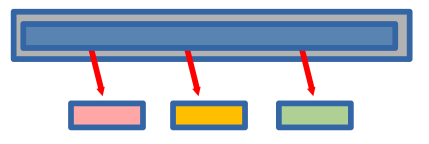

<!-- ::: {style="color: #2E86C1; font-size: 0.9em; text-align: center; margin-top: 0.5em;"} -->

# What Are We Building Today? 🎉

<center>

{width=34%}

</center>

::: {style="color: #8E44AD;"}
**Project Goal:** Build a QR code creator that is cleanly packaged, tested with `pytest`, and ready for real-world sharing.

**Fun Fact**: To help in some of his conference and committee work, [OBC (seen here with his lead software developer)](https://www.oliverbonhamcarter.com/images/flintAndMe2.jpg), created this project from scratch using the same tools and practices from **this** class!! See [myQR GitHub project](https://github.com/developmentAC/myQR) if interested! 🚀

:::

---

# On For Today 🚀

::: {.callout-tip icon="true"}
## Building a Real Python App from Start to Finish

* 📦 **Setup with UV** — Reproducible environments and dependencies
* 🧠 **Requirements** — What users need from a QR generator
* 🔄 **Flowcharting** — Program behavior before coding
* 💻 **Implementation** — CLI + Streamlit app architecture
* 🧪 **Testing** — Unit tests for core functionality
* ✅ **Verification** — Professional quality checklist
:::

::: {style="color: #27AE60;"}
**Today's Outcome:** A professional-grade `myQR` project students can build and explain.
:::

<center>

{width=30%}

</center>

---

# 🛠️ Part 1: Project Setup with UV

::: {.callout-note icon="false"}
## Initialize and Sync

Copy into: Terminal commands from the `myQR/` project root (not copied into a source file).

```bash
# 1. Move into your project folder
cd myQR

# 2. Create new UV project
uv init
# Note: you may have to remove the "hello.py file that UV creates by default.

# 3. Add dependencies
uv add pillow qrcode rich typer streamlit

# 4. Verify toolchain
uv --version
uv run python --version
```
:::

::: {style="color: #8E44AD;"}
**Tip:** `uv sync` is the first command to run on a fresh clone because it creates the environment and installs exactly what the project needs.
:::

---

## Project Structure Overview

::: {.callout-important icon="false"}
## Pythonic Naming and Structure

Copy into: Not code to copy; this is the target project layout in `myQR/`.

```text
myQR/
├── pyproject.toml
├── README.md
├── myqr/
│   ├── __init__.py
│   ├── main.py
│   ├── file_ops.py
│   └── myqr_streamlit.py
└── tests/
    ├── __init__.py
    └── test_myqr.py
```

**Structure:**

- Module filenames use `snake_case`
- App logic and tests are clearly separated
- Package can expose a clean CLI entrypoint
:::

---

# 🎯 Part 2: Understanding the Problem

What Problems Are We Solving?

::: {.callout-note icon="false"}
## Functional Requirements

1. Accept user text/URL to encode
2. Let user customize QR color and background
3. Let user control box size and border size
4. Save generated PNG files safely
5. Prevent accidental filename collisions
6. Display the generated image in browser UI
:::

::: {.callout-important icon="false"}
## Non-Functional Requirements

- Pythonic naming and readable code
- Works with `uv run` workflow
- Includes automated tests
- Clear CLI command for students
:::

---


## The Pros May Say...

::: {.callout-red icon="false"}

::: {style="color: #8E44AD;"}
"When building a project, it's crucial to balance the 'must-have' features with the 'nice-to-have' ones. Focus on delivering a solid core experience first, and then you can always add more bells and whistles later. This way, you ensure that the essential functionality is reliable and well-tested before expanding the scope of the project."
:::

:::

<center>

{width=40%}

</center>

::: {.callout-red icon="false"}

::: {style="color: #27AE60;"}

"Remember, it's better to have a simple, working application than a complex one that's full of bugs. Prioritize features that are easy to implement and test, and save the more ambitious ideas for future iterations."

:::

:::

---

## Feature Options Matrix and Trade-offs


| Feature | Minimum | Better | Current Project |
|---|---|---|---|
| Input | text field | validated URL/text | text input with defaults |
| Output naming | overwrite | unique suffixing | unique filename logic |
| UI | plain script | browser form | Streamlit app |
| Testing | manual only | unit tests | pytest unit tests |


::: {style="color: #27AE60;"}

**What are Features and Tradeoffs?**

- A *feature* is a specific functionality or capability that a project can have. 
- A *tradeoff* is a compromise between two desirable features, where improving one may lead to a decrease in the other.
<!-- ::: {.callout-blue icon="false"} -->

:::


::: {style="color: #8E44AD;"}
**Key Insight:** We can prioritize practical features that are easily testable, even if they are not the most flashy. For flashy features, we can always add them later as extensions! 📝
:::

---

# 🔄 Part 3: Program Flow


::: {.callout-important icon="false"}

Copy into: Not copied into a file; this is an architecture diagram for planning.

```{mermaid}
%%| fig-width: 12
%%| fig-height: 5.8
%%{init: {
    'flowchart': {
        'nodeSpacing': 45,
        'rankSpacing': 55,
        'useMaxWidth': false,
        'htmlLabels': true
    },
    'themeVariables': {
        'fontSize': '18px'
    }
}}%%
flowchart LR
        Start([Start]) --> UI[Streamlit: Collect input]
    UI --> Validate{Input Provided?}

        Validate -->|No| Warn[Show warning]
    Warn --> UI

        Validate -->|Yes| BuildQR[Create QRCode object]

        BuildQR --> EnsureDir[Output dir exists?]
        BuildQR --> RenderQR[Render QR image]

        EnsureDir --> UniqueName[ Create unique filename]
    RenderQR --> UniqueName

        UniqueName --> Save[Save PNG]
        Save --> Display[Display in app]
        Display --> Done([Done])

    classDef startEnd fill:#27AE60,stroke:#229954,stroke-width:4px,color:#fff
    classDef decision fill:#3498DB,stroke:#2874A6,stroke-width:4px,color:#fff
    classDef process fill:#9B59B6,stroke:#7D3C98,stroke-width:4px,color:#fff
    classDef output fill:#E74C3C,stroke:#C0392B,stroke-width:4px,color:#fff

    class Start,Done startEnd
    class Validate decision
    class UI,BuildQR,RenderQR,EnsureDir,UniqueName process
    class Warn,Save,Display output
```

:::


::: {style="color: #8E44AD;"}
**Our Solution:** Scrolling horizontally, we note that each step in the flowchart corresponds to a clear, testable function (or mechanism) in our code! 🎨
:::


---

## Flowchart Debrief

::: {.callout-note icon="false"}
## Where Bugs Usually Happen

- Missing output directory
- Re-using the same filename repeatedly
- Empty data input
- Invalid assumptions about execution path

**Takeaway:** Flowcharts help us spot edge cases before writing more code.
:::


::: {style="color: #27AE60;"}

**Pytest to the rescue!**
- We can write unit tests for the logic of the code. This way, we can catch potential bugs early and ensure our core functionality is reliable before integrating it into the larger application.

:::

---

##  💻  Implementation Plan

::: {.callout-important icon="false"}
## Module Responsibilities

- `myqr/main.py`: command-line entrypoint with Typer
- `myqr/file_ops.py`: output directory helper
- `myqr/myqr_streamlit.py`: Streamlit interface and QR generation
- `tests/test_myqr.py`: unit tests for helper + save logic

All full copy/paste file contents were provided in **Part 4: Build It From Slides Only**.
:::

---


# 🧱 Part 4: Adding Code to Project

::: {.callout-important icon="false"}
## Create Folders

Copy into: Terminal commands (run from the folder where you want the project).

```bash
mkdir -p myQR/myqr
mkdir -p myQR/tests
cd myQR
```
:::

---

## Edit `pyproject.toml`

::: {style="color: #27AE60;"}

**Check**: You have already added the dependencies with `uv add`, but now we need to make sure the file is complete and includes all necessary sections for our project.
:::


```toml
[project]
name = "myqr"
version = "1.1.0"
description = "Interactive QR code generator with Streamlit and Typer"
readme = "README.md"
requires-python = ">=3.11"
dependencies = [
    "pillow>=11.0.0",
    "qrcode[pil]>=8.2",
    "rich>=15.0.0",
    "streamlit>=1.56.0",
    "typer>=0.24.1",
]

[project.scripts]
myqr = "myqr.main:cli_entrypoint"

[dependency-groups]
dev = [
    "pytest>=8.3.0",
]

[build-system]
requires = ["hatchling>=1.27.0"]
build-backend = "hatchling.build"
```


::: {style="color: #8E44AD;"}
Note: to run the project, including the tests, the file must include the above content. The `dependencies` section lists the runtime dependencies, while the `[dependency-groups]` section lists the development dependencies needed for testing. The `[project.scripts]` section defines a console script entry point for the CLI.
:::

---

## Create `myqr/__init__.py`


::: {.callout-important icon="false"}
Copy into: `myQR/myqr/__init__.py`

```python
# Package marker for myqr.
```
:::

::: {style="color: #27AE60;"}
**Is this necessary?**
This may not be necessary as Python will treat `myqr/` as a package without it, but it's a common convention to include an empty `__init__.py` file to explicitly mark the directory as a Python package.
:::

---

## Create `myqr/file_ops.py`

::: {.callout-important icon="false"}
Copy into: `myQR/myqr/file_ops.py`

:::

```python
import os


def check_data_dir(dir_str: str) -> bool:
    """Ensure output directory exists.

    Returns True if created, False if it already existed.
    """
    try:
        os.makedirs(dir_str)
        return True
    except OSError:
        return False
# End of check_data_dir()


def save_with_unique_filename(file_path: str) -> str:
    """Return a safe filename by adding _01, _02, ... if needed."""
    if not os.path.exists(file_path):
        return file_path

    base, ext = os.path.splitext(file_path)
    counter = 1
    while True:
        new_filename = f"{base}_{counter:02d}{ext}"
        if not os.path.exists(new_filename):
            return new_filename
        counter += 1
# End of save_with_unique_filename()

```

---

## Create `myqr/main.py`

::: {.callout-important icon="false"}
Copy into: `myQR/myqr/main.py`

:::

```python
#!/usr/bin/env python3
# -*- coding: utf-8 -*-
import subprocess
import sys

from rich.console import Console
import typer

DATE = "20 April 2026"
VERSION = "0.1.0"
AUTHOR = "myName"
AUTHORMAIL = "obonhamcarter@allegheny.edu"

cli = typer.Typer()
console = Console()


@cli.command()
def main(
    big_help_flag: bool = typer.Option(False, "--bighelp", help="Show extended help")
) -> None:
    """Front end of the program."""

    if big_help_flag:
        big_help()
        raise typer.Exit()

    console.print(
        "\t:dog:[bold yellow] QR code generator.\n\tStarting browser version. Use Control-C to exit from Command Line.[bold yellow]"
    )
    console.print(
        "\t:coffee:[bold green] Command: [bold yellow] Getting browser ready ..."
    )
    subprocess.run(
        [sys.executable, "-m", "streamlit", "run", "myqr/myqr_streamlit.py"],
        check=False,
    )
# End of main()

def big_help() -> None:
    """Give available command line prompts."""

    h_str = "   " + DATE + " | version: " + VERSION + " |" + AUTHOR + " | " + AUTHORMAIL
    console.print(f"[bold green] {len(h_str) * '-'}")
    console.print(f"[bold yellow]{h_str}")
    console.print(f"[bold green] {len(h_str) * '-'}")
    console.print("\n\t:coffee:[bold green] Command: [bold yellow]uv run myqr")

# End of big_help()

def cli_entrypoint() -> None:
    """Package entrypoint for the myqr console script."""
    cli()
# End of cli_entrypoint()

```

---

## Create `myqr/myqr_streamlit.py`

::: {.callout-important icon="false"}
Copy into: `myQR/myqr/myqr_streamlit.py`

:::

```python
import os
from typing import Any

from PIL import Image
import qrcode
import streamlit as st

from myqr import file_ops as fo


OUTPUTDIR = "0_out/"


def generate_qrcode(
    data: str,
    color: str,
    bgcolor: str,
    box_size: int,
    border: int,
    fname: str,
) -> None:
    """Generate and display a QR code image."""
    qr = qrcode.QRCode(version=1, box_size=box_size, border=border)
    qr.add_data(data)
    qr.make(fit=True)

    saved_file = save_file(bgcolor, color, fname, qr)

    if saved_file is not None:
        image = Image.open(saved_file)
        st.image(image, caption="Uploaded PNG", use_container_width=True)
# End of generate_qrcode()


def save_file(bgcolor: str, color: str, fname: str, qr: Any) -> str:
    """Save QR image to a unique filename in OUTPUTDIR."""
    img = qr.make_image(fill_color=color, back_color=bgcolor)

    fo.check_data_dir(OUTPUTDIR)
    fname = OUTPUTDIR + fname
    fname = fo.save_with_unique_filename(fname)

    if os.path.exists(fname):
        st.error(
            f"Attention: The file, {fname}, already exists! Please change the filename above."
        )
    else:
        img.save(fname)
        st.success(f"Saved file as {fname}")

    return fname
# End of save_file()


def app() -> None:
    """Streamlit main app function."""
    st.title("MyQR: An Interactive QR Code Generator!")
    st.write("Generate QR codes with customizable styles!")

    data = st.text_input(
        "Enter the data for the QR Code:", "https://www.oliverbonhamcarter.com"
    )

    suggested_file_name = "myQRCode.png"
    fname = st.text_input("Enter the filename to save the QRcode", suggested_file_name)

    color = st.color_picker("Select QR Code color", "#23dda0")
    bgcolor = st.color_picker("Select Background color", "#0E228E")
    box_size = st.slider("Select Box Size", min_value=1, max_value=20, value=10)
    border = st.slider("Select Border Size", min_value=1, max_value=10, value=4)

    if st.button("Generate QR Code"):
        if data:
            generate_qrcode(data, color, bgcolor, box_size, border, fname)
        else:
            st.warning("Please enter some data to generate the QR code!")

# End of app()

if __name__ == "__main__":
    app()

```


---

## Create `tests/test_myqr.py`

::: {.callout-important icon="false"}
Copy into: `myQR/tests/test_myqr.py`

:::

```python
from typing import Any
from pathlib import Path

from myqr import file_ops
from myqr import myqr_streamlit as qr_app


class DummyImage:
    def save(self, file_path: str) -> None:
        """Write placeholder image bytes to disk for test assertions."""
        Path(file_path).write_bytes(b"png-bytes")
# End of DummyImage()

class DummyQR:
    def make_image(self, fill_color: str, back_color: str) -> DummyImage:
        """Return a dummy image object that mimics qrcode output."""
        return DummyImage()
# End of DummyQR()

def test_check_data_dir_creates_then_detects_existing(tmp_path: Path) -> None:
    """Create output directory once, then confirm second call reports existing."""
    out_dir = tmp_path / "0_out"

    created = file_ops.check_data_dir(str(out_dir))
    existed = file_ops.check_data_dir(str(out_dir))

    assert created is True
    assert existed is False
    assert out_dir.exists()
# End of test_check_data_dir_creates_then_detects_existing()

def test_save_with_unique_filename_adds_counter(tmp_path: Path) -> None:
    """Verify filename collision appends _01 suffix."""
    first = tmp_path / "myQRCode.png"
    first.write_text("exists", encoding="utf-8")

    next_name = file_ops.save_with_unique_filename(str(first))

    assert next_name.endswith("myQRCode_01.png")
# End of test_save_with_unique_filename_adds_counter()

def test_save_file_writes_image_and_reports_success(tmp_path: Path, monkeypatch: Any) -> None:
    """Ensure save_file writes PNG and emits a success message."""
    out_dir = tmp_path / "0_out"
    monkeypatch.setattr(qr_app, "OUTPUTDIR", f"{out_dir}/")

    messages = []
    monkeypatch.setattr(qr_app.st, "success", lambda msg: messages.append(("success", msg)))
    monkeypatch.setattr(qr_app.st, "error", lambda msg: messages.append(("error", msg)))

    saved_path = qr_app.save_file("#000000", "#ffffff", "qr.png", DummyQR())

    assert Path(saved_path).exists()
    assert messages
    assert messages[0][0] == "success"
# End of test_save_file_writes_image_and_reports_success()

```

---

## Final Setup Commands

::: {.callout-tip icon="true"}
Copy into: Terminal commands from the `myQR/` project root.

```bash
uv sync
uv run pytest
uv run myqr
```
:::

---

## Implementation Recap

::: {.callout-tip icon="true"}
## What to Check Before Running

- All files from Part 4 were created in the correct folders.
- Function names are referenced correctly.
- Each example function is called correctly.
- `pyproject.toml` includes both runtime and dev dependencies.
:::

## Testing Checklist

::: {.callout-red icon="false"}
**✅ Functionality**

- [ ] App launches with `uv run myqr`
- [ ] Generates QR image for valid input
- [ ] Saves to output folder
- [ ] Never overwrites existing files

**✅ Reliability**

- [ ] Tests pass locally with `uv run pytest`
- [ ] Naming conventions are Pythonic (`snake_case`)
- [ ] `pyproject.toml` reflects real dependencies

:::


# 🔧 Part 5: Dependency Management & Troubleshooting


## Common Dependency Errors & Fixes

::: {.callout-warning icon="false"}
### ❌ **Error: `ModuleNotFoundError: No module named 'streamlit'`**

**What happened?** A dependency wasn't installed.

**How to fix:**
Copy into: Terminal commands from the `myQR/` project root (not copied into a source file).

```bash
# Run sync to install ALL dependencies
uv sync

# Verify it's installed
uv run python -c "import streamlit; print(streamlit.__version__)"
```
:::

---

### ❌ **Error: `ModuleNotFoundError: No module named 'myqr'`**

**What happened?** You're running tests from the wrong directory, or the package isn't properly installed.

**How to fix:**
Copy into: Terminal commands from the `myQR/` project root (not copied into a source file).

```bash
# Make sure you're in the myQR project root directory
cd myQR

# Sync dependencies
uv sync

# Run tests using uv to ensure correct environment
uv run pytest
```

::: {style="color: #E74C3C;"}
**Pro Tip:** Always use `uv run` when executing Python commands. It ensures you're using the correct environment with all dependencies installed.
:::

---

### ❌ **Error: Version Conflicts or Build Failures**

**What happened?** Dependencies have conflicting requirements, or a dependency is broken.

**How to fix:**
Copy into: Terminal commands from the `myQR/` project root (not copied into a source file).

```bash
# Start fresh by removing the environment
rm -rf .venv

# Re-sync from scratch
uv sync
```

::: {style="color: #27AE60;"}
This is safe because `pyproject.toml` is your source of truth.
:::

---

## Best Practices for Imports

::: {.callout-note icon="false"}
### ✅ **Good: Explicit, From-Package Imports**

Copy into: `myQR/myqr/myqr_streamlit.py`

```python
# In myqr_streamlit.py (within the myqr package)
from myqr import file_ops
```

### ✅ **Good: Using `uv run` for All Commands**

Copy into: Terminal commands from the `myQR/` project root (not copied into a source file).

```bash
uv run myqr          # Launch app
uv run pytest        # Run tests
uv run python script.py  # Run any script
```

### ❌ **Avoid: Direct `python` Without `uv run`**

Copy into: Terminal commands from the `myQR/` project root (not copied into a source file).

```bash
# ❌ Don't do this — might use wrong environment
python -m pytest

# ✅ Do this instead
uv run pytest
```
:::

---

# 🚀 Part 6: Extensions to Consider

::: {.callout-note icon="false"}
**Beginner Extensions**

- Add input validation for empty/invalid URLs
- Add filename sanitization for illegal characters
- Offer preset color themes

**Intermediate Extensions**

- Export generation metadata to JSON
- Add CLI-only mode (no browser)
- Add more unit tests around edge cases
:::

---

# 📚 Resources

::: {.callout-note icon="false"}
## Learn More

- [UV Documentation](https://docs.astral.sh/uv/)
- [Streamlit Docs](https://docs.streamlit.io/)
- [qrcode on PyPI](https://pypi.org/project/qrcode/)
- [Typer Docs](https://typer.tiangolo.com/)
- [pytest Docs](https://docs.pytest.org/)
:::

::: {style="color: #8E44AD;"}
**Key message for students:** Professional projects are built in steps: plan, implement, test, and document.
:::

---

# What will you build next? 🚀

::: {.callout-tip icon="true"}
**Your Next Steps:**
Add more features, write more tests, or start a new project using the same tools and practices! The skills you've learned here are the foundation for building real-world Python applications.
:::

<center>

{width=50%}

</center>
