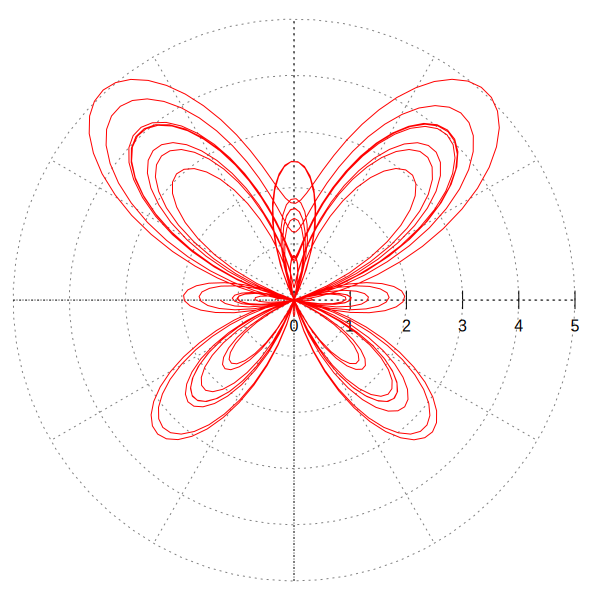
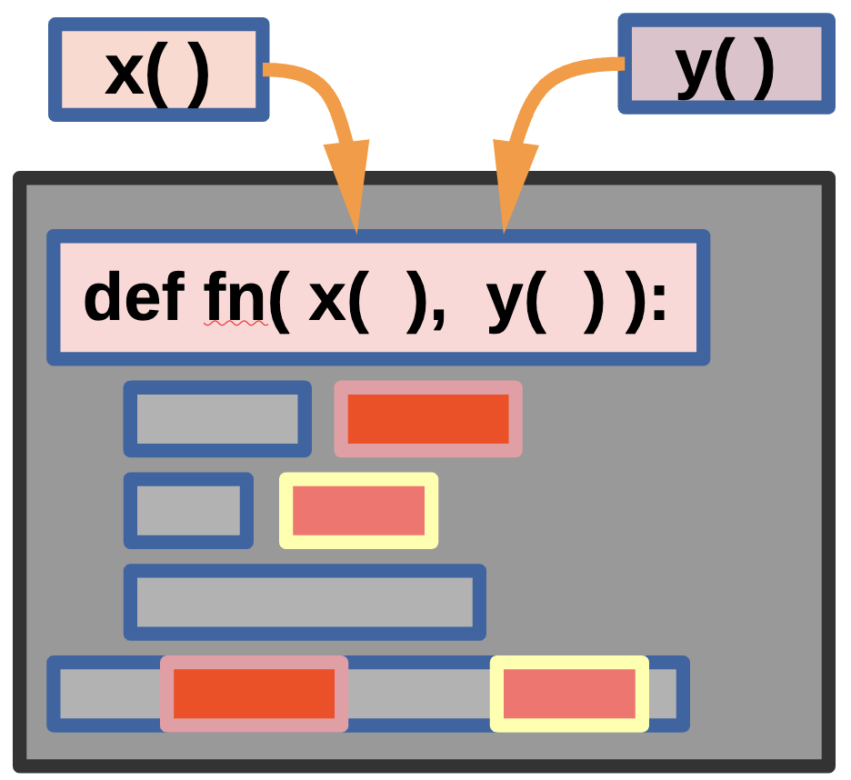

# On For Today

::: {.callout-tip icon="true"}
## Let's explore three powerful Python patterns!
**Topics covered in today's discussion:**

* 🐍 **Higher-Order Functions** — Functions that take or return other functions
* 🐍 **Passing Functions as Arguments** — Treating functions as first-class citizens
* 🐍 **Returning Functions from Functions** — Building function factories
* 🐍 **Decorators** — Wrapping functions to add behavior
* 🐍 **Decorator Syntax (`@`)** — Python's elegant shorthand
* 🐍 **Simple Classes** — Bundling data and behavior together
* 🐍 **The `__init__` Method** — Constructing objects
* 🐍 **Methods and Attributes** — Working with class instances
* 🐍 **Challenge Problems & Solutions** — Practice what you've learned!
:::

<center>
{width=40%}
</center>

---


## Motivation: Parametric Curves & Higher-Order Functions


::: {.callout-important icon="false"}
**The Butterfly Curve — A Parametric Function**
A **parametric equation** expresses coordinates as functions of a shared variable $t$:

$$x(t) = \sin(t)\!\left(e^{\cos t} - 2\cos(4t) - \sin^5\!\tfrac{t}{12}\right)$$

$$y(t) = \cos(t)\!\left(e^{\cos t} - 2\cos(4t) - \sin^5\!\tfrac{t}{12}\right)$$

:::

::: {.callout-note}
As $t$ sweeps from $0$ to $12\pi$, the pair $(x(t),\,y(t))$ traces the butterfly shape.
:::


## The Python Connection

::: {.callout-important icon="false"}

Plotting this curve means applying the same mathematical building blocks — $e^{\cos t}$, $\cos(4t)$, $\sin^5(t/12)$ — inside both $x$ and $y$. We can define each piece as a **function** and pass it as an argument. That is precisely what **higher-order functions** make possible!

:::

<center>
{width=50%}
</center>


## Plotting the Butterfly Curve in Python

::: {.callout-important icon="false"}
## Higher-Order Functions Make This Clean
```python
import numpy as np
import matplotlib.pyplot as plt

# Define each reusable mathematical building block as a function
def radial(t):
    return np.exp(np.cos(t)) - 2*np.cos(4*t) - np.sin(t/12)**5

def x_coord(t, r_func):   # <-- accepts a function as an argument!
    return np.sin(t) * r_func(t)

def y_coord(t, r_func):   # <-- accepts a function as an argument!
    return np.cos(t) * r_func(t)

t = np.linspace(0, 12 * np.pi, 10_000)

plt.figure(figsize=(6, 6))
plt.plot(x_coord(t, radial), y_coord(t, radial), linewidth=0.6)
plt.axis("equal"); plt.axis("off")
plt.title("Butterfly Curve"); plt.tight_layout(); plt.show()
```

**The higher-order connection:** `x_coord` and `y_coord` each **accept `r_func` as a parameter** — they don't hard-code the radial formula. Swapping in a different function instantly produces a different curve. This is a higher-order function in real scientific code.
:::


## Parametric Functions with Python 

<center>
{width=45%}
</center>

::: {.callout-note}
We can plug in any function we like for `fn()` — the functions `x()` and `y()` still work as parameters! This is the essence of higher-order programming: variables and functions can be used as parameters.
:::

## Interactive Parametric Curve Explorer Code

```{=html}
<div style="font-family:system-ui,sans-serif;font-size:13px;line-height:1.4;user-select:none;">
<div style="display:flex;gap:10px;align-items:flex-start;">

<!-- ===== CONTROLS ===== -->
<div style="width:200px;flex-shrink:0;padding:8px 10px;background:#f4f4f4;
            border:1px solid #d0d0d0;border-radius:6px;">

  <div style="margin-bottom:9px;">
    <label style="font-weight:700;font-size:12px;display:block;margin-bottom:3px;">Curve family</label>
    <select id="pcv-sel" onchange="pcvChangeCurve()"
      style="width:100%;padding:3px 5px;border-radius:4px;border:1px solid #bbb;font-size:12px;">
      <option value="butterfly">🦋 Butterfly</option>
      <option value="rose">🌹 Rose</option>
      <option value="lissajous">〰 Lissajous</option>
      <option value="spirograph">⚙ Spirograph</option>
    </select>
  </div>

  <div style="margin-bottom:7px;">
    <label id="pcv-l1" style="display:block;font-size:11px;color:#444;margin-bottom:2px;"></label>
    <div style="display:flex;align-items:center;gap:5px;">
      <input type="range" id="pcv-s1" style="flex:1;" oninput="pcvDraw()">
      <span id="pcv-v1" style="width:34px;text-align:right;font-size:11px;font-weight:600;"></span>
    </div>
  </div>

  <div style="margin-bottom:7px;">
    <label id="pcv-l2" style="display:block;font-size:11px;color:#444;margin-bottom:2px;"></label>
    <div style="display:flex;align-items:center;gap:5px;">
      <input type="range" id="pcv-s2" style="flex:1;" oninput="pcvDraw()">
      <span id="pcv-v2" style="width:34px;text-align:right;font-size:11px;font-weight:600;"></span>
    </div>
  </div>

  <div style="margin-bottom:10px;">
    <label id="pcv-l3" style="display:block;font-size:11px;color:#444;margin-bottom:2px;"></label>
    <div style="display:flex;align-items:center;gap:5px;">
      <input type="range" id="pcv-s3" style="flex:1;" oninput="pcvDraw()">
      <span id="pcv-v3" style="width:34px;text-align:right;font-size:11px;font-weight:600;"></span>
    </div>
  </div>

  <hr style="border:none;border-top:1px solid #ccc;margin:6px 0 8px;">

  <div style="margin-bottom:8px;">
    <label style="display:block;font-size:11px;color:#444;margin-bottom:2px;">Anim. speed</label>
    <input type="range" id="pcv-spd" min="2" max="80" value="25" style="width:100%;">
  </div>

  <div style="display:flex;gap:6px;">
    <button id="pcv-anim" onclick="pcvAnimate()"
      style="flex:1;padding:5px 4px;background:#1a6fa8;color:#fff;border:none;
             border-radius:4px;cursor:pointer;font-size:12px;font-weight:600;">
      ▶ Animate
    </button>
    <button onclick="pcvReset()"
      style="flex:1;padding:5px 4px;background:#555;color:#fff;border:none;
             border-radius:4px;cursor:pointer;font-size:12px;font-weight:600;">
      ↺ Reset
    </button>
  </div>
</div>
<!-- ===== /CONTROLS ===== -->

<!-- ===== CANVAS ===== -->
<canvas id="pcv-cv" width="640" height="550"
  style="border:1px solid #ccc;border-radius:6px;background:#fafafa;flex-shrink:0;">
</canvas>
<!-- ===== /CANVAS ===== -->

</div><!-- /flex -->

<!-- equation strip -->
<div id="pcv-eq"
  style="margin-top:7px;padding:5px 10px;background:#eef4fb;
         border-left:3px solid #1a6fa8;border-radius:3px;
         font-size:11.5px;color:#12345a;min-height:22px;">
</div>
</div><!-- /outer -->

<script>
(function () {
  /* ================================================================
     CURVE DEFINITIONS
     Each entry exposes:
       color, steps, tmax(p), params[], eq(p), px(t,p), py(t,p)
     px/py return canvas offsets from centre (y is flipped by caller).
     The plotting engine (pcvDraw / pcvAnimate) never needs to know
     which curve is active — it just calls px and py.
     This IS the higher-order pattern: functions passed as arguments.
  ================================================================ */
  var CURVES = {
    butterfly: {
      color: '#1a6fa8', steps: 8000,
      tmax: function (p) { return 12 * Math.PI; },
      params: [
        { label: 'Loops  n',     min: 1,   max: 8,   step: 0.5, def: 4   },
        { label: 'Amplitude  a', min: 0.5, max: 3,   step: 0.1, def: 2   },
        { label: 'Scale',        min: 40,  max: 165, step: 5,   def: 100 }
      ],
      eq: function (p) {
        return 'r(t) = e<sup>cos t</sup> &minus; ' + p[1].toFixed(1) +
               '&thinsp;cos(' + p[0].toFixed(1) + 't) &minus; sin<sup>5</sup>(t/12)' +
               ' &nbsp;|&nbsp; x = sin(t)&thinsp;r(t),&ensp;y = cos(t)&thinsp;r(t)';
      },
      px: function (t, p) {
        var r = Math.exp(Math.cos(t)) - p[1] * Math.cos(p[0] * t) - Math.pow(Math.sin(t / 12), 5);
        return Math.sin(t) * r * p[2];
      },
      py: function (t, p) {
        var r = Math.exp(Math.cos(t)) - p[1] * Math.cos(p[0] * t) - Math.pow(Math.sin(t / 12), 5);
        return Math.cos(t) * r * p[2];
      }
    },
    rose: {
      color: '#c0392b', steps: 6000,
      tmax: function (p) { return (Math.round(p[0]) % 2 === 0 ? 4 : 2) * Math.PI * Math.round(p[2]); },
      params: [
        { label: 'Petals  k',  min: 1,  max: 12,  step: 1,  def: 5   },
        { label: 'Scale',      min: 60, max: 260, step: 5,  def: 220 },
        { label: 'Rounds',     min: 1,  max: 4,   step: 1,  def: 1   }
      ],
      eq: function (p) {
        var k = Math.round(p[0]);
        return 'x(t) = cos(' + k + 't)&thinsp;cos(t) &ensp; y(t) = cos(' + k + 't)&thinsp;sin(t)';
      },
      px: function (t, p) { return Math.cos(Math.round(p[0]) * t) * Math.cos(t) * p[1]; },
      py: function (t, p) { return Math.cos(Math.round(p[0]) * t) * Math.sin(t) * p[1]; }
    },
    lissajous: {
      color: '#27ae60', steps: 5000,
      tmax: function (p) { return 2 * Math.PI; },
      params: [
        { label: 'X frequency  a',   min: 1, max: 9, step: 1, def: 3 },
        { label: 'Y frequency  b',   min: 1, max: 9, step: 1, def: 2 },
        { label: 'Phase  \u03b4 (\u00d7\u03c0/8)', min: 0, max: 8, step: 1, def: 4 }
      ],
      eq: function (p) {
        var a = Math.round(p[0]), b = Math.round(p[1]), d = Math.round(p[2]);
        return 'x = sin(' + a + 't + &delta;)&ensp;y = sin(' + b + 't)' +
               '&ensp;&delta; = ' + (d / 8).toFixed(3) + '&pi;';
      },
      px: function (t, p) { return Math.sin(Math.round(p[0]) * t + Math.round(p[2]) * Math.PI / 8) * 260; },
      py: function (t, p) { return Math.sin(Math.round(p[1]) * t) * 260; }
    },
    spirograph: {
      color: '#8e44ad', steps: 8000,
      tmax: function (p) { return 20 * Math.PI; },
      params: [
        { label: 'Outer  R', min: 50,  max: 220, step: 5, def: 150 },
        { label: 'Inner  r', min: 10,  max: 120, step: 5, def: 60  },
        { label: 'Offset  d', min: 10, max: 180, step: 5, def: 90  }
      ],
      eq: function (p) {
        return 'x = (R&minus;r)cos(t) + d cos(<sup>R&minus;r</sup>/<sub>r</sub>t)' +
               '&ensp;R=' + p[0] + ', r=' + p[1] + ', d=' + p[2];
      },
      px: function (t, p) { return (p[0]-p[1])*Math.cos(t) + p[2]*Math.cos((p[0]-p[1])/p[1]*t); },
      py: function (t, p) { return (p[0]-p[1])*Math.sin(t) - p[2]*Math.sin((p[0]-p[1])/p[1]*t); }
    }
  };

  /* ================================================================
     UI WIRING
  ================================================================ */
  var cv     = document.getElementById('pcv-cv');
  var ctx    = cv.getContext('2d');
  var selEl  = document.getElementById('pcv-sel');
  var animBtn= document.getElementById('pcv-anim');
  var eqDiv  = document.getElementById('pcv-eq');
  var animId = null;

  var UI = [
    { s: document.getElementById('pcv-s1'), l: document.getElementById('pcv-l1'), v: document.getElementById('pcv-v1') },
    { s: document.getElementById('pcv-s2'), l: document.getElementById('pcv-l2'), v: document.getElementById('pcv-v2') },
    { s: document.getElementById('pcv-s3'), l: document.getElementById('pcv-l3'), v: document.getElementById('pcv-v3') }
  ];

  function getCurve () { return CURVES[selEl.value]; }

  function getParams () {
    return UI.map(function (u) { return parseFloat(u.s.value); });
  }

  function fmtVal (v, step) {
    return step < 1 ? v.toFixed(1) : Math.round(v).toString();
  }

  function loadSliders () {
    var c = getCurve();
    c.params.forEach(function (pd, i) {
      UI[i].s.min   = pd.min;
      UI[i].s.max   = pd.max;
      UI[i].s.step  = pd.step;
      UI[i].s.value = pd.def;
      UI[i].l.textContent = pd.label;
      UI[i].v.textContent = fmtVal(pd.def, pd.step);
    });
  }

  function cancelAnim () {
    if (animId) { cancelAnimationFrame(animId); animId = null; }
    animBtn.textContent = '\u25b6 Animate';
  }

  /* ================================================================
     DRAWING
     pcvDraw  — draw the complete curve in one pass (instant feedback)
     pcvAnimate — sweep t incrementally using precomputed point array
  ================================================================ */
  function drawFull (ptsOverride) {
    var c = getCurve(), p = getParams();
    var W = cv.width, H = cv.height, cx = W / 2, cy = H / 2;
    var pts = ptsOverride;
    if (!pts) {
      var N = c.steps, TMAX = c.tmax(p);
      pts = [];
      for (var i = 0; i <= N; i++) {
        var t = (i / N) * TMAX;
        pts.push([cx + c.px(t, p), cy - c.py(t, p)]);
      }
    }
    ctx.clearRect(0, 0, W, H);
    ctx.strokeStyle = c.color;
    ctx.lineWidth   = 1.4;
    ctx.beginPath();
    ctx.moveTo(pts[0][0], pts[0][1]);
    for (var j = 1; j < pts.length; j++) ctx.lineTo(pts[j][0], pts[j][1]);
    ctx.stroke();

    /* update slider value labels */
    UI.forEach(function (u, i) {
      u.v.textContent = fmtVal(parseFloat(u.s.value), parseFloat(u.s.step));
    });
    eqDiv.innerHTML = c.eq(p);
  }

  /* exposed globals for inline oninput / onclick handlers */
  window.pcvDraw = function () { cancelAnim(); drawFull(); };

  window.pcvChangeCurve = function () { cancelAnim(); loadSliders(); drawFull(); };

  window.pcvReset = function () { cancelAnim(); loadSliders(); drawFull(); };

  window.pcvAnimate = function () {
    if (animId) { cancelAnim(); return; }
    var c = getCurve(), p = getParams();
    var W = cv.width, H = cv.height, cx = W / 2, cy = H / 2;
    var N = c.steps, TMAX = c.tmax(p);

    /* precompute all points once so animation is smooth */
    var pts = [];
    for (var i = 0; i <= N; i++) {
      var t = (i / N) * TMAX;
      pts.push([cx + c.px(t, p), cy - c.py(t, p)]);
    }

    var step = 0;
    animBtn.textContent = '\u23f9 Stop';

    function frame () {
      var spd = parseInt(document.getElementById('pcv-spd').value, 10) || 25;
      step = Math.min(step + spd, N);
      ctx.clearRect(0, 0, W, H);
      ctx.strokeStyle = c.color;
      ctx.lineWidth   = 1.4;
      ctx.beginPath();
      ctx.moveTo(pts[0][0], pts[0][1]);
      for (var k = 1; k <= step; k++) ctx.lineTo(pts[k][0], pts[k][1]);
      ctx.stroke();
      if (step < N) { animId = requestAnimationFrame(frame); }
      else          { animId = null; animBtn.textContent = '\u25b6 Animate'; }
    }
    animId = requestAnimationFrame(frame);
  };

  /* ---- boot ---- */
  loadSliders();
  drawFull();
}());
</script>
```


---

# Part 1: Higher-Order Functions

::: {.callout-note icon="false"}
## What Is a Higher-Order Function?
A **higher-order function** is a function that does at least one of the following:

1. **Takes another function as an argument**, or
2. **Returns a function** as its result.

You have already seen some! `map()`, `filter()`, and `sorted()` are all higher-order functions because they accept a function as a parameter.
:::

::: {style="color: #8E44AD;"}
**Key Insight:** In Python, functions are *first-class citizens* — they can be stored in variables, passed around, and returned, just like numbers or strings.
:::

## Functions Are Just Objects

::: {.callout-important icon="false"}
## Assigning Functions to Variables
```python
def shout(text):
    return text.upper() + "!"

# Assign the function to a new variable (no parentheses!)
yell = shout

print(shout("hello"))   # Output: HELLO!
print(yell("hello"))    # Output: HELLO!
print(type(yell))       # Output: <class 'function'>
```
:::

::: {.callout-important icon="false"}

**How it works:** `yell = shout` does **not** call the function. It copies the *reference* to the function object into `yell`. Both names point to the same function — calling either one produces the same result.
:::

## Passing a Function as an Argument — Simple

::: {.callout-important icon="false"}
## A Function That Accepts Another Function
```python
def apply_twice(func, value):
    return func(func(value))

def add_three(x):
    return x + 3

result = apply_twice(add_three, 10)
print(result)  # Output: 16
```

**Step-by-step:** `apply_twice(add_three, 10)` sets `func = add_three` and `value = 10`.
Inner call: `func(10)` → `add_three(10)` → `13`.
Outer call: `func(13)` → `add_three(13)` → `16`. Result `16` is returned.
:::

## Passing a Function as an Argument — More Complex

::: {.callout-important icon="false"}
## Applying Different Operations to a List
```python
def transform_list(data, operation):
    result = []
    for item in data:
        result.append(operation(item))
    return result

def square(x):  return x ** 2
def negate(x):  return -x

numbers = [1, 2, 3, 4, 5]
print(transform_list(numbers, square))  # [1, 4, 9, 16, 25]
print(transform_list(numbers, negate))  # [-1, -2, -3, -4, -5]
print(transform_list(numbers, str))     # ['1', '2', '3', '4', '5']
```

:::

::: {.callout-important icon="false"}

**How it works:** `transform_list` doesn't care *which* function it receives — it simply calls `operation(item)` for each element. We can even pass the built-in `str`. This makes the function **reusable** with any transformation.
:::

## Returning a Function from a Function — Simple

::: {.callout-important icon="false"}
## A Function Factory
```python
def make_multiplier(factor):
    def multiplier(x):
        return x * factor
    return multiplier

double = make_multiplier(2)
triple = make_multiplier(3)

print(double(5))   # Output: 10
print(triple(5))   # Output: 15
print(double(10))  # Output: 20
```
:::

::: {.callout-important icon="false"}

**How it works:** `make_multiplier(2)` builds and *returns* the inner `multiplier` function with `factor = 2` baked in. `double` is now that function. This is called a **closure** — the inner function remembers `factor` from its enclosing scope even after `make_multiplier` has finished.
:::

## Returning a Function — More Complex

::: {.callout-important icon="false"}
## A Greeting Factory
```python
def make_greeter(greeting, punctuation="!"):
    def greeter(name):
        return f"{greeting}, {name}{punctuation}"
    return greeter

say_hello   = make_greeter("Hello")
say_goodbye = make_greeter("Goodbye", "...")
say_hey     = make_greeter("Hey", "! 👋")

print(say_hello("Alice"))    # Hello, Alice!
print(say_goodbye("Bob"))    # Goodbye, Bob...
print(say_hey("Charlie"))    # Hey, Charlie! 👋
```

**Why this is useful:** Instead of three separate greeting functions we build one *factory* that produces customized functions on demand. Each returned function carries its own `greeting` and `punctuation` values locked in via closure.
:::

## Built-In Higher-Order Functions Revisited

::: {.callout-note icon="false"}
## `map()`, `filter()`, and `sorted()` Are Higher-Order Functions
They are higher-order because they **accept a function as an argument**. You can pass any callable — including built-in functions — directly, without parentheses.

```python
numbers = [1, -3, 5, -2, 8, -7, 4]

absolutes = list(map(abs, numbers))
print(absolutes)  # [1, 3, 5, 2, 8, 7, 4]

positives = list(filter(lambda x: x > 0, numbers))
print(positives)  # [1, 5, 8, 4]

by_abs = sorted(numbers, key=abs)
print(by_abs)     # [-2, 1, -3, 4, 5, -7, 8]
```

**Notice:** `abs` is passed directly — no parentheses, no lambda needed. Any callable works!
:::

---

# Part 2: Decorators

::: {.callout-note icon="false"}
## What Is a Decorator?
A **decorator** is a higher-order function that takes a function, adds some behavior to it, and returns a new function — all *without modifying* the original function's code.

:::

::: {style="color: #8E44AD;"}
**Analogy:** Think of a decorator like a gift wrapper 🎁. The gift (your function) stays the same; the wrapper adds something extra — logging, timing, validation — around it.
:::

## Decorator Pattern — Manual Approach

::: {.callout-important icon="false"}
## Before the `@` Syntax
```python
def my_decorator(func):
    def wrapper():
        print("Something happens BEFORE the function.")
        func()
        print("Something happens AFTER the function.")
    return wrapper

def say_hello():
    print("Hello!")

say_hello = my_decorator(say_hello)  # manually decorate
say_hello()
```

**Output:** `Something happens BEFORE the function.` / `Hello!` / `Something happens AFTER the function.`
:::

::: {.callout-important icon="false"}


**How it works:** `my_decorator` wraps `say_hello` inside `wrapper` and returns it. Re-assigning `say_hello = my_decorator(say_hello)` means every future call runs `wrapper()`, which sandwiches the original call with extra behavior.
:::

## The `@` Syntax — Python's Shorthand

::: {.callout-important icon="false"}
## Much Cleaner!
```python
def my_decorator(func):
    def wrapper():
        print("Before the function runs.")
        func()
        print("After the function runs.")
    return wrapper

@my_decorator
def say_goodbye():
    print("Goodbye!")

say_goodbye()
```

**Output:** `Before the function runs.` / `Goodbye!` / `After the function runs.`
:::

::: {.callout-important icon="false"}
**Key Point:** `@my_decorator` above a function is exactly the same as writing `say_goodbye = my_decorator(say_goodbye)`. The `@` symbol is syntactic sugar — it looks cleaner and is the Pythonic way.
:::

## Decorator with Arguments — Simple

::: {.callout-important icon="false"}
## Handling Any Signature with `*args` and `**kwargs`
```python
def log_call(func):
    def wrapper(*args, **kwargs):
        print(f"Calling {func.__name__} with args={args}")
        result = func(*args, **kwargs)
        print(f"{func.__name__} returned {result}")
        return result
    return wrapper

@log_call
def add(a, b):
    return a + b

print(add(3, 5))
# Calling add with args=(3, 5)
# add returned 8
# 8
```
:::

::: {.callout-important icon="false"}

**How it works:** `*args` captures positional arguments as a tuple; `**kwargs` captures keyword arguments as a dictionary. The wrapper can therefore decorate **any** function signature. The original return value is captured and passed through unchanged.
:::

## A Practical Decorator — Timing a Function

::: {.callout-important icon="false"}
## Measuring Execution Time
```python
import time

def timer(func):
    def wrapper(*args, **kwargs):
        start = time.time()
        result = func(*args, **kwargs)
        elapsed = time.time() - start
        print(f"{func.__name__} took {elapsed:.4f} seconds")
        return result
    return wrapper

@timer
def slow_sum(n):
    total = 0
    for i in range(n):
        total += i
    return total

result = slow_sum(1_000_000)
print(f"Result: {result}")
```

**Why decorators are powerful:** Timing was added to `slow_sum` **without changing its code**. `@timer` can be placed on *any* function to profile it — reusable, composable behavior.
:::

## Stacking Decorators

::: {.callout-important icon="false"}
## Multiple Decorators on One Function
```python
def bold(func):
    def wrapper(*args, **kwargs):
        return f"<b>{func(*args, **kwargs)}</b>"
    return wrapper

def italic(func):
    def wrapper(*args, **kwargs):
        return f"<i>{func(*args, **kwargs)}</i>"
    return wrapper

@bold
@italic
def say(text):
    return text

print(say("Hello"))  # <b><i>Hello</i></b>
```
:::

::: {.callout-important icon="false"}
**Execution order:** Decorators apply **bottom-up**. `@italic` wraps `say` first, then `@bold` wraps the result. Calling `say("Hello")` is equivalent to `bold(italic(say))("Hello")`.
:::

---

# Part 3: Simple Classes

::: {.callout-note icon="false"}
## What Is a Class?
A **class** is a blueprint for creating objects. Each object (instance) bundles together:

* **Attributes** — data (variables) that belong to the object
* **Methods** — functions that belong to the object
:::

::: {style="color: #8E44AD;"}
**Analogy:** A class is like a cookie cutter 🍪. The cutter (class) defines the shape; each cookie (instance) is made from it and can have its own decorations (attribute values).
:::

## Your First Class — Simple Example

::: {.callout-important icon="false"}
## Defining and Using a Class
```python
class Dog:
    def __init__(self, name, breed):
        self.name = name
        self.breed = breed

    def bark(self):
        return f"{self.name} says: Woof!"

my_dog   = Dog("Buddy", "Golden Retriever")
your_dog = Dog("Max", "Poodle")

print(my_dog.bark())    # Buddy says: Woof!
print(your_dog.name)    # Max
```

:::

::: {.callout-important icon="false"}

**Step-by-step:** `class Dog:` defines the blueprint. `__init__` is the **constructor** — it runs automatically when you create a new instance. `self` refers to the specific object being created. `my_dog.bark()` passes `my_dog` as `self` automatically.
:::

## Understanding `self`

::: {.callout-important icon="false"}
## Each Instance Has Its Own Data
```python
class Counter:
    def __init__(self):
        self.count = 0

    def increment(self):
        self.count += 1

    def get_count(self):
        return self.count

counter_a = Counter()
counter_b = Counter()

counter_a.increment()
counter_a.increment()
counter_b.increment()

print(counter_a.get_count())  # 2
print(counter_b.get_count())  # 1
```

**Key Point:** `counter_a` and `counter_b` each have their **own** `count` attribute. `self.count` inside `counter_a.increment()` only changes `counter_a`'s data — `counter_b` is unaffected.
:::

## A More Complete Class — `BankAccount`

::: {.callout-important icon="false"}
## Encapsulating Data and Operations
```python
class BankAccount:
    def __init__(self, owner, balance=0):
        self.owner = owner
        self.balance = balance

    def deposit(self, amount):
        if amount > 0:
            self.balance += amount
            return f"Deposited ${amount}. Balance: ${self.balance}"
        return "Amount must be positive."

    def withdraw(self, amount):
        if amount > self.balance:
            return "Insufficient funds!"
        self.balance -= amount
        return f"Withdrew ${amount}. Balance: ${self.balance}"

account = BankAccount("Alice", 100)
print(account.deposit(50))    # Deposited $50. Balance: $150
print(account.withdraw(200))  # Insufficient funds!
```

**How it works:** `BankAccount` keeps data (`owner`, `balance`) and operations (`deposit`, `withdraw`) together. This prevents outside code from misusing the data and makes the logic easy to maintain.
:::

## The `__str__` Method — Making Objects Printable

::: {.callout-important icon="false"}
## Custom String Representation
```python
class Student:
    def __init__(self, name, grade):
        self.name = name
        self.grade = grade

    def __str__(self):
        return f"Student({self.name}, grade={self.grade})"

    def is_passing(self):
        return self.grade >= 60

s1 = Student("Alice", 92)
s2 = Student("Bob", 55)

print(s1)               # Student(Alice, grade=92)
print(s1.is_passing())  # True
print(s2.is_passing())  # False
```

**Why `__str__`?** Without it `print(s1)` shows `<__main__.Student object at 0x...>`. Defining `__str__` tells Python how to render your object as a human-readable string whenever `print()` or `str()` is called on it.
:::

## Classes with Collections — `Playlist`

::: {.callout-important icon="false"}
## Storing a List Inside an Object
```python
class Playlist:
    def __init__(self, name):
        self.name = name
        self.songs = []

    def add_song(self, song):   self.songs.append(song)
    def total_songs(self):      return len(self.songs)

    def show(self):
        print(f"🎵 {self.name}")
        for i, song in enumerate(self.songs, 1):
            print(f"  {i}. {song}")

my_playlist = Playlist("Study Vibes")
my_playlist.add_song("Lo-Fi Beats")
my_playlist.add_song("Piano Chill")
my_playlist.show()
print(f"Total: {my_playlist.total_songs()} songs")
```
:::

::: {.callout-important icon="false"}

**How it works:** `self.songs = []` creates an independent list **per instance**. Each `Playlist` object manages its own song list; the methods provide a clean interface for manipulating it.
:::

## Classes + Higher-Order Functions Together

::: {.callout-important icon="false"}
## `sorted()` and `filter()` Work Great with Objects
```python
class Product:
    def __init__(self, name, price):
        self.name = name
        self.price = price
    def __str__(self):
        return f"{self.name}: ${self.price:.2f}"

products = [
    Product("Laptop", 999.99),
    Product("Mouse", 29.99),
    Product("Keyboard", 79.99),
]

by_price   = sorted(products, key=lambda p: p.price)
affordable = list(filter(lambda p: p.price < 100, products))

for p in by_price:   print(p)
print("---")
for p in affordable: print(p)
```

**The connection:** Higher-order functions like `sorted()` and `filter()` accept a lambda that extracts an attribute from each object. This shows how all three topics — higher-order functions, lambdas, and classes — work together in real Python code.
:::

---

# Challenge Problems

<center>
{width=60%}
</center>

::: {.callout-warning icon="false"}
## 🏁 Try These on Your Own!
Work through each challenge before looking at the solutions on the next slides.
:::

## Challenge 1 — Apply a Function Repeatedly

::: {.callout-warning icon="false"}
## Higher-Order Function Challenge
Write a function `apply_n_times(func, value, n)` that applies `func` to `value` exactly `n` times.

```python
def apply_n_times(func, value, n):
    # Your code here
    pass

def double(x):
    return x * 2

print(apply_n_times(double, 3, 4))
# Expected: 48   (3 → 6 → 12 → 24 → 48)
```
:::

## Challenge 2 — A Decorator That Counts Calls

::: {.callout-warning icon="false"}
## Decorator Challenge
Write a decorator `count_calls` that tracks how many times the decorated function is called. Store the count as an attribute on the wrapper.

```python
# Write your count_calls decorator here

@count_calls
def say_hi():
    print("Hi!")

say_hi()
say_hi()
say_hi()
print(f"say_hi was called {say_hi.call_count} times")
# Expected output:  Hi! / Hi! / Hi! / say_hi was called 3 times
```
:::

## Challenge 3 — A `Rectangle` Class

::: {.callout-warning icon="false"}
## Class Challenge
Create a `Rectangle` class with `width` and `height`, an `area()` method, a `perimeter()` method, an `is_square()` method, and a `__str__` method.

```python
# Write your Rectangle class here

r1 = Rectangle(5, 3)
r2 = Rectangle(4, 4)
print(r1)                          # Rectangle(5 x 3)
print(f"Area:      {r1.area()}")   # Area:      15
print(f"Perimeter: {r1.perimeter()}")  # Perimeter: 16
print(r1.is_square())              # False
print(r2.is_square())              # True
```
:::

## Challenge 4 — Function Composer

::: {.callout-warning icon="false"}
## Higher-Order Function Challenge
Write `compose(f, g)` that returns a new function applying `g` first, then `f`. In math: `compose(f, g)(x) = f(g(x))`.

```python
def compose(f, g):
    pass   # Your code here

def add_one(x): return x + 1
def double(x):  return x * 2

add_then_double = compose(double, add_one)
double_then_add = compose(add_one, double)

print(add_then_double(5))  # Expected: 12
print(double_then_add(5))  # Expected: 11
```
:::

## Challenge 5 — `GradeBook` with Higher-Order Functions

::: {.callout-warning icon="false"}
## Putting It All Together!
Build a `GradeBook` class with: `add_student(name, grade)`, `get_passing(min_grade=60)` using `filter`, `get_curved_grades(curve_func)` using `map`, and `top_student()`.

```python
gb = GradeBook()
gb.add_student("Alice", 92)
gb.add_student("Bob", 55)
gb.add_student("Charlie", 78)
gb.add_student("Diana", 43)

print(gb.get_passing())
# Expected: ['Alice', 'Charlie']
print(gb.get_curved_grades(lambda g: g + 10))
# Expected: {'Alice': 102, 'Bob': 65, 'Charlie': 88, 'Diana': 53}
print(gb.top_student())
# Expected: Alice
```
:::

---

# Challenge Solutions

## Solution 1 — Apply a Function Repeatedly

```python
def apply_n_times(func, value, n):
    result = value
    for _ in range(n):
        result = func(result)
    return result

def double(x):
    return x * 2

print(apply_n_times(double, 3, 4))  # 48
```


::: {.callout-important icon="false"}

**How it works:** `result` starts at `3`. Each loop iteration applies `func`, chaining output to input: `3 → 6 → 12 → 24 → 48`. This is a **higher-order function** because `func` is received as a parameter.
:::

## Solution 2 — Decorator That Counts Calls

```python
def count_calls(func):
    def wrapper(*args, **kwargs):
        wrapper.call_count += 1
        return func(*args, **kwargs)
    wrapper.call_count = 0
    return wrapper

@count_calls
def say_hi():
    print("Hi!")

say_hi(); say_hi(); say_hi()
print(f"say_hi was called {say_hi.call_count} times")
```


::: {.callout-important icon="false"}

**How it works:** Functions are objects — you can attach attributes to them. `wrapper.call_count = 0` initialises the counter on the function object itself. Each call increments it before delegating to the original `func`. After `@count_calls`, `say_hi` *is* `wrapper`, so `say_hi.call_count` gives the total.
:::

## Solution 3 — `Rectangle` Class

```python
class Rectangle:
    def __init__(self, width, height):
        self.width = width
        self.height = height

    def area(self):       return self.width * self.height
    def perimeter(self):  return 2 * (self.width + self.height)
    def is_square(self):  return self.width == self.height
    def __str__(self):    return f"Rectangle({self.width} x {self.height})"

r1 = Rectangle(5, 3)
r2 = Rectangle(4, 4)
print(r1)               # Rectangle(5 x 3)
print(r1.area())        # 15
print(r1.is_square())   # False
print(r2.is_square())   # True
```


::: {.callout-important icon="false"}

**How it works:** `__init__` stores dimensions as instance attributes. Each method uses `self` to access that specific instance's data. `__str__` provides a readable string when `print()` is called on the object.
:::

## Solution 4 — Function Composer

```python
def compose(f, g):
    def composed(x):
        return f(g(x))
    return composed

def add_one(x): return x + 1
def double(x):  return x * 2

add_then_double = compose(double, add_one)
double_then_add = compose(add_one, double)

print(add_then_double(5))  # 12
print(double_then_add(5))  # 11
```

::: {.callout-important icon="false"}

**How it works:** `compose(f, g)` returns `composed` — a closure that calls `g` first, feeds the result to `f`. `add_then_double(5)`: `add_one(5) = 6`, then `double(6) = 12`. `double_then_add(5)`: `double(5) = 10`, then `add_one(10) = 11`. `composed` is a **closure** — it remembers `f` and `g` from the enclosing scope.
:::

## Solution 5 — `GradeBook` (Code)
```python
class GradeBook:
    def __init__(self):
        self.students = {}

    def add_student(self, name, grade):
        self.students[name] = grade

    def get_passing(self, min_grade=60):
        passing = filter(
            lambda item: item[1] >= min_grade,
            self.students.items()
        )
        return [name for name, grade in passing]

    def get_curved_grades(self, curve_func):
        curved = map(
            lambda item: (item[0], curve_func(item[1])),
            self.students.items()
        )
        return dict(curved)

    def top_student(self):
        return max(self.students, key=self.students.get)
```


## Solution 5 — `GradeBook` (How It Works)

```python
gb = GradeBook()
gb.add_student("Alice", 92); gb.add_student("Bob", 55)
gb.add_student("Charlie", 78); gb.add_student("Diana", 43)

print(gb.get_passing())                        # ['Alice', 'Charlie']
print(gb.get_curved_grades(lambda g: g + 10))  # {'Alice': 102, ...}
print(gb.top_student())                        # Alice
```

::: {.callout-note icon="false"}
## Explanation
<!-- ```python
gb = GradeBook()
gb.add_student("Alice", 92); gb.add_student("Bob", 55)
gb.add_student("Charlie", 78); gb.add_student("Diana", 43)

print(gb.get_passing())                        # ['Alice', 'Charlie']
print(gb.get_curved_grades(lambda g: g + 10))  # {'Alice': 102, ...}
print(gb.top_student())                        # Alice
``` -->

* `self.students` is a **dict** mapping names → grades.
* `get_passing()` uses `filter()` on `self.students.items()` — keeps pairs whose grade ≥ `min_grade`; a list comprehension extracts just the names.
* `get_curved_grades()` uses `map()` to apply `curve_func` to every grade, returning a new dict. Accepting `curve_func` as a parameter makes this a **higher-order method**.
* `top_student()` uses `max()` with `key=self.students.get` — finds the key with the highest value.
:::

---

# What's the Big Picture?


:::: {.columns}
::: {.column width="33%"}

**Higher-Order Functions**

* Accept or return other functions
* Functions are **first-class citizens** in Python
* Closures remember their enclosing scope
* `map()`, `filter()`, `sorted()` are built-in examples

:::
::: {.column width="33%"}

**Decorators**

* Wrap a function to add behavior
* `@decorator` is clean syntactic sugar
* `*args`, `**kwargs` handle any signature
* Decorators can be stacked (bottom-up order)
* Uses: logging, timing, validation

:::
::: {.column width="34%"}

**Simple Classes**

* Blueprint for creating objects
* `__init__` is the constructor
* `self` refers to the current instance
* `__str__` makes objects printable
* Combine with higher-order functions for powerful, expressive code

:::
::::

<center>
{width=40%}
</center>
